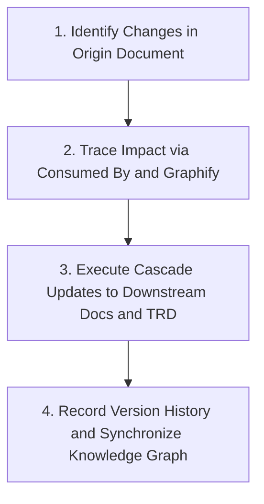

# Change Impact Synchronizer & Traceability Skill

This skill governs how to manage, trace, and cascade changes across the **Pharmacy POS & ERP System** documentation ecosystem to ensure that when any business rule, feature, or technical architecture is modified, all correlated documents remain 100% synchronized.

---

## 1. The Core Philosophy: "Zero Documentation Drift"

In an interconnected multi-tier documentation system (Master PRD $\rightarrow$ Feature PRDs $\rightarrow$ Master Data $\rightarrow$ POS & Inventory $\rightarrow$ Technical Blueprints & TRD):
* **No document is an isolated island.**
* Any change in an upstream business rule (PRD) MUST immediately reflect on its downstream business modules and technical implementation specifications (DBML, diagrams, TRD).
* Any constraint discovered during technical architecture (DBML/TRD) that affects pharmacy workflow MUST be fed back and synchronized into the corresponding PRD.

---

## 2. Standard 4-Step Cascade Update Workflow

When a change request, feature adjustment, or regulation update is proposed for an existing document (e.g., `Document X`):



### Step 1: Identify & Update Origin Document
1. Apply the modifications to the designated document.
2. Increment the document version number (e.g., `v1.0.0` $\rightarrow$ `v1.1.0` for minor adjustments / new business rules, or `v2.0.0` for major overhauls).
3. Record a concise summary of changes in the document's metadata changelog.

### Step 2: Impact Traceability Analysis
1. **Check `Consumed By (Downstream)` Field:** Open the top section of the origin document and extract the list of all documents that consume this feature.
2. **Query Graphify AI:** Execute an impact query to detect any potential indirect dependencies:
   ```bash
   graphify query "What workflows, database tables, and APIs are impacted by modifications to [Module Name]?"
   ```

### Step 3: Execute Cascade Updates
1. Open every downstream document listed in `Consumed By`.
2. Align user workflows, transaction validations, and edge case scenarios with the new rule.
3. Open correlated technical documents inside `technical/`:
   * If new business attributes are added to the PRD $\rightarrow$ update tables, enums, or columns in `technical/database/schema.dbml` (e.g., adding `sipa_number` or new Purchase Order classifications).
   * If workflow logic changes in the PRD $\rightarrow$ update diagrams in `technical/diagrams/` and request/response payloads in `technical/0X-trd-*.md`.

### Step 4: Save Progress & Synchronize Knowledge Graph
1. Execute the `/save-progress` workflow to update [PROGRESS.md](file:///Users/dystopia/projects/pharmacy/pharmacy-docs/PROGRESS.md).
2. Refresh the Graphify knowledge graph:
   ```bash
   graphify update .
   ```
3. Prepare a descriptive git commit message: `refactor(docs): cascade update impact of [feature]`.
