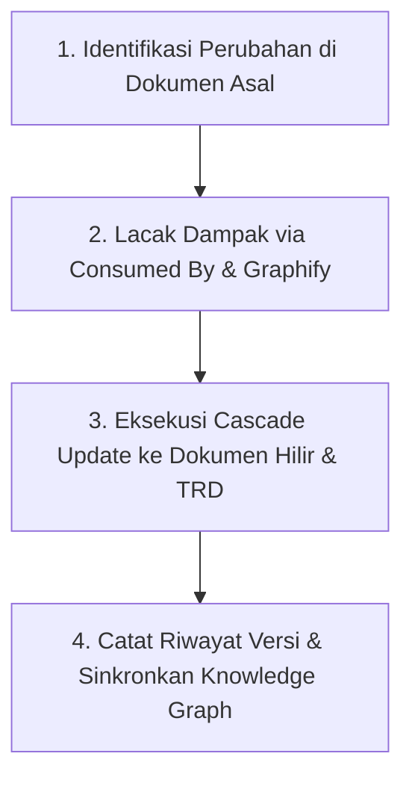

# Change Impact Synchronizer & Traceability Skill

This skill governs how to manage, trace, and cascade changes across the **Pharmacy POS & ERP System** documentation ecosystem to ensure that when any business rule, feature, or technical architecture is modified, all correlated documents remain 100% synchronized.

---

## 1. The Core Philosophy: "Zero Documentation Drift"

In an interconnected multi-tier documentation system (Master PRD $\rightarrow$ Feature PRD $\rightarrow$ Master Data $\rightarrow$ POS & Inventory $\rightarrow$ TRD/DRA):
* **No document is an isolated island.**
* Any change in an upstream business rule (PRD) MUST immediately reflect on its downstream business modules and technical implementation specs (TRD/DRA).
* Any constraint discovered during technical architecture (TRD/DRA) that affects pharmacy workflow MUST be fed back and synchronized into the corresponding PRD.

---

## 2. Standard 4-Step Cascade Update Workflow

When a change request, feature adjustment, or regulation update is proposed for an existing document (e.g., `Document X`):



### Langkah 1: Identifikasi & Update Dokumen Asal
1. Terapkan perubahan pada dokumen yang bersangkutan.
2. Naikkan nomor versi dokumen (misal: `v1.0.0` $\rightarrow$ `v1.1.0` untuk perubahan minor/aturan bisnis baru, atau `v2.0.0` untuk perombakan besar).
3. Catat ringkasan perubahan pada tabel metadata dokumen.

### Langkah 2: Lacak Dampak (Impact Traceability Analysis)
1. **Cek Baris `Consumed By (Dampak)`:** Buka bagian atas dokumen asal dan salin daftar seluruh file yang mengonsumsi dokumen ini.
2. **Cek Graphify AI:** Jalankan query untuk mendeteksi relasi tidak langsung yang berpotensi terlewat:
   ```bash
   graphify query "Apa saja alur, tabel DB, dan API yang terdampak oleh perubahan pada [Nama Modul]?"
   ```

### Langkah 3: Eksekusi Cascade Update (Penyelarasan Hilir)
1. Buka setiap dokumen hilir yang terdaftar di `Consumed By`.
2. Sesuaikan alur pengguna, validasi transaksi, atau penanganan kasus khusus (*edge cases*) agar selaras dengan aturan baru.
3. Buka dokumen teknis terkait di folder `technical/` (TRD / DRA):
   * Jika ada penambahan atribut bisnis di PRD $\rightarrow$ tambahkan kolom / tipe data / enum di DRA Database (misal: penambahan kolom `sipa_number` pada master apoteker atau penambahan jenis Surat Pesanan).
   * Jika ada perubahan alur di PRD $\rightarrow$ sesuaikan request/response payload di TRD API Specs.

### Langkah 4: Simpan Progres & Sinkronkan Knowledge Graph
1. Jalankan workflow `/save-progress` untuk memperbarui [PROGRESS.md](file:///Users/dystopia/projects/pharmacy/pharmacy-docs/PROGRESS.md).
2. Perbarui graf Graphify:
   ```bash
   graphify update .
   ```
3. Commit perubahan ke git dengan pesan deskriptif: `refactor(docs): cascade update impact of [feature]`.
