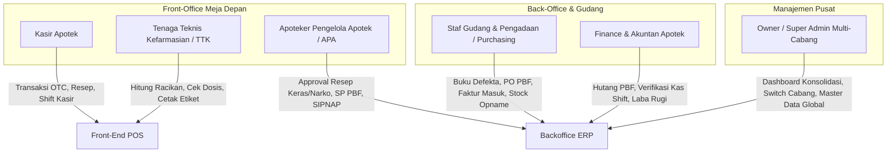

# Master Product Requirements Document (PRD)
# Pharmacy Management System: POS & ERP Apotek

---

## 1. Metadata Dokumen

| Properti | Keterangan |
| :--- | :--- |
| **Nama Produk** | Pharmacy POS & ERP System (Sistem Informasi & Manajemen Apotek Terpadu) |
| **Domain Spesifik** | Operasional Ritel Farmasi, Pelayanan Resep, Inventory FEFO, Pengadaan PBF & Kepatuhan Regulasi Kemenkes/BPOM |
| **Tingkat Dokumen** | **Master PRD (Global System Overview)** |
| **Versi Dokumen** | 1.0.0 |
| **Status** | Approved / Baseline |
| **Terakhir Diperbarui** | 2026-09-19 |
| **Target Pembaca** | Owner Apotek, Apoteker Pengelola Apotek (APA), Product Manager, Lead Engineer, UI/UX Designer, QA |

---

## 2. Latar Belakang & Problem Statement

### 2.1 Konteks Masalah Operasional Apotek
Apotek adalah bisnis ritel unik yang menggabungkan transaksi perdagangan berkecepatan tinggi dengan kepatuhan regulasi medis dan farmasi yang sangat ketat (Permenkes No. 73/2016). Di lapangan, mayoritas apotek mandiri maupun yang sedang berkembang menuju jaringan multi-cabang menghadapi kendala operasional krusial:

1. **Kerugian Akibat Obat Kedaluwarsa (*Expired Date* / ED):** Tanpa sistem **FEFO (First Expired, First Out)** berbasis batch yang disiplin, staf sering mengambil obat di rak depan tanpa memperhatikan tanggal kadaluarsa. Akibatnya, obat yang tertimbun di belakang kedaluwarsa dan menjadi beban kerugian (*dead loss*).
2. **Antrean Kasir Lambat pada Transaksi Resep & Racikan:** Transaksi obat bebas (OTC) sering terhambat jika ada pasien yang membeli obat resep atau racikan. Perhitungan manual dosis, tuslah (jasa farmasi), dan embalase (plastik/kapsul/botol) memakan waktu lama serta rentan salah hitung.
3. **Pencatatan Kartu Stok Manual & Risiko Audit BPOM:** Balai POM mewajibkan pencatatan kartu stok per nomor batch fisik untuk obat keras dan psikotropika. Kartu stok kertas sering kali tercecer, selisih dengan stok fisik, dan menyulitkan audit resmi.
4. **Alur Pengadaan ke PBF Tidak Terkontrol:** Pemesanan obat ke Pedagang Besar Farmasi (PBF) sering terlambat karena buku defekta manual tidak terupdate otomatis saat stok menipis. Surat Pesanan (SP) untuk obat tertentu, prekursor, dan narkotika sering kali salah format dan ditolak PBF.
5. **Hutang PBF & HPP yang Bias:** Diskon faktur dari PBF (diskon regular, diskon cash, bonus barang) sering tidak diperhitungkan ke dalam Harga Pokok Penjualan (HPP). Akibatnya, laba kotor yang dilaporkan tampak tinggi semu (*paper profit*), sementara kas apotek defisit akibat tagihan jatuh tempo PBF (*Term of Payment*).
6. **Tantangan Ekspansi Multi-Cabang:** Apotek yang ingin membuka cabang ke-2 atau ke-3 sering gagal karena aplikasi kasirnya tidak siap multi-cabang, data stok terisolasi secara manual, dan transfer stok antar cabang tidak dapat dilacak secara transparan (*in-transit loss*).

### 2.2 Visi & Solusi Produk
**Pharmacy POS & ERP System** dirancang sebagai ekosistem digital komprehensif yang mengintegrasikan meja kasir depan (*front-office*) dengan tata kelola pergudangan, pengadaan, dan akuntansi (*backoffice ERP*), serta dirancang **Multi-Branch Ready sejak Hari Pertama**.

Sistem ini menghadirkan:
* **Kasir Cepat Keyboard-First & Kalkulator Racikan Otomatis:** Memfasilitasi transaksi OTC cepat dan peracikan puyer/kapsul otomatis dengan pemotongan bahan baku multi-satuan dan pencetakan etiket thermal instan.
* **Manajemen Gudang Berbasis Batch & FEFO Ketat:** Memastikan obat yang keluar dari gudang atau meja kasir selalu berurutan dari tanggal kadaluarsa paling dekat, dilengkapi *early warning system* obat mendekati ED (6/3/1 bulan).
* **Buku Defekta & Generator Surat Pesanan (SP) Resmi:** Otomasi pengadaan saat stok menembus Reorder Point (ROP) dengan pemisahan template SP resmi BPOM (Reguler, OOT, Prekursor, Psikotropika/Narkotika).
* **HPP Dinamis & Pelacakan Jatuh Tempo Hutang PBF:** Perhitungan laba kotor riil berbasis *Moving Average* dan pengawasan ketat *Term of Payment* (TOP) tagihan PBF untuk menjaga likuiditas kas.
* **Kepatuhan Regulasi Otomatis (SIPNAP & SatuSehat):** Ekspor pelaporan narkotika/psikotropika format SIPNAP dan kesiapan integrasi resep elektronik berbasis standar HL7/FHIR SatuSehat Kemenkes.

---

## 3. Matriks Peran Pengguna (Role-Based Access Control / RBAC)

Sistem melayani 6 persona utama dengan hak akses yang terisolasi dan sadar konteks cabang:



| Role | Deskripsi Tugas & Tanggung Jawab | Akses Lingkup Cabang |
| :--- | :--- | :--- |
| **Kasir** | Melayani penjualan OTC, scan barcode, pembayaran tunai/non-tunai, pembukaan & penutupan laci kasir (shift). | Terkunci ke 1 Cabang aktif |
| **Tenaga Teknis Kefarmasian (TTK)** | Menyiapkan obat resep, meracik puyer/kapsul/salep, input formula racikan, cetak etiket, cek stok fisik rak. | Terkunci ke 1 Cabang aktif |
| **Apoteker Pengelola Apotek (APA)** | Melakukan skrining resep, otorisasi obat keras/narkotika, tanda tangan SP resmi dengan SIPA, validasi laporan SIPNAP. | 1 Cabang atau Multi-Cabang |
| **Staf Gudang & Pengadaan** | Mengelola stok masuk dari PBF, verifikasi batch & ED faktur fisik, transfer stok antar cabang, dan stock opname. | Sesuai penugasan gudang/cabang |
| **Finance & Akunting** | Memantau kas shift, rekonsiliasi selisih kas, pelunasan faktur PBF, analisa HPP, dan laporan laba rugi. | Seluruh cabang atau per cabang |
| **Owner / Super Admin** | Mengatur master data global, melihat performa penjualan seluruh cabang, persetujuan belanja modal, manajemen pengguna. | Global (All Branches) |

---

## 4. Arsitektur 5 Pilar Modul Utama

```
                     ┌─────────────────────────────────────────────────────────┐
                     │            DASHBOARD & EXECUTIVE ANALYTICS              │
                     │  (Omzet, Margin HPP, Dead Stock, ROP, Audit Log Cabang) │
                     └────────────────────────────┬────────────────────────────┘
                                                  │
         ┌───────────────────────┬────────────────┴────────────────┬───────────────────────┐
         ▼                       ▼                                 ▼                       ▼
┌──────────────────┐   ┌──────────────────┐             ┌──────────────────┐   ┌──────────────────┐
│  PILAR 1: MASTER │   │   PILAR 2: POS   │             │ PILAR 3: WMS &   │   │  PILAR 4: SUPPLY │
│  DATA & CABANG   │   │  KASIR & RESEP   │             │ INVENTORY FEFO   │   │  CHAIN & PBF     │
├──────────────────┤   ├──────────────────┤             ├──────────────────┤   ├──────────────────┤
│• Multi-Branch    │   │• Penjualan OTC   │ ◄──Mutasi── │• Batch & ED FEFO │ ◄─│• Defekta ROP     │
│• Master Produk   │   │• Skrining Resep  │    Stok     │• Multi-Satuan    │ PO│• SP Resmi APA    │
│  (Paten/Generik) │   │• Modul Racikan   │             │• Kartu Stok BPOM │   │• Faktur Masuk    │
│• Multi-Satuan    │   │• Cetak Etiket    │             │• Stock Opname    │   │• Retur ED ke PBF │
│• Master PBF & SIP│   │• Shift & Laci Kas│             │• Mutasi Cabang   │   │• Hutang & TOP    │
└──────────────────┘   └──────────────────┘             └──────────────────┘   └──────────────────┘
                                                                  │
                                                                  ▼
                                                ┌──────────────────────────────────┐
                                                │ PILAR 5: FINANSIAL & KEPATUHAN   │
                                                ├──────────────────────────────────┤
                                                │• HPP Moving Average & Laba Rugi  │
                                                │• Laporan SIPNAP (Kemenkes/BPOM)  │
                                                │• Kesiapan Integrasi SatuSehat    │
                                                └──────────────────────────────────┘
```

### Pilar 1: Master Data & Tata Kelola Multi-Cabang
* **Hierarki Cabang:** Struktur fleksibel dari Apotek Tunggal (*Single-Outlet*) yang siap instan diekspansi ke Jaringan Apotek Multi-Cabang (*Branch Office & Central Warehouse*).
* **Katalog Produk Global:** Standarisasi nama paten, nama generik (zat aktif), produsen farmasi, golongan obat (Bebas, Terbatas, Keras, Narkotika), dan barcode EAN-13/UPC.
* **Hierarki Satuan Bertingkat:** Relasi konversi satuan terkecil hingga terbesar (contoh: 1 Box = 10 Strip = 100 Tablet) dengan perhitungan harga jual proporsional.

### Pilar 2: Front-Office POS, Resep & Racikan
* **Kasir Cepat Keyboard-First:** Navigasi tanpa mouse, auto-focus scanner barcode, dan fitur *hold/recall* keranjang saat pasien konsultasi tambahan.
* **Pelayanan Resep Dokter:** Pencatatan dokter perujuk, nomor SIP, data pasien (berat badan, umur, alergi), dan riwayat medikasi pasien (*Patient Medication Record*).
* **Kalkulator Racikan (Puyer, Kapsul, Sirup, Salep):** Pemotongan otomatis bahan baku mentah (tablet, sirup, salep) ditambah biaya jasa farmasi (**Tuslah**) dan biaya kemasan (**Embalase**).
* **Pencetakan Otomatis:** Struk kasir thermal (ESC/POS) dan etiket obat sesuai regulasi (Etiket Putih untuk obat dalam & Etiket Biru untuk obat luar).

### Pilar 3: Pergudangan, Batch & Inventory FEFO
* **Strict FEFO Allocation:** Setiap transaksi penjualan otomatis memotong stok dari nomor batch yang memiliki tanggal kadaluarsa paling dekat.
* **Kartu Stok Digital Otomatis:** Jejak audit digital tidak dapat dimanipulasi (*tamper-evident*) memuat riwayat mutasi masuk, keluar, sisa stok, nomor batch, dan dokumen referensi untuk pemeriksaan BPOM.
* **Stock Opname Dinamis:** Fitur opname parsial per rak tanpa perlu menghentikan operasional kasir apotek.
* **Transfer Stok Antar Cabang:** Alur tertutup *Request $\rightarrow$ In-Transit Dispatch $\rightarrow$ Receipt Confirmation* untuk mencegah selisih stok di perjalanan.

### Pilar 4: Procurement & Rantai Pasok PBF
* **Buku Defekta Otomatis:** Rekomendasi belanja otomatis saat stok menembus batas aman (Buffer Stock & Reorder Point).
* **Generator Surat Pesanan (SP) Resmi BPOM:** Pembuatan otomatis 4 jenis SP standar farmasi yang memuat nomor SIPA Apoteker Pengelola Apotek.
* **Penerimaan Faktur PBF & Validasi Fisik:** Pengecekan kesesuaian faktur dengan barang datang, pencatatan batch & ED baru, serta diskon bertingkat (diskon reguler, diskon pembayaran, bonus item).
* **Retur Barang Kadaluwarsa / Rusak:** Pengelolaan klaim retur obat mendekati expired ke PBF sesuai kebijakan masing-masing distributor.

### Pilar 5: Finansial, Laba Rugi & Kepatuhan Regulasi
* **Perhitungan HPP Moving Average:** Nilai persediaan dan HPP bergerak otomatis setiap kali faktur pembelian baru diterima, memastikan laporan laba kotor selalu akurat.
* **Manajemen Hutang & Term of Payment (TOP):** Dashboard pengawasan jatuh tempo tagihan PBF (7, 14, 21, 30 hari) untuk mencegah pemblokiran pesanan oleh PBF.
* **Laporan Resmi SIPNAP:** Ekspor data mutasi Narkotika dan Psikotropika siap upload ke portal SIPNAP Kemenkes.
* **Kesiapan Kemenkes SatuSehat:** Arsitektur data siap mengirimkan data transaksi resep ke platform SatuSehat Farmasi berbasis standar FHIR.

---

## 5. Non-Functional Requirements (NFR)

1. **Kecepatan & Responsivitas Transaksi POS:**
   * Response time penambahan item obat via barcode scanner $\le 100\text{ ms}$.
   * Proses finalisasi pembayaran hingga pencetakan struk $\le 1.5\text{ detik}$.
2. **Integritas & Keamanan Data (Audit Trails):**
   * Semua mutasi stok dan penjualan memiliki rekam jejak universal (`created_by`, `created_at`, `updated_at`).
   * Penghapusan data transaksi atau stok lama mutlak dilarang (*no hard delete*); semua pembatalan wajib melalui mekanisme retur atau penyesuaian stok (*Stock Adjustment*).
3. **Ketahanan Jaringan (Offline Resilience):**
   * Kasir dapat tetap melakukan pencarian produk dan penambahan item saat koneksi internet terputus sesaat, dan melakukan sinkronisasi otomatis saat online kembali.
4. **Isolasi Multi-Cabang:**
   * Kasir cabang A tidak boleh melihat atau memotong stok cabang B kecuali melalui transaksi resmi transfer antar cabang.

---

## 6. Roadmap & Milestone Implementasi

* **Fase 1: Fondasi Master Data, Multi-Branch & Autentikasi**
  * Master cabang, role kasir/apoteker/gudang, master obat, golongan obat, multi-satuan, dan arsitektur database DRA awal.
* **Fase 2: Front-Office POS, Resep & Peracikan**
  * Kasir cepat OTC, transaksi resep dokter, kalkulator racikan (tuslah & embalase), cetak etiket & struk kasir, shift kasir.
* **Fase 3: Inventory WMS, Batch FEFO & Kartu Stok BPOM**
  * Manajemen stok per batch & ED, kartu stok digital, stock opname parsial, mutasi antar cabang.
* **Fase 4: Procurement PBF, Defekta & Hutang Usaha**
  * Buku defekta ROP, generator SP resmi (Reguler, OOT, Prekursor, Narkotika), penerimaan faktur PBF, HPP Moving Average, jatuh tempo hutang.
* **Fase 5: Dashboard Finansial, SIPNAP & Integrasi SatuSehat**
  * Laporan laba rugi konsolidasian per cabang, ekspor SIPNAP BPOM, dan integrasi SatuSehat Kemenkes FHIR API.
