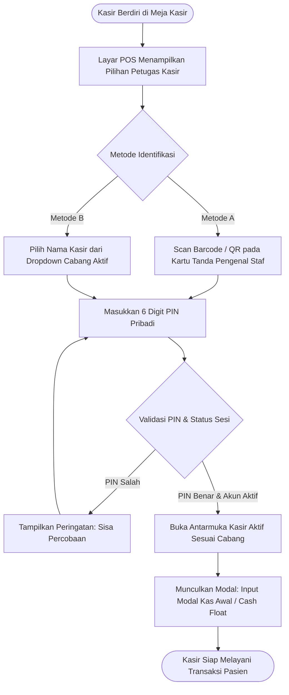
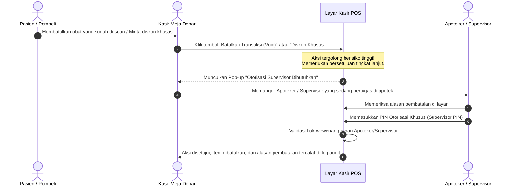
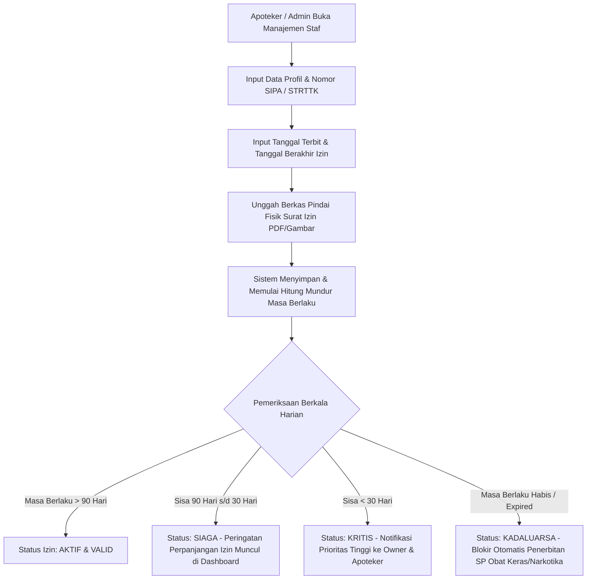

# Feature PRD: Autentikasi, Akun Pengguna, Legalitas Profesi Farmasi & Hak Akses (RBAC)

---

## 1. Metadata Dokumen

| Properti | Keterangan |
| :--- | :--- |
| **Kode Dokumen** | **PRD-PHARM-01** |
| **Nama Modul** | Autentikasi Dual-UX, Akun Pengguna, Legalitas Profesi (SIPA/STRTTK) & Hak Akses (RBAC) |
| **Dokumen Induk** | [`00-MASTER-PRD.md`](../00-MASTER-PRD.md) |
| **Depends On (Prasyarat)** | *Tidak ada (Fondasi Awal Sistem)* |
| **Consumed By (Dampak)** | • [`features/master-data/01-prd-cabang-dan-gudang.md`](./master-data/01-prd-cabang-dan-gudang.md) • [`features/pos-resep/01-prd-kasir-otc-dan-shift.md`](./pos-resep/01-prd-kasir-otc-dan-shift.md) • [`features/pos-resep/02-prd-pelayanan-resep-dokter.md`](./pos-resep/02-prd-pelayanan-resep-dokter.md) • [`features/procurement-pbf/01-prd-defekta-rop-dan-surat-pesanan-sp.md`](./procurement-pbf/01-prd-defekta-rop-dan-surat-pesanan-sp.md) • [`technical/01-dra-database-erd-master-auth.md`](../technical/01-dra-database-erd-master-auth.md) • [`technical/02-trd-auth-session-api.md`](../technical/02-trd-auth-session-api.md) |
| **Target Pengguna** | Kasir Apotek, Tenaga Teknis Kefarmasian (TTK), Apoteker Pengelola Apotek (APA), Staf Gudang & Pengadaan, Bagian Keuangan, Owner / Manajemen Apotek |

---

## 2. Latar Belakang & Masalah Bisnis

Operasional apotek memiliki dinamika kerja yang kontras antara area depan (*front-office*) dan area belakang (*backoffice*):

1. **Dilema Kecepatan vs Keamanan di Meja Kasir:**
   * Di meja kasir, antrean pasien menuntut kecepatan transaksi tinggi. Jika pergantian kasir saat jam sibuk mengharuskan mengetik email dan kata sandi yang panjang, waktu tunggu pasien akan melonjak dan meningkatkan risiko salah ketik.
   * Di sisi lain, menggunakan satu akun bersama untuk semua kasir (*shared account*) memicu bahaya besar: selisih uang laci kasir dan manipulasi transaksi tidak dapat diusut pertanggungjawabannya.
2. **Kepatuhan Terhadap Legalitas Profesi Kefarmasian (Permenkes No. 73/2016):**
   * Apotek wajib dipimpin oleh seorang **Apoteker Pengelola Apotek (APA)** yang memiliki **Surat Izin Praktik Apoteker (SIPA)** aktif.
   * Surat Pesanan (SP) obat keras, prekursor, dan narkotika ke distributor (PBF) serta etiket obat resep **wajib secara hukum mencantumkan nama dan nomor SIPA Apoteker penanggung jawab**.
   * Jika izin SIPA atau STRTTK asisten apoteker kadaluarsa tanpa disadari, apotek berisiko dijatuhi sanksi administratif, penutupan izin operasional oleh Dinas Kesehatan/BPOM, atau penolakan pengiriman obat oleh PBF.
3. **Pencegahan Kebocoran Kas & Fraud Transaksi (*Internal Shrinkage*):**
   * Pembatalan transaksi (*void item*), penghapusan tagihan, pembukaan laci kasir manual tanpa belanja, dan pemberian diskon manual adalah titik rawan manipulasi kasir.
   * Dibutuhkan sistem otorisasi berjenjang di mana tindakan berisiko tinggi wajib disetujui langsung oleh Apoteker atau Supervisor yang sedang bertugas (*Manager Override*).
4. **Kesiapan Jaringan Apotek Multi-Cabang:**
   * Staf kasir atau gudang di Cabang A tidak boleh memiliki akses untuk melihat atau mengubah data di Cabang B.
   * Sebaliknya, Owner atau Apoteker Penanggung Jawab yang membawahi beberapa outlet memerlukan fleksibilitas untuk berpindah antar-cabang tanpa harus memiliki banyak akun terpisah.

---

## 3. Persona & Konteks Penggunaan

| Persona | Lingkungan Kerja & Perangkat | Kebutuhan Utama pada Akses & Akun |
| :--- | :--- | :--- |
| **Kasir Apotek** | Meja kasir depan: PWA di PC Desktop / Laptop atau Tablet Android/iPad (10–12 inci), barcode scanner, thermal printer. | Login secepat kilat (PIN 6 digit atau scan kartu ID), sesi terkunci aman saat meninggalkan kasir, hanya bertransaksi di cabangnya sendiri. |
| **Tenaga Teknis Kefarmasian (TTK)** | Ruang racik: PWA di Tablet atau PC Desktop, area penyerahan obat, printer etiket. | Akses ke antrean resep dan racikan obat, pencatatan identitas peracik pada etiket obat, pencatatan izin STRTTK aktif. |
| **Apoteker Pengelola Apotek (APA)** | Meja konsultasi / ruang apoteker, laptop/desktop backoffice. | Verifikasi resep obat keras/narkotika, pop-up PIN otorisasi saat kasir meminta approval, penandatanganan SP resmi ke PBF, kontrol masa berlaku SIPA. |
| **Staf Gudang & Pengadaan** | Area gudang penyimpanan obat, komputer desktop gudang. | Pengelolaan defekta stok, input faktur penerimaan PBF, pencatatan nomor batch obat, tidak memiliki akses melihat laporan keuangan laba rugi. |
| **Finance & Akuntansi** | Ruang administrasi kantor, laptop/desktop. | Rekonsiliasi fisik uang shift kasir, pelunasan hutang faktur PBF, analisa laba kotor HPP, tidak dapat mengedit transaksi kasir yang sudah ditutup. |
| **Owner / Super Admin** | Kantor pusat atau mobile (akses jarak jauh). | Pemantauan performa seluruh cabang, fitur pengalihan cabang (*Branch Switcher*), pengelolaan akun karyawan dan hak akses. |

---

## 4. Alur Kerja Utama (Core User Journey)

### 4.1 Alur 1: Login Cepat Kasir di Meja Depan (POS Fast PIN)

### 4.2 Alur 2: Otorisasi Supervisor / Apoteker (*Manager Override*) di Meja Kasir

### 4.3 Alur 3: Manajemen Profil Legalitas Profesi & Pemantauan Masa Berlaku SIPA

---

## 5. Kebutuhan Fungsional & Aturan Bisnis (Business Rules)

### 5.1 Dual-UX Autentikasi & Keamanan Sesi
* **BR-PHARM-AUTH-01 (Dual-UX Entry):**
  * Antarmuka Kasir Meja Depan (*Front-Office POS*) wajib mendukung metode otentikasi instan menggunakan **PIN 6 digit numerik** atau pemindaian **barcode/QR kartu identitas staf** tanpa mewajibkan pengetikan kata sandi alfanumerik panjang.
  * Antarmuka Manajemen Belakang (*Backoffice ERP*) menggunakan autentikasi standar **Email dan Kata Sandi** yang kuat (minimal 8 karakter, kombinasi huruf besar, kecil, angka, dan simbol).
* **BR-PHARM-AUTH-02 (Isolasi Cabang Tunggal Kasir):**
  * Sesi login kasir dan asisten apoteker (TTK) **wajib terikat secara mutlak ke satu cabang apotek fisik tempat bertugas**.
  * Kasir tidak dapat melihat keranjang belanja, laci kas, atau memotong stok dari cabang lain selain cabang yang aktif pada sesinya.
* **BR-PHARM-AUTH-03 (Multi-Branch Switcher untuk Manajemen):**
  * Pengguna dengan peran Owner, Direksi, dan Apoteker Penanggung Jawab Jaringan berhak memiliki wewenang akses lintas cabang (*Multi-Branch Access*).
  * Antarmuka backoffice wajib menyediakan tombol pengalih cabang (*Branch Switcher*) di bilah navigasi utama untuk berganti konteks cabang operasional tanpa harus melakukan logout dan login ulang.
* **BR-PHARM-AUTH-04 (Batas Percobaan Salah & Kunci Sementara):**
  * Jika pengguna salah memasukkan PIN kasir sebanyak **5 (lima) kali berturut-turut**, akun kasir tersebut otomatis dikunci sementara selama **15 menit** atau wajib dibuka oleh akun Supervisor/Owner.
* **BR-PHARM-AUTH-05 (Penguncian Layar Otomatis / Auto-Lock POS):**
  * Antarmuka kasir POS wajib memiliki fitur *Auto-Lock* jika tidak ada aktivitas penekanan tombol keyboard atau pemindaian barcode selama **3 (tiga) menit**.
  * Kasir cukup memasukkan kembali 6 digit PIN miliknya untuk membuka layar tanpa menghilangkan transaksi yang sedang aktif di keranjang belanja.

### 5.2 Legalitas Profesi Farmasi (SIPA & STRTTK)
* **BR-PHARM-AUTH-06 (Mandatori Izin Praktik APA):**
  * Setiap apotek wajib mendaftarkan minimal 1 (satu) orang pengguna dengan peran **Apoteker Pengelola Apotek (APA)**.
  * Profil APA wajib memuat:
    1. Nama Lengkap beserta gelar kefarmasian (contoh: *apt. Siti Rahmawati, S.Farm.*)
    2. Nomor Surat Tanda Registrasi Apoteker (STRA)
    3. Nomor Surat Izin Praktik Apoteker (SIPA)
    4. Tanggal akhir masa berlaku izin SIPA
    5. Nomor telepon resmi yang terhubung WhatsApp untuk konfirmasi pengadaan PBF.
* **BR-PHARM-AUTH-07 (Mandatori Izin Asisten Apoteker / TTK):**
  * Staf yang bertugas meracik obat wajib memiliki peran TTK dan terdata nomor **Surat Tanda Registrasi Tenaga Teknis Kefarmasian (STRTTK)** atau Surat Izin Kerja TTK (SIKTTK) yang masih berlaku.
* **BR-PHARM-AUTH-08 (Integritas Pencetakan Dokumen Resmi):**
  * Nama lengkap dan nomor SIPA dari APA yang ditugaskan di cabang terkait wajib ditarik otomatis oleh sistem sebagai kepala surat (*letterhead*) dan bagian penandatanganan pada formulir cetak:
    * **Surat Pesanan (SP) Reguler, Obat-Obat Tertentu (OOT), Prekursor, dan Narkotika/Psikotropika** ke PBF.
    * **Etiket Obat Resep** (etiket putih dan etiket biru).
    * **Salinan Resep Dokter (*Copy Resep / Apograph*)**.
* **BR-PHARM-AUTH-09 (Blokir Otomatis Izin Kadaluarsa):**
  * Jika tanggal hari ini melewati tanggal masa berlaku SIPA APA, sistem secara otomatis:
    1. Mengubah status izin menjadi **KADALUARSA**.
    2. Menolak proses pembuatan dan pencetakan Surat Pesanan (SP) resmi ke PBF.
    3. Menampilkan pesan peringatan keras saat apotek melayani resep obat golongan Narkotika atau Psikotropika.

### 5.3 Matriks Hak Akses (Role-Based Access Control / RBAC)
* **BR-PHARM-AUTH-10 (Matriks Pembagian Wewenang 6 Persona):**
  Sistem menegakkan batasan akses fitur sebagai berikut:

| Modul & Hak Akses | Kasir | TTK (Asisten Apoteker) | Apoteker (APA) | Staf Gudang | Finance / Akunting | Owner / Super Admin |
| :--- | :---: | :---: | :---: | :---: | :---: | :---: |
| **Buka/Tutup Kasir & Transaksi OTC** | ✅ Ya | ✅ Ya | ✅ Ya | ❌ Tidak | ❌ Tidak | ✅ Ya |
| **Input Resep & Peracikan Obat** | ❌ Tidak | ✅ Ya | ✅ Ya | ❌ Tidak | ❌ Tidak | ✅ Ya |
| **Otorisasi Resep Narkotika/Psiko** | ❌ Tidak | ❌ Tidak | ✅ Ya | ❌ Tidak | ❌ Tidak | ✅ Ya |
| **Supervisor Override (Void/Diskon)**| ❌ Tidak | ❌ Tidak | ✅ Ya | ❌ Tidak | ❌ Tidak | ✅ Ya |
| **Stock Opname & Mutasi Rak** | ❌ Tidak | ✅ Ya | ✅ Ya | ✅ Ya | ❌ Tidak | ✅ Ya |
| **Buku Defekta & Buat SP ke PBF** | ❌ Tidak | ❌ Tidak | ✅ Ya | ✅ Ya (Draft) | ❌ Tidak | ✅ Ya |
| **Penerimaan Barang & Faktur PBF** | ❌ Tidak | ❌ Tidak | ✅ Ya | ✅ Ya | ❌ Tidak | ✅ Ya |
| **Laporan Laba Rugi & Finansial** | ❌ Tidak | ❌ Tidak | ❌ Tidak | ❌ Tidak | ✅ Ya | ✅ Ya |
| **Pelaporan SIPNAP Kemenkes** | ❌ Tidak | ❌ Tidak | ✅ Ya | ❌ Tidak | ❌ Tidak | ✅ Ya |
| **Master Data Cabang & Karyawan** | ❌ Tidak | ❌ Tidak | ❌ Tidak | ❌ Tidak | ❌ Tidak | ✅ Ya |

### 5.4 Kebijakan Supervisor / Manager Override
* **BR-PHARM-AUTH-11 (Triggers Override Kasir):**
  Tindakan kasir berikut ini wajib memicu dialog pop-up otorisasi supervisor:
  1. **Void Transaksi:** Membatalkan seluruh struk transaksi yang sudah memiliki lebih dari 1 item obat.
  2. **Hapus Baris Item Obat Bebas/Resep:** Menghapus item obat yang sudah di-scan setelah kasir mencetak tagihan sementara.
  3. **Diskon Manual:** Memberikan diskon persentase atau nominal di luar promo resmi apotek.
  4. **Buka Laci Kasir Manual (*No-Sale Open Drawer*):** Membuka laci uang tanpa adanya transaksi penjualan (misal untuk tukar uang kecil).
  5. **Pengeluaran Kas Kecil (*Petty Cash Out*):** Mengeluarkan uang kas dari laci untuk keperluan operasional apotek (misal beli air galon, plastik kresek).
* **BR-PHARM-AUTH-12 (Audit Log Otorisasi Override):**
  Setiap kali otorisasi override disetujui, sistem wajib merekam:
  * Waktu kejadian persis (tanggal, jam, menit, detik).
  * Nama kasir pemohon.
  * Nama supervisor/apoteker penyetuju (berdasarkan PIN yang diinput).
  * Alasan otorisasi (wajib memilih dari opsi: *Pasien Batal Beli*, *Salah Input Jumlah*, *Uang Kurang*, *Diskon Khusus Karyawan*, atau *Lainnya*).

---

## 6. Elemen Antarmuka & Input Bisnis (UI & Information Elements)

### 6.1 Layar Login Kasir Meja Depan (POS Lock Screen)
* **Informasi yang Ditampilkan:**
  * Nama Apotek dan Nama Cabang Aktif (contoh: *Apotek Sehat Bahagia - Cabang Diponegoro*).
  * Jam digital real-time dan tanggal kerja aktif.
  * Status koneksi sistem (*Online / Terhubung ke Server Lokal*).
  * Grid avatar atau daftar tombol nama kasir yang terdaftar di cabang tersebut.
* **Elemen Masukan & Interaksi:**
  * Area pemindaian barcode kartu identitas staf (kamera/scanner aktif otomatis).
  * Tombol keypad angka virtual (angka 0-9, tombol Hapus/Backspace, tombol Batal).
  * Kolom titik-titik PIN tersembunyi (masking: `● ● ● ● ● ●`).
  * Tombol darurat: "Ganti Cabang Kasir" (hanya dapat dibuka dengan otorisasi Owner).
* **Adaptasi Perangkat (PWA Responsive):**
  * **Pada PC Desktop Kasir:** Mendukung pengetikan langsung melalui Numpad fisik keyboard kasir.
  * **Pada Tablet Android / iPad:** Menampilkan tombol virtual keypad angka layar sentuh berukuran besar yang nyaman ditekan dengan jari.

### 6.2 Layar Modal Supervisor Override (Pop-up di Layar Kasir)
* **Informasi yang Ditampilkan:**
  * Judul peringatan: *"Memerlukan Otorisasi Supervisor / Apoteker"*.
  * Deskripsi tindakan yang memicu (contoh: *Pembatalan Item: Amoxicillin 500mg (2 Strip) - Nilai: Rp 24.000*).
  * Nama kasir yang sedang bertugas.
* **Elemen Masukan:**
  * Pilihan nama Supervisor / Apoteker yang menyetujui.
  * Masukan PIN Otorisasi 6 digit.
  * Dropdown alasan pembatalan/diskon (*wajib dipilih*).
  * Kolom catatan keterangan tambahan (*opsional*).
  * Tombol "Setujui Aksi" dan tombol "Tolak / Kembali".

### 6.3 Formulir Pendaftaran Staf & Izin Profesi (Web Admin Backoffice)
* **Kelompok Data Akun:**
  * Nama Lengkap Staf (teks wajib).
  * Nomor Induk Karyawan / NIK (angka unik wajib).
  * Email Resmi (teks format email, digunakan untuk login Web ERP).
  * Nomor Handphone / WhatsApp Aktif (wajib untuk notifikasi).
  * Penugasan Cabang Utama (pilihan dropdown cabang).
  * Peran Akun (Role: *Kasir, TTK, Apoteker APA, Gudang, Finance, Owner*).
  * 6 Digit PIN Kasir (input numerik 6 digit, otomatis divalidasi tidak boleh angka berulang seperti `111111` atau urut `123456`).
* **Kelompok Legalitas Khusus Apoteker & TTK (Kondisional Muncul):**
  * Nomor STRA (wajib jika peran Apoteker).
  * Nomor SIPA (wajib jika peran Apoteker, format resmi Kemenkes).
  * Nomor STRTTK / SIPTTK (wajib jika peran TTK).
  * Tanggal Terbit Izin (pemilih tanggal).
  * Tanggal Akhir Masa Berlaku Izin (pemilih tanggal).
  * Unggah Berkas Pindai Dokumen Surat Izin (file PDF atau Foto formulir resmi).

---

## 7. Skenario Pengecualian & Kasus Khusus (Edge Cases)

| Skenario Kasus Khusus | Dampak Bisnis | Penanganan Operasional Sistem |
| :--- | :--- | :--- |
| **Kasir lupa PIN di tengah antrean panjang.** | Transaksi kasir terhenti, pasien menunggu lama. | Apoteker atau Supervisor dapat membuka dialog *Reset PIN Kasir* di menu admin, memverifikasi identitas kasir, dan memberikan PIN sementara 6 digit baru dalam waktu kurang dari 1 menit. |
| **Apoteker Penanggung Jawab sedang cuti / tidak di tempat saat kasir butuh override void.** | Kasir tidak bisa membatalkan transaksi yang salah scan. | Sistem mengizinkan peran *Asisten Apoteker Senior / Kepala Toko* yang diberi mandat sementara (*Delegated Supervisor*) untuk memasukkan PIN otorisasi, dengan penandaan di log audit bahwa tindakan dilakukan oleh Pejabat Pengganti. |
| **Staf bertukar shift mendadak dengan kasir lain.** | Akuntabilitas uang laci kasir bisa bercampur jika tidak logout. | Sistem mewajibkan kasir pertama melakukan prosedur *Tutup Shift Sementara* (menghitung uang kas berjalan), lalu kasir pengganti login dengan PIN miliknya dan menginput modal kas awal baru. |
| **Masa berlaku SIPA Apoteker habis pada hari libur / akhir pekan.** | PBF menolak pengiriman obat keras, apotek tidak bisa beli stok obat. | Sistem telah memberikan peringatan berjenjang sejak H-90, H-60, H-30, dan H-7 hari ke WhatsApp APA dan Owner. Jika tetap terlewati, sistem mengunci pembuatan SP obat keras namun tetap memperbolehkan kasir menjual obat bebas (OTC) agar apotek tidak rugi total. |
| **Komputer kasir mati mendadak (listrik padam) saat transaksi berlangsung.** | Data transaksi dan status shift kasir berisiko hilang. | Saat komputer kasir dinyalakan kembali, kasir cukup memasukkan PIN. Sistem otomatis memulihkan sesi shift yang belum ditutup dan menampilkan kembali keranjang belanja terakhir yang belum dibayar (*Session Auto-Recovery*). |

---

## 8. Metrik Keberhasilan Bisnis (KPI)

1. **Efisiensi Waktu Pergantian Kasir (*Handoff Speed*):**
   * Waktu yang dibutuhkan kasir untuk login dan mulai melayani transaksi $\le 3\text{ detik}$.
2. **Nol Kebocoran Transaksi Ilegal (*Zero Unauthorized Void*):**
   * 100% pembatalan struk kasir, diskon manual, dan pengeluaran kas kecil tercatat lengkap dengan identitas supervisor penyetuju beserta alasannya.
3. **Kepatuhan Legalitas Regulasi PBF (*Zero License Rejection*):**
   * Tidak ada Surat Pesanan (SP) yang ditolak oleh PBF akibat masa berlaku izin SIPA Apoteker kadaluarsa tanpa terdeteksi sebelumnya.
4. **Keamanan Integritas Cabang (*Zero Cross-Branch Leakage*):**
   * Kasir cabang tidak dapat mengakses atau memanipulasi kas dan inventaris cabang lain.

---

## 9. Kriteria Penerimaan (Acceptance Criteria)

### AC-AUTH-01: Login Cepat Kasir Meja Depan (POS Fast PIN)
* **Given** kasir berada di layar antarmuka kasir meja depan pada Cabang Diponegoro,
* **When** kasir memilih nama akunnya dan memasukkan 6 digit PIN yang benar,
* **Then** sistem berhasil membuka antarmuka kasir dalam waktu $\le 1\text{ detik}$, mengikat transaksi ke Cabang Diponegoro, dan memunculkan pop-up input modal kas awal (*Cash Float*).

### AC-AUTH-02: Pencegahan Pembobolan PIN (Brute-Force Lock)
* **Given** pengguna berada di layar login kasir POS,
* **When** pengguna memasukkan PIN yang salah sebanyak 5 kali berturut-turut,
* **Then** sistem mengunci formulir login selama 15 menit, mencatat insiden keamanan ke log audit, dan menampilkan pesan bahwa akun terkunci sementara.

### AC-AUTH-03: Mekanisme Supervisor Override pada Pembatalan Item
* **Given** kasir telah memindai 3 obat ke dalam keranjang dan ingin membatalkan 1 strip obat resep,
* **When** kasir menekan tombol "Hapus / Void Item",
* **Then** sistem menahan proses penghapusan dan menampilkan pop-up permintaan PIN otorisasi supervisor beserta dropdown alasan pembatalan.
* **When** Apoteker memasukkan PIN yang sah dan memilih alasan "Pasien Batal Beli",
* **Then** item obat terhapus dari keranjang kasir, dan riwayat pembatalan tersimpan di log audit harian.

### AC-AUTH-04: Blokir Otomatis Penerbitan SP saat SIPA Expired
* **Given** data akun Apoteker Pengelola Apotek (APA) memiliki masa berlaku izin SIPA yang sudah melewati tanggal hari ini,
* **When** staf gudang atau APA membuka menu pembuatan Surat Pesanan (SP) resmi ke PBF,
* **Then** sistem menampilkan status "IZIN SIPA KADALUARSA", menonaktifkan tombol terbitkan/cetak SP obat keras/narkotika, dan mengarahkan pengguna untuk memperbarui data izin praktik apoteker.

### AC-AUTH-05: Pengalihan Cabang untuk Akun Manajemen (Branch Switcher)
* **Given** pengguna login ke Web Admin Backoffice dengan peran Owner yang memiliki hak akses ke Cabang Pusat dan Cabang Barat,
* **When** pengguna memilih "Cabang Barat" pada dropdown pemilih cabang di bilah navigasi atas,
* **Then** sistem seketika memutakhirkan tampilan ringkasan dashboard, stok gudang, dan laporan transaksi menjadi data spesifik milik Cabang Barat tanpa meminta login ulang.
