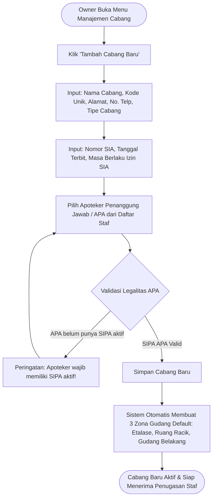
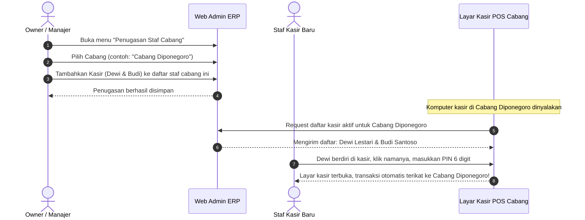

# Feature PRD: Master Cabang, Izin Operasional Apotek (SIA) & Struktur Gudang

---

## 1. Metadata Dokumen

| Properti | Keterangan |
| :--- | :--- |
| **Kode Dokumen** | **PRD-PHARM-MD01** |
| **Nama Modul** | Master Cabang, Izin Operasional Apotek (SIA), Struktur Gudang & Penugasan Staf |
| **Dokumen Induk** | [`00-MASTER-PRD.md`](../../00-MASTER-PRD.md) |
| **Depends On (Prasyarat)** | [`features/01-prd-auth-user.md`](../01-prd-auth-user.md) |
| **Consumed By (Dampak)** | • [`features/master-data/02-prd-obat-dan-satuan-bertingkat.md`](./02-prd-obat-dan-satuan-bertingkat.md) • [`features/master-data/03-prd-pbf-supplier-dan-dokter.md`](./03-prd-pbf-supplier-dan-dokter.md) • [`features/pos-resep/01-prd-kasir-otc-dan-shift.md`](../pos-resep/01-prd-kasir-otc-dan-shift.md) • [`features/inventory-wms/01-prd-alokasi-batch-fefo-dan-warning-ed.md`](../inventory-wms/01-prd-alokasi-batch-fefo-dan-warning-ed.md) • [`features/inventory-wms/03-prd-transfer-stok-antar-cabang.md`](../inventory-wms/03-prd-transfer-stok-antar-cabang.md) • [`technical/00-architecture-and-multibranch-guidelines.md`](../../technical/00-architecture-and-multibranch-guidelines.md) • [`technical/01-dra-database-erd-master-auth.md`](../../technical/01-dra-database-erd-master-auth.md) |
| **Target Pengguna** | Owner / Direksi Apotek, Apoteker Pengelola Apotek (APA), Manajer Operasional Cabang, Staf Gudang |

---

## 2. Latar Belakang & Masalah Bisnis

Pengembangan apotek modern menuntut tata kelola lokasi fisik yang teratur sejak hari pertama, baik untuk apotek mandiri (*single-outlet*) maupun apotek jaringan (*multi-branch*):

1. **Kepatuhan Hukum Perizinan Sarana Apotek (Permenkes No. 9/2017 & No. 73/2016):**
   * Setiap sarana apotek fisik wajib memiliki izin resmi pemerintah yaitu **Surat Izin Apotek (SIA)** yang diterbitkan oleh Dinas Kesehatan / Pelayanan Terpadu Satu Pintu (PTSP/OSS).
   * Izin SIA secara hukum terikat mutlak pada satu **Apoteker Pengelola Apotek (APA)** penanggung jawab. Jika apotek beroperasi tanpa penanggung jawab APA sah atau jika izin SIA kadaluarsa, apotek terancam penutupan paksa dan penyitaan obat keras oleh Balai POM.
2. **Kekacauan Penugasan Staf Tanpa Batasan Cabang yang Jelas:**
   * Banyak apotek mengalami kebocoran kas dan selisih stok karena staf kasir tidak terdaftar secara resmi di cabang tempatnya bertugas.
   * Kasir cabang A bisa salah menginput transaksi yang mengurangi stok fisik cabang B, atau login di cabang yang salah sehingga uang laci fisik tidak sesuai dengan sistem pembukuan.
3. **Struktur Penyimpanan Obat Fisik yang Tidak Terpetakan:**
   * Di dalam satu cabang apotek fisik, obat tidak diletakkan sembarangan di satu ruangan. Ada pemisahan area yang jelas:
     * **Area Etalase Depan (Display Kasir):** Khusus obat bebas (OTC), vitamin, susu, dan alat kesehatan konsumen.
     * **Area Rak Resep / Ruang Racik:** Khusus obat keras (daftar G), antibiotik, dan bahan baku puyer/kapsul.
     * **Lemari Khusus Narkotika & Psikotropika:** Lemari berkunci ganda sesuai regulasi BPOM.
     * **Gudang Simpan Belakang (*Back-Store*):** Tempat penyimpanan stok cadangan dalam satuan besar (karton/box).
   * Tanpa pemetaan lokasi rak (*bin/rack location*), staf kasir baru membutuhkan waktu lama hanya untuk mencari posisi obat saat pasien mengantre.
4. **Kebutuhan Sentralisasi Pengadaan (*Central Warehouse / Hub*):**
   * Apotek yang berkembang memiliki pola pengadaan: distributor PBF mengirim barang ke **Gudang Pusat**, lalu Gudang Pusat mendistribusikan barang ke **Cabang-Cabang Apotek Satelit**.
   * Sistem harus mampu membedakan entitas cabang yang berfungsi sebagai **Apotek Ritel (dengan kasir)** versus **Gudang Pusat Murni (hanya logistik tanpa kasir)**.

---

## 3. Persona & Konteks Penggunaan

| Persona | Lingkungan & Perangkat | Peran & Kebutuhan dalam Modul Cabang |
| :--- | :--- | :--- |
| **Owner / Super Admin** | Web Admin Backoffice (Desktop / Laptop). | Membuka cabang baru, mengisi data izin legalitas SIA, menetapkan Apoteker Penanggung Jawab (APA), dan memantau status operasional seluruh outlet. |
| **Apoteker Pengelola Apotek (APA)** | Web Admin Backoffice & POS Meja Kasir. | Memastikan masa berlaku izin SIA dan izin SIPA miliknya selalu sinkron, memvalidasi bahwa alamat apotek pada kop cetak resep/SP sesuai dokumen resmi Dinkes. |
| **Manajer Operasional / Supervisor** | Web Admin Backoffice (Desktop / Tablet). | Mengatur penugasan kasir harian (*Assign Staff to Branch*), mengelola jam buka/tutup cabang, dan menonaktifkan kasir yang sudah mutasi/berhenti. |
| **Staf Gudang & Kasir** | POS Kasir & Tablet Ruang Racik. | Mengetahui lokasi rak fisik obat saat meracik atau mengambil pesanan pasien. |

---

## 4. Alur Kerja Utama (Core User Journey)

### 4.1 Alur 1: Pembukaan Cabang Baru & Penetapan Legalitas SIA

### 4.2 Alur 2: Penugasan Staf & Aktivasi Komputer Kasir Cabang

---

## 5. Kebutuhan Fungsional & Aturan Bisnis (Business Rules)

### 5.1 Struktur & Tipe Cabang
* **BR-PHARM-BRANCH-01 (Klasifikasi Entitas Cabang):**
  Sistem mendukung 3 (tiga) jenis tipe cabang operasional:
  1. **Apotek Ritel (Retail Pharmacy):** Cabang fisik yang melayani penjualan langsung ke pasien, memiliki kasir POS, ruang racik, dan gudang display.
  2. **Apotek Klinik / Satelit:** Cabang apotek kecil yang menempel pada fasilitas klinik atau ruang praktik dokter bersama, fokus pada pelayanan resep.
  3. **Gudang Pusat (Central Distribution Hub):** Fasilitas penyimpanan logistik murni yang menerima pengadaan dari PBF dalam jumlah besar dan mendistribusikannya ke cabang lain. Cabang tipe ini **tidak memiliki meja kasir POS untuk penjualan umum**.
* **BR-PHARM-BRANCH-02 (Kode Unik Cabang):**
  * Setiap cabang wajib memiliki kode unik singkat (3–5 karakter alfanumerik huruf kapital), contoh: `CB-PUSAT`, `CB-DPN`, `GD-CENTRAL`.
  * Kode ini otomatis digunakan sebagai awalan (*prefix*) nomor dokumen transaksi kasir, nomor resep, dan nomor faktur (contoh: `INV/DPN/2026/0001`).

### 5.2 Legalitas Perizinan Apotek (SIA)
* **BR-PHARM-BRANCH-03 (Mandatori Izin SIA):**
  * Setiap cabang bertipe Apotek Ritel dan Apotek Satelit wajib mencatat data legalitas resmi:
    1. **Nomor Surat Izin Apotek (SIA)**
    2. **Tanggal Terbit Izin SIA**
    3. **Tanggal Akhir Masa Berlaku Izin SIA**
    4. **Instansi Penerbit Izin** (contoh: *Dinas Penanaman Modal & PTSP Kota Surabaya*)
    5. **Unggah Pindai Berkas Izin SIA** (format PDF atau gambar).
* **BR-PHARM-BRANCH-04 (Early Warning Masa Berlaku SIA):**
  * Sistem wajib memantau tanggal masa berlaku SIA dan menampilkan indikator status:
    * **Status HIJAU (Aktif):** Sisa masa berlaku $> 90\text{ hari}$.
    * **Status KUNING (Peringatan Perpanjangan):** Sisa masa berlaku antara $31\text{ s/d }90\text{ hari}$. Peringatan muncul di dashboard Owner dan APA.
    * **Status MERAH (Kritis):** Sisa masa berlaku $\le 30\text{ hari}$.
    * **Status KADALUARSA (Expired):** Tanggal hari ini telah melewati masa berlaku izin.
* **BR-PHARM-BRANCH-05 (Dampak Hukum SIA Kadaluarsa):**
  * Jika status SIA suatu cabang menjadi KADALUARSA, sistem secara otomatis:
    1. Membekukan penerbitan Surat Pesanan (SP) baru ke distributor PBF untuk cabang tersebut.
    2. Menampilkan peringatan permanen di bagian atas layar kasir POS cabang terkait.

### 5.3 Keterikatan Apoteker Pengelola Apotek (APA)
* **BR-PHARM-BRANCH-06 (Prinsip Satu Apotek Satu APA):**
  * Sesuai regulasi kefarmasian Indonesia, satu cabang apotek fisik ber-SIA **hanya boleh memiliki 1 (satu) orang Apoteker Pengelola Apotek (APA) utama sebagai penanggung jawab hukum**.
  * Apoteker yang sudah ditugaskan sebagai APA utama di Cabang A **tidak boleh** didaftarkan sebagai APA utama di Cabang B secara bersamaan (*anti-duplikasi penanggung jawab*).
* **BR-PHARM-BRANCH-07 (Prosedur Pergantian APA / Handover):**
  * Jika terjadi pergantian Apoteker Penanggung Jawab (misal APA lama resign atau mutasi):
    1. Owner wajib memilih APA pengganti yang memiliki nomor SIPA aktif.
    2. Sistem merekam tanggal efektif pergantian APA.
    3. Seluruh dokumen historis (resep lama, kartu stok lama, faktur lama) tetap mempertahankan nama APA yang menjabat saat dokumen tersebut diterbitkan (*immutable historical audit*).
    4. Dokumen baru sejak tanggal efektif otomatis mencantumkan nama dan nomor SIPA dari APA pengganti.

### 5.4 Penugasan Staf (*Staff Branch Binding*)
* **BR-PHARM-BRANCH-08 (Penugasan Karyawan ke Cabang):**
  * Setiap data staf karyawan fisik wajib ditugaskan minimal ke 1 (satu) cabang utama (*Home Branch*).
  * Jika staf tersebut memiliki Akun Pengguna aktif dengan hak akses POS (peran Kasir, TTK, atau Apoteker), akun tersebut otomatis tersedia untuk login di komputer kasir pada cabang penugasannya.
  * Staf tanpa akun login (seperti kurir, helper gudang fisik, atau staf umum) tetap dapat ditugaskan ke cabang untuk kepentingan administrasi operasional dan roster kerja, tanpa membebani daftar login komputer kasir.
* **BR-PHARM-BRANCH-09 (Penugasan Multi-Cabang untuk Staf Bantuan / Floating):**
  * Sistem mengizinkan seorang karyawan ditugaskan ke lebih dari 1 cabang sebagai staf perbantuan (*floating staff*) untuk mengakomodasi jadwal giliran kerja (*roster*) antar-outlet.
  * Saat staf bantuan membuka komputer POS di cabang B, sistem memverifikasi daftar penugasan aktif cabang B sebelum mengizinkan kasir membuka sesi kasir (*shift*).

### 5.5 Struktur Ruang Simpan & Rak Obat Cabang (Internal Storage Zones)
* **BR-PHARM-BRANCH-10 (Zona Simpan Baku Cabang):**
  Setiap cabang baru yang dibuat otomatis memiliki 3 (tiga) zona penyimpanan baku:
  1. **Zona Display / Etalase Kasir:** Area kasir depan untuk obat bebas (OTC).
  2. **Zona Ruang Racik / Apotek Dalam:** Area peracikan resep obat keras dan bahan baku racikan.
  3. **Zona Gudang Transit / Stok Cadangan:** Area penyimpanan dus/karton stok cadangan.
* **BR-PHARM-BRANCH-11 (Struktur Penomoran Rak Fisik):**
  * Staf gudang dapat menambahkan sub-lokasi rak dengan format: `[Nama Zona] - [Kode Rak] - [Nomor Baris]` (contoh: `Racik-Rak A-02`, `Etalase-Rak C-01`).
  * Lokasi rak ini akan ditampilkan di antarmuka kasir saat penyiapan obat resep agar staf cepat menemukan posisi fisik obat.

### 5.6 Status Operasional Cabang
* **BR-PHARM-BRANCH-12 (Siklus Status Cabang):**
  Cabang apotek memiliki 3 (tiga) status operasional:
  * **AKTIF:** Cabang beroperasi normal, kasir dapat bertransaksi, gudang dapat menerima stok.
  * **NONAKTIF (Renovasi / Libur Panjang):** Operasional kasir dibekukan sementara, data stok tetap tersimpan, transaksi penjualan baru ditolak sistem.
  * **TUTUP PERMANEN:** Cabang ditutup permanen. Seluruh sisa stok wajib ditransfer habis ke cabang lain (*Inventory Liquidation*) sebelum status ini dapat diaktifkan. Data riwayat transaksi masa lalu tetap tersimpan utuh dan tidak boleh dihapus.

---

## 6. Elemen Antarmuka & Input Bisnis (UI & Information Elements)

### 6.1 Formulir Pendaftaran & Edit Cabang (Web Admin)
* **Informasi Identitas Cabang:**
  * Nama Cabang Apotek (teks wajib, contoh: *Apotek Sehat Bahagia - Cabang Diponegoro*).
  * Kode Singkat Cabang (teks kapital wajib, 3–5 karakter, contoh: *CB-DPN*).
  * Tipe Cabang (pilihan dropdown: *Apotek Ritel, Apotek Klinik, Gudang Pusat*).
  * Alamat Lengkap Fisik (nama jalan, nomor gedung, kelurahan, kecamatan, kota/kabupaten, kode pos).
  * Titik Koordinat Peta GPS (opsional, untuk perhitungan jarak pengiriman).
  * Nomor Telepon Apotek & Nomor WhatsApp Layanan Pasien.
* **Informasi Perizinan & Legalitas (SIA):**
  * Nomor Izin Apotek / SIA (teks wajib untuk tipe apotek).
  * Tanggal Terbit Izin (pemilih tanggal).
  * Tanggal Berakhir Masa Berlaku Izin (pemilih tanggal).
  * Instansi Penerbit (teks).
  * Unggah Berkas Pindai Surat Izin (file PDF atau gambar izin fisik).
* **Penetapan Penanggung Jawab (APA):**
  * Pilihan Apoteker Pengelola Apotek (dropdown daftar apoteker yang memiliki SIPA aktif dan belum menjadi APA di cabang lain).
* **Pengaturan Jam Kerja Operasional:**
  * Pilihan hari kerja (Senin s/d Minggu).
  * Jam buka dan jam tutup standar (contoh: *07.00 s/d 22.00 WIB* atau opsi *Layanan 24 Jam*).

### 6.2 Layar Kelola Penugasan Staf Cabang (*Staff Assignment Matrix*)
* **Informasi yang Ditampilkan:**
  * Header nama cabang dan APA penanggung jawab.
  * Tabel daftar staf yang saat ini ditugaskan di cabang tersebut (Nama Staf, NIK, Peran: Kasir/TTK/Gudang, Status: Utama / Staf Bantuan).
* **Aksi Pengguna:**
  * Tombol "Tambah Staf ke Cabang": Memunculkan modal pencarian staf yang terdaftar di sistem untuk ditugaskan ke cabang ini.
  * Tombol "Hapus dari Cabang": Mencabut penugasan staf dari cabang ini (kasir tidak bisa lagi login di komputer cabang ini).

### 6.3 Layar Penataan Rak & Lokasi Penyimpanan Fisik (*Rack Management*)
* **Informasi yang Ditampilkan:**
  * Struktur pohon (*tree view*) zona penyimpanan cabang: *Zona $\rightarrow$ Nama Rak $\rightarrow$ Nomor Baris/Kotak*.
  * Jumlah jenis obat yang terpetakan di rak tersebut.
* **Aksi Pengguna:**
  * Tombol "Tambah Rak Baru" (input nama rak, kategori rak, misal: *Khusus Sirup, Khusus Salep, Khusus Antibiotik*).
  * Tombol cetak label barcode rak untuk ditempelkan pada fisik rak apotek.

---

## 7. Skenario Pengecualian & Kasus Khusus (Edge Cases)

| Skenario Kasus Khusus | Dampak Bisnis | Penanganan Operasional Sistem |
| :--- | :--- | :--- |
| **Apoteker Pengelola Apotek (APA) mengundurkan diri mendadak.** | Cabang apotek kehilangan penanggung jawab sah, operasional resep terancam ilegal. | Owner dapat mengaktifkan status *APA Transisi / Pejabat Sementara (Pjs)* dengan mengaitkan Apoteker Pengganti ber-SIPA aktif. Sistem memberi batas toleransi 30 hari untuk proses pelaporan balik nama SIA ke Dinas Kesehatan. |
| **Cabang apotek ditutup sementara karena banjir / renovasi gedung.** | Transaksi kasir tidak boleh berjalan, namun stok fisik masih ada di lokasi. | Manajer mengubah status cabang menjadi **NONAKTIF**. Sistem otomatis mengunci kasir POS agar tidak ada transaksi baru, namun modul transfer stok tetap aktif agar stok obat dapat dievakuasi ke cabang lain jika diperlukan. |
| **Cabang mau ditutup permanen (*Permanent Closure*), tapi masih ada stok obat bernilai Rp 50 juta.** | Nilai aset persediaan menggantung dan berisiko hilang tanpa jejak. | Sistem menolak perubahan status ke "TUTUP PERMANEN" jika saldo persediaan obat belum nol. Sistem mewajibkan penerbitan *Transfer Stok Masal* ke cabang lain atau gudang pusat hingga stok fisik cabang tersebut benar-benar kosong. |
| **Kasir cabang A diperbantukan darurat ke cabang B karena kasir B sakit mendadak.** | Kasir A tidak bisa login di komputer kasir cabang B jika tidak ditugaskan. | Manajer cabang B cukup membuka Web Admin, menambahkan kasir A ke daftar staf cabang B dalam waktu 10 detik. Kasir A seketika dapat memilih namanya di layar POS cabang B dan memasukkan PIN pribadinya. |

---

## 8. Metrik Keberhasilan Bisnis (KPI)

1. **Kecepatan Onboarding Cabang Baru (*Branch Deployment Speed*):**
   * Waktu yang dibutuhkan dari pembuatan data cabang hingga kasir pertama siap melayani transaksi $\le 10\text{ menit}$.
2. **Kepatuhan Regulasi 100% (*Zero Non-Compliant Branch*):**
   * Nol cabang yang beroperasi tanpa izin SIA aktif dan tanpa keterikatan APA ber-SIPA sah.
3. **Akurasi Penugasan Kasir (*Zero Cross-Branch Cash Incident*):**
   * 100% transaksi kasir tercatat pada laci kas dan cabang fisik yang benar tanpa ada pencampuran omzet antar-outlet.
4. **Efisiensi Pencarian Obat (*Picking Time Efficiency*):**
   * Berkat pemetaan nomor rak fisik di sistem, waktu yang dibutuhkan staf untuk mengambil obat di rak turun dari rata-rata 60 detik menjadi $\le 20\text{ detik}$.

---

## 9. Kriteria Penerimaan (Acceptance Criteria)

### AC-BRANCH-01: Pendaftaran Cabang Pertama Saat Inisialisasi Sistem
* **Given** sistem baru saja diinisialisasi oleh Owner,
* **When** Owner mengisi formulir pendaftaran cabang dengan data nama "Apotek Sehat - Cabang Utama", kode "CB-UTM", alamat lengkap, dan nomor SIA yang sah,
* **Then** sistem berhasil menyimpan cabang tersebut sebagai cabang utama aktif, otomatis menghasilkan 3 zona penyimpanan default (Etalase, Ruang Racik, Gudang Simpan), dan menetapkannya sebagai cabang pilihan pertama di sistem.

### AC-BRANCH-02: Validasi Penetapan Apoteker Penanggung Jawab (APA)
* **Given** Owner sedang membuat cabang baru "Cabang Barat",
* **When** Owner memilih Apoteker Siti yang telah terdaftar sebagai APA utama di "Cabang Utama",
* **Then** sistem menolak pilihan tersebut dan memunculkan pesan validasi: *"Apoteker Siti sudah menjadi penanggung jawab di Cabang Utama. Sesuai regulasi, satu apoteker hanya dapat menjadi APA utama di satu apotek fisik."*

### AC-BRANCH-03: Penugasan Staf Kasir ke Cabang Fisik
* **Given** staf kasir baru bernama "Budi Santoso" telah terdaftar di sistem akun,
* **When** Manajer Operasional memasukkan Budi Santoso ke dalam daftar penugasan "Cabang Diponegoro",
* **Then** antarmuka kasir POS di Cabang Diponegoro seketika menampilkan nama "Budi Santoso" pada daftar tombol kasir yang siap menerima login PIN.

### AC-BRANCH-04: Notifikasi Peringatan Masa Berlaku Izin SIA
* **Given** data cabang memiliki tanggal berakhir masa berlaku izin SIA tersisa 45 hari dari hari ini,
* **When** Owner atau APA cabang membuka dashboard utama,
* **Then** sistem menampilkan banner peringatan berwarna kuning: *"Izin SIA Cabang Diponegoro tersisa 45 hari. Segera lakukan proses perpanjangan di Dinas Kesehatan / OSS."*

### AC-BRANCH-05: Pembekuan Transaksi pada Cabang Nonaktif
* **Given** status operasional Cabang Diponegoro diubah oleh Owner menjadi "NONAKTIF (Renovasi)",
* **When** kasir mencoba membuka laci kasir atau login di komputer POS Cabang Diponegoro,
* **Then** sistem menolak login dan menampilkan pesan: *"Operasional Cabang Diponegoro sedang dinonaktifkan sementara. Transaksi kasir tidak dapat dilakukan."*
