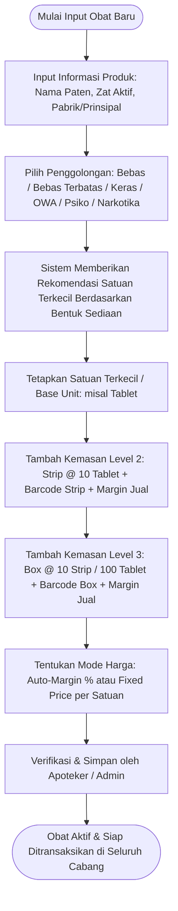
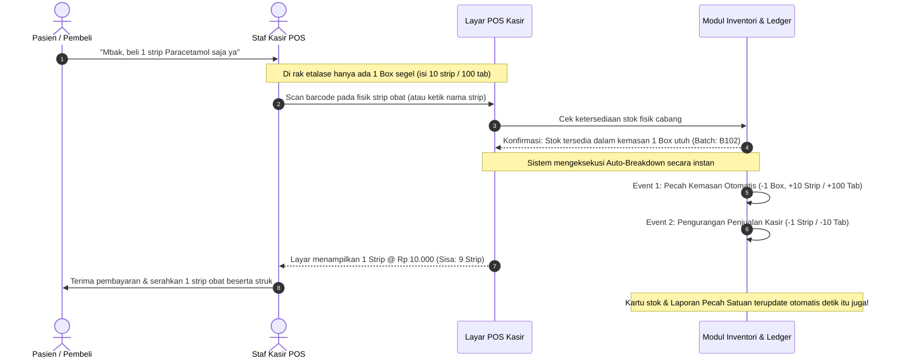

# Feature PRD: Master Obat, Penggolongan Regulasi Farmasi & Multi-Satuan Bertingkat

---

## 1. Metadata Dokumen

| Properti | Keterangan |
| :--- | :--- |
| **Kode Dokumen** | **PRD-PHARM-MD02** |
| **Nama Modul** | Master Obat, Penggolongan Regulasi Farmasi, Multi-Satuan Bertingkat & Valuasi HPP |
| **Dokumen Induk** | [`00-MASTER-PRD.md`](../../00-MASTER-PRD.md) |
| **Depends On (Prasyarat)** | • [`features/01-prd-auth-user.md`](../01-prd-auth-user.md)<br>• [`features/master-data/01-prd-cabang-dan-gudang.md`](./01-prd-cabang-dan-gudang.md) |
| **Consumed By (Dampak)** | • [`features/master-data/03-prd-pbf-supplier-dan-dokter.md`](./03-prd-pbf-supplier-dan-dokter.md)<br>• [`features/pos-resep/01-prd-kasir-otc-dan-shift.md`](../pos-resep/01-prd-kasir-otc-dan-shift.md)<br>• [`features/pos-resep/02-prd-pelayanan-resep-dan-racikan.md`](../pos-resep/02-prd-pelayanan-resep-dan-racikan.md)<br>• [`features/inventory-wms/01-prd-alokasi-batch-fefo-dan-warning-ed.md`](../inventory-wms/01-prd-alokasi-batch-fefo-dan-warning-ed.md)<br>• [`features/inventory-wms/02-prd-stock-opname-dan-kartu-stok.md`](../inventory-wms/02-prd-stock-opname-dan-kartu-stok.md)<br>• [`features/procurement/02-prd-penerimaan-barang-faktur-pbf.md`](../procurement/02-prd-penerimaan-barang-faktur-pbf.md)<br>• [`technical/00-architecture-and-multibranch-guidelines.md`](../../technical/00-architecture-and-multibranch-guidelines.md)<br>• [`technical/01-dra-database-erd-master-auth.md`](../../technical/01-dra-database-erd-master-auth.md)<br>• [`technical/03-trd-master-data-api.md`](../../technical/03-trd-master-data-api.md) |
| **Target Pengguna** | Apoteker Pengelola Apotek (APA), Tenaga Teknis Kefarmasian (TTK), Kasir POS, Bagian Pengadaan (Procurement), Owner / Keuangan |

---

## 2. Latar Belakang & Masalah Bisnis

Pengelolaan persediaan obat di apotek memiliki kompleksitas unik yang membedakannya secara fundamental dari toko ritel umum:

1. **Kompleksitas Kemasan Fisik & Konversi Bertingkat (*Multi-Level Packaging*):**
   * Apotek membeli obat dari Pedagang Besar Farmasi (PBF) dalam kemasan besar (*Karton*, *Box*, *Dus*, atau *Botol 1.000s*).
   * Namun, obat tersebut dijual ke pasien dalam berbagai variasi kemasan: per *Box*, per *Strip/Blister*, per *Tablet/Kapsul*, atau bahkan dipecah menjadi dosis racikan miligram (*mg*) dan mililiter (*ml*).
   * Tanpa sistem satuan bertingkat yang baku, staf apotek sering membuat data produk ganda (misal: "Paracetamol Box" dan "Paracetamol Strip" dibuat sebagai dua item terpisah), yang mengakibatkan stok fisik terpecah, kartu stok desinkronisasi, dan laporan nilai aset apotek kacau.

2. **Friksi Kasir saat Eceran (*Breakdown / De-aggregation*):**
   * Di lapangan, pasien sering membeli hanya 1 strip dari obat yang masih tersimpan dalam 1 box segel di etalase.
   * Pada sistem kasir konvensional, kasir harus keluar dari layar penjualan untuk membuat dokumen manual "Pecah Satuan" terlebih dahulu sebelum bisa memindai barcode strip, yang menyebabkan antrean panjang dan komplain pasien.
   * Diperlukan mekanisme **Pecah Satuan Otomatis (*Seamless Auto-Breakdown*)** yang mengeksekusi konversi kemasan dalam hitungan milidetik di kasir tanpa hambatan, namun tetap membukukan riwayat lalu lintas mutasi secara disiplin untuk audit stok.

3. **Ketidakpastian Perhitungan HPP & Laba Rugi Akuntansi:**
   * Pembelian obat dari PBF kerap disertai skema diskon bertingkat (misal: diskon reguler 5% + diskon tambahan 2.5%) dan bonus barang cuma-cuma (*on-faktur* seperti *"Beli 10 Box Gratis 1 Box"*).
   * Jika HPP tidak dihitung secara presisi hingga ke level satuan terkecil (*Base Unit*), margin keuntungan eceran menjadi bias, penetapan harga jual salah sasaran, dan laporan laba-rugi keuangan apotek menjadi tidak valid.

4. **Kepatuhan Regulasi Farmasi (Permenkes & BPOM):**
   * Obat memiliki klasifikasi legalitas ketat: **Obat Bebas** (Lingkaran Hijau), **Bebas Terbatas** (Lingkaran Biru dengan Peringatan P1–P6), **Obat Keras** (Lingkaran Merah / K, wajib resep), **Obat Wajib Apotek (OWA)**, **Prekursor**, **Obat-Obat Tertentu (OOT)**, **Psikotropika**, dan **Narkotika**.
   * Kesalahan klasifikasi obat atau ketiadaan pencatatan zat aktif generik dapat berujung pada sanksi administratif hingga penutupan izin apotek oleh Dinas Kesehatan dan Balai POM.

---

## 3. Persona & Konteks Penggunaan

| Persona | Lingkungan & Perangkat | Peran & Kebutuhan dalam Modul Obat & Satuan |
| :--- | :--- | :--- |
| **Apoteker Pengelola Apotek (APA)** | Web Admin ERP (Desktop / Laptop). | Mengesahkan klasifikasi regulasi obat (Keras/Bebas/Psiko/Narkotika), menetapkan hierarki kemasan dan satuan terkecil, menyetujui wizard migrasi satuan jika ada perubahan kemasan pabrik, serta memverifikasi laporan pecah satuan. |
| **Tenaga Teknis Kefarmasian (TTK) / Meja Racik** | Tablet / Desktop Ruang Racik. | Mengambil obat eceran atau pecahan desimal untuk puyer/kapsul racikan, memeriksa zat aktif generik untuk rekomendasi substitusi obat paten, dan mengecek sisa strip terbuka di rak. |
| **Kasir POS (Front-Office)** | Layar Sentuh / Keyboard Kasir POS & Barcode Scanner. | Memindai barcode kemasan apa pun (Box, Strip, Botol) secara instan, melayani pembelian eceran dengan harga bertingkat otomatis, serta melihat stok ramah manusia (*Dual-View Display*). |
| **Staf Pengadaan & Gudang** | Web Admin ERP (Desktop / Mobile Scanner). | Mencocokkan kemasan datang dari PBF dengan pesanan (PO), memvalidasi bonus kemasan gratis, dan memeriksa HPP kalkulasi otomatis sistem. |
| **Owner / Keuangan** | Web Admin ERP (Desktop). | Mengatur margin keuntungan per tingkat satuan (eceran vs grosir), memantau valuasi persediaan di neraca, dan menganalisis profit dari pemecahan satuan (*unbundling margin*). |

---

## 4. Alur Kerja Utama (Core User Journey)

### 4.1 Alur 1: Pendaftaran Master Obat & Definisi Hierarki Multi-Satuan



---

### 4.2 Alur 2: Transaksi Penjualan Eceran POS & Auto-Breakdown Mutasi



---

### 4.3 Alur 3: Prosedur Aman Penggantian Satuan Terkecil (Unit Re-basing Wizard)

```mermaid
flowchart TD
    A([Kebutuhan Mengubah Satuan Terkecil]) --> B{Apakah Obat Sudah Pernah Ditransaksikan / Ada Stok?}
    B -->|Belum Pernah / Stok = 0| C[Buka Form Edit Master Obat -> Langsung Ubah Satuan Terkecil -> Simpan]
    B -->|Sudah Ada Transaksi / Stok > 0| D[Sistem Mengunci Kolom Satuan Terkecil - Akses Hard Edit Ditolak]
    D --> E[Apoteker Membuka Menu 'Wizard Konversi Satuan Terkecil']
    E --> F[Pastikan Antrean Kasir & Draft PO Selesai]
    F --> G[Input Satuan Baru & Rasio Pengali Konversi: misal 1 Strip = 10 Tablet]
    G --> H[Sistem Menghitung Dampak: Stok Fisik Baru & HPP Baru Proporsional]
    H --> I[Review Valuasi Aset: Total Nilai Persediaan Wajib 100% Sama]
    I --> J[Otorisasi PIN Apoteker Pengelola Apotek (APA)]
    J --> K[Sistem Membukukan Mutasi Jurnal Konversi Otomatis]
    K --> L([Satuan Terkecil Berhasil Dimigrasi Tanpa Merusak Histori Transaksi])
```

---

## 5. Kebutuhan Fungsional & Aturan Bisnis (Business Rules)

### 5.1 Katalog Produk & Penggolongan Regulasi Farmasi
* **BR-PHARM-PROD-01 (Katalog Ganda: Nama Dagang vs Komposisi Zat Aktif):**
  Setiap master obat wajib memuat:
  1. **Nama Dagang / Nama Paten:** Nama komersial dari pabrik (contoh: *Panadol Extra*, *Amoxsan 500mg*).
  2. **Komposisi Zat Aktif (*Active Pharmaceutical Ingredient - API*):** Senyawa generik dan kekuatan dosis (contoh: *Paracetamol 500 mg + Caffeine 65 mg*, *Amoxicillin Trihydrate 500 mg*).
  3. **Pencarian Cerdas Kasir:** Layar kasir wajib memungkinkan pencarian berdasarkan nama paten MAUPUN komposisi zat aktif guna mempermudah penawaran obat substitusi generik berkhasiat serupa kepada pasien.
* **BR-PHARM-PROD-02 (Penggolongan Obat BPOM & Kemenkes):**
  Setiap produk farmasi wajib diklasifikasikan ke dalam salah satu golongan regulasi resmi:
  1. **Obat Bebas (Lingkaran Hijau Garis Hitam):** Dapat dijual bebas tanpa resep (*Over The Counter - OTC*).
  2. **Obat Bebas Terbatas (Lingkaran Biru Garis Hitam):** Dapat dijual bebas terbatas, wajib disertai tanda peringatan resmi (*P.No.1 s/d P.No.6*).
  3. **Obat Keras (Lingkaran Merah Huruf K):** Hanya boleh diserahkan dengan Resep Dokter yang sah, kecuali yang masuk daftar OWA.
  4. **Obat Wajib Apotek (OWA 1, 2, 3):** Obat keras yang dapat diserahkan oleh Apoteker kepada pasien tanpa resep dokter dalam batas jumlah tertentu sesuai ketentuan Menkes.
  5. **Prekursor Farmasi:** Obat yang mengandung zat kimia bahan baku narkotika/psikotropika (contoh: *Pseudoephedrine*, *Ephedrine*), wajib pelaporan khusus dan pemesanan menggunakan Surat Pesanan (SP) Prekursor.
  6. **Obat-Obat Tertentu (OOT):** Obat yang kerap disalahgunakan (contoh: *Tramadol*, *Trihexyphenidyl*, *Dextromethorphan*), wajib menggunakan Surat Pesanan (SP) OOT.
  7. **Psikotropika (Golongan II, III, IV):** Wajib resep dokter, penyimpanan di lemari khusus, dan wajib pelaporan bulanan SIPNAP.
  8. **Narkotika (Golongan I, II, III):** Wajib resep dokter asli (tidak boleh copy resep dari apotek lain), disimpan di lemari berkunci ganda (*double lock*), dan pelaporan mutlak SIPNAP.
* **BR-PHARM-PROD-03 (Pabrik Farmasi / Prinsipal & Nomor Registrasi BPOM):**
  Setiap obat wajib mencatat pabrik produsen (*Manufacturer/Principal*, contoh: *PT Kalbe Farma*, *PT Sanbe Farma*) dan nomor izin edar resmi dari BPOM (*Nomor Registrasi/NIE*, contoh: *DKL1234567890A1*).

---

### 5.2 Kamus Master Satuan Baku (*Units of Measurement - UoM Directory*)
* **BR-PHARM-UOM-01 (Kamus Terstandarisasi & Larangan Mutlak Free-Text):**
  Satuan ukuran pada seluruh katalog obat, kartu stok, faktur pembelian, etiket, dan layar kasir **BUKAN merupakan teks bebas (*free-text input*)**, melainkan wajib dipilih dari **Kamus Master Satuan (*Master UoM Directory*)** yang terpusat. Hal ini guna mencegah duplikasi data (*misal: "Tab", "Tablet", "tblt"*), ambiguitas nama satuan, dan kegagalan integrasi.
* **BR-PHARM-UOM-02 (Struktur Data Standar & Kepatuhan SatuSehat Kemenkes):**
  Setiap entitas dalam Kamus Master Satuan wajib memuat:
  1. **Kode Unik Satuan (3–5 Karakter Kapital):** Kode unik sistem (contoh: `TAB`, `KAP`, `KPS`, `STR`, `BOX`, `BTL`, `TBE`, `AMP`, `VIA`, `SCT`, `POT`, `ML`, `GR`, `MG`).
  2. **Nama Satuan Resmi:** Nama baku dalam Bahasa Indonesia (contoh: *Tablet*, *Kaplet*, *Kapsul*, *Strip*, *Box*, *Botol*, *Tube*, *Ampul*, *Vial*, *Sachet*, *Pot*, *Mililiter*, *Gram*, *Miligram*).
  3. **Singkatan Cetak Etiket & Struk:** Format pendek untuk keterbacaan ruang cetak printer thermal (contoh: *Tab*, *Kps*, *Str*, *Btl*, *Tbe*, *ml*).
  4. **Kategori Dimensi Fisik:** Pengelompokan fisik satuan (Cacah/Count, Kemasan/Pack, Wadah/Container, Volume/Cairan, Berat/Massa).
  5. **Pemetaan Kode Standar SatuSehat / FHIR (UCUM):** Pemetaan wajib ke format *Unified Code for Units of Measure* (UCUM) sesuai regulasi Kementerian Kesehatan RI (contoh: `TAB` $\rightarrow$ `{tbl}`, `STR` $\rightarrow$ `{strip}`, `BTL` $\rightarrow$ `{bottle}`, `ML` $\rightarrow$ `mL`, `MG` $\rightarrow$ `mg`) guna menjamin pertukaran data *MedicationDispense* SatuSehat valid 100%.
* **BR-PHARM-UOM-03 (Proteksi Integritas Relasional - Dilarang Hapus Satuan Aktif):**
  Satuan dalam Kamus Master yang sudah terikat pada minimal 1 (satu) produk obat berstatus **Terkunci (*In-Use*) dan DILARANG KERAS DIHAPUS (*Restricted Deletion*)** dari sistem agar tidak merusak integritas riwayat peracikan resep, kartu stok, dan laporan audit BPOM.

---

### 5.3 Hierarki Multi-Satuan Bertingkat (*Packaging Hierarchy*)
* **BR-PHARM-SATUAN-01 (Invarian Mutlak: Single Base Unit):**
  Setiap produk obat **HANYA MEMILIKI SATU Satuan Terkecil (*Base Unit / Smallest Dispensing Unit - SDU*)** sebagai patokan atomik sistem. Seluruh pencatatan stok fisik gudang, mutasi batch, kartu stok, dan kalkulasi HPP **WAJIB dihitung dan disimpan dalam Satuan Terkecil ini**.
* **BR-PHARM-SATUAN-02 (Struktur Multi-Tingkat Maksimal 4 Level):**
  Sistem mendukung hierarki hingga 4 tingkat satuan dengan rantai konversi matematis terhadap Satuan Terkecil (*Base Unit*):
  * **Level 1 (Terkecil / Base Unit):** `Tablet`, `Kapsul`, `Kaplet`, `Botol`, `Tube`, `Sachet`, `Ampul`, `Vial`, `Pcs`, `Gram`, `ml`. (Pengali = 1).
  * **Level 2 (Sub-Kemasan / Ritel):** Kemasan menengah, contoh: `Strip`, `Blister`, `Papan`. (Pengali = Jumlah Base Unit per Level 2).
  * **Level 3 (Kemasan Luar / Pembelian):** Kemasan luar pabrik, contoh: `Box`, `Dus`, `Kotak`, `Pot`. (Pengali = Jumlah Base Unit per Level 3).
  * **Level 4 (Kemasan Besar / Grosir / Bulk):** Kemasan pengadaan partai besar, contoh: `Karton`, `Ctn`, `Ball`. (Pengali = Jumlah Base Unit per Level 4).
* **BR-PHARM-SATUAN-03 (Multi-Barcode Independen per Tingkat Satuan):**
  Setiap tingkat satuan dapat memiliki kode barcode fisik (*UPC/EAN/GS1*) yang berbeda:
  * Barcode Box: Tercetak pada kardus luar kemasan pabrik.
  * Barcode Strip: Tercetak pada aluminium foil blister strip.
  * Barcode Eceran / Internal: Barcode cetak label apotek untuk eceran/plastik klip.
  * **Aturan Pindai Kasir:** Saat barcode dipindai di kasir, sistem secara otomatis mengenali tingkat kemasan yang bersangkutan, menerapkan harga jual satuan tersebut, dan memotong stok sejumlah pengali satuan tersebut dari batch FEFO aktif.
* **BR-PHARM-SATUAN-04 (Penyajian Ramah Manusia - *Dual-View Display*):**
  Pada seluruh antarmuka (Kasir POS, Manajemen Gudang, Kartu Stok, dan Laporan), sistem wajib menyajikan kuantitas stok dalam dua format:
  1. **Format Agregat Kemasan (*Human-Readable*):** Menampilkan rincian kemasan fisik (contoh: *"2 Box, 4 Strip, 7 Tablet"*).
  2. **Format Satuan Atomik (*Total Base Unit*):** Angka mutlak satuan terkecil (contoh: *"Total: 247 Tablet"*).
* **BR-PHARM-SATUAN-05 (Dukungan Pecahan Desimal untuk Racikan):**
  Khusus untuk peracikan obat (puyer/kapsul/sirup racik), sistem wajib mendukung kuantitas bertipe pecahan desimal presisi hingga 3 angka di belakang koma (contoh: pengambilan `1.500` tablet, `0.250` tablet, atau `7.500` ml sirup curah).

---

### 5.4 Proses Pecah Satuan (*De-aggregation / Repackaging*) & Lalu Lintas Stok
* **BR-PHARM-BREAKDOWN-01 (Seamless Auto-Breakdown di Kasir POS):**
  Jika kasir menjual suatu kemasan (misal: 1 Strip) namun stok dalam kemasan tersebut berstatus 0 di rak fisik sementara masih terdapat kemasan induk yang lebih besar (misal: 1 Box) dari batch yang sama/valid:
  1. Sistem mengeksekusi pemecahan kemasan secara otomatis tanpa memunculkan pop-up formulir manual.
  2. Transaksi penjualan kasir diselesaikan seketika tanpa menghambat antrean.
* **BR-PHARM-BREAKDOWN-02 (Pencatatan Ganda Lalu Lintas Stok - *Immutable Ledger Entry*):**
  Setiap pemecahan satuan otomatis di kasir wajib menghasilkan 2 (dua) baris mutasi resmi pada kartu stok digital:
  1. **Mutasi Tipe `AUTO_BREAKDOWN`:** Mengurangi 1 unit kemasan asal dan menambah $N$ unit kemasan hasil pecah, mencatat nomor batch, tanggal kedaluwarsa, identitas kasir, dan nomor referensi struk kasir pemicu.
  2. **Mutasi Tipe `DISPENSE_SALE`:** Mengeluarkan unit kemasan yang dibeli pasien.
* **BR-PHARM-BREAKDOWN-03 (Pecah Satuan Fisik di Gudang / Etalase):**
  Sistem menyediakan menu manual bagi staf gudang/TTK untuk melakukan pemecahan kemasan fisik terjadwal (misal: membuka 5 box Amoxicillin menjadi 50 strip untuk mengisi etalase kasir). Proses ini dicatat sebagai mutasi perpindahan rak (*Bin Transfer with Packaging Disassembly*).
* **BR-PHARM-BREAKDOWN-04 (Integritas Batch & Expired Date):**
  Seluruh sub-kemasan dan eceran hasil pemecahan satuan **WAJIB membawa data Nomor Batch dan Tanggal Kedaluwarsa (ED) yang identik dengan kemasan induk asalnya**. Dilarang keras menghilangkan jejak batch pada obat eceran.
* **BR-PHARM-BREAKDOWN-05 (Kebijakan Habiskan Kemasan Terbuka - *Open-Box First Rule*):**
  Sistem mengarahkan kasir dan staf untuk menghabiskan stok pada kemasan yang sudah berstatus terbuka (*unsealed/open pack*) sebelum memecah kemasan segel baru pada batch yang sama, guna mencegah penumpukan obat terbuka di rak.
* **BR-PHARM-BREAKDOWN-06 (Laporan Khusus Pemecahan Satuan - *De-aggregation Audit Report*):**
  Sistem menyediakan laporan berkala yang dapat difilter berdasarkan cabang, tanggal, nama obat, dan operator, memuat:
  * Waktu & operator pembuka kemasan.
  * Nomor transaksi pemicu.
  * Kemasan asal $\rightarrow$ kemasan hasil pecah.
  * Nomor batch dan tanggal kedaluwarsa.
  * Potensi penambahan nilai penjualan (*unbundling margin gain*).

---

### 5.5 Kebijakan Ganti Satuan Terkecil (*Unit Re-basing Wizard*)
* **BR-PHARM-REBASE-01 (Larangan Mutlak Hard Edit pada Data Bertransaksi):**
  Sistem **DILARANG KERAS** mengizinkan pengubahan langsung (*direct update / hard edit*) pada kolom Satuan Terkecil (*Base Unit*) jika produk obat tersebut sudah memiliki riwayat transaksi (pembelian PBF, penjualan kasir, mutasi transfer, atau kartu stok $> 0$).
* **BR-PHARM-REBASE-02 (Fleksibilitas Edit untuk Produk Baru Tanpa Riwayat):**
  Jika produk obat baru didaftarkan dan belum pernah memiliki histori transaksi apa pun serta stok fisik $= 0$, pengubahan satuan terkecil diizinkan secara bebas oleh Admin Master Data.
* **BR-PHARM-REBASE-03 (Wizard Migrasi Satuan Resmi - *Unit Re-basing Wizard*):**
  Jika perubahan satuan terkecil mutlak diperlukan pada obat yang sudah memiliki stok/transaksi:
  1. Aksi wajib diotorisasi menggunakan kredensial/PIN **Apoteker Pengelola Apotek (APA)** atau **Superadmin**.
  2. Seluruh transaksi gantung (antrean kasir belum bayar atau draft PO) untuk obat tersebut wajib diselesaikan atau dibatalkan.
  3. Pengguna memasukkan rasio pengali satuan baru terhadap satuan lama.
  4. Sistem otomatis membukukan transaksi penyesuaian:
     * Menarik total saldo fisik pada satuan lama (*Adjustment Out*).
     * Memasukkan total saldo fisik baru sesuai rasio pengali baru (*Adjustment In*).
     * Menghitung HPP baru yang proporsional sehingga **total nilai aset persediaan tidak berubah sama sekali (Nol Selisih / 100% Imbang)**.
* **BR-PHARM-REBASE-04 (Pencegahan Sejak Dini - *Smart Form Default Recommendation*):**
  Saat pengguna menginput obat baru, sistem otomatis memberikan rekomendasi satuan terkecil berbasis bentuk sediaan farmasi:
  * Sediaan Padat Ecer (Tablet, Kaplet, Kapsul, Pil) $\rightarrow$ *Default Base Unit: Tablet / Kapsul*.
  * Sediaan Cair Segel Pabrik (Sirup, Drop, Suspensi 60ml) $\rightarrow$ *Default Base Unit: Botol*.
  * Sediaan Cair Curah Racikan (Alkohol 70%, Sirup Simpleks Curah) $\rightarrow$ *Default Base Unit: ml*.
  * Sediaan Topikal Segel (Salep, Krim, Gel) $\rightarrow$ *Default Base Unit: Tube*.
  * Sediaan Injeksi (Injeksi, Infus) $\rightarrow$ *Default Base Unit: Ampul / Vial / Flabot*.

---

### 5.6 Valuasi HPP (Harga Pokok Penjualan) & Strategi Harga Bertingkat
* **BR-PHARM-HPP-01 (Kalkulasi HPP Bersih per Base Unit):**
  HPP obat mutlak dihitung dan disimpan pada level **Satuan Terkecil (*Base Unit*)**. Rumus baku HPP dari faktur PBF:
  $$\text{HPP Base Unit} = \frac{\text{Total Tagihan Faktur Bersih (Harga Beli PBF} - \text{Diskon Reguler} - \text{Diskon Tambahan} + \text{PPN 11\%/12\%)}}{\text{Total Kuantitas Fisik yang Diterima dalam Base Unit}}$$
* **BR-PHARM-HPP-02 (Proporsionalitas HPP Kemasan Hierarki):**
  HPP untuk satuan di atasnya selalu merupakan perkalian proporsional matematis:
  $$\text{HPP Satuan Level } N = \text{HPP Base Unit} \times \text{Rasio Pengali ke Base Unit}$$
* **BR-PHARM-HPP-03 (Penanganan Bonus Barang Faktur PBF - *Free Goods Cost Absorption*):**
  Jika pembelian PBF memuat bonus barang cuma-cuma (*on-faktur*, contoh: *"Beli 10 Box Dapat Gratis 1 Box"*):
  1. Kuantitas bonus barang wajib dimasukkan ke dalam total fisik yang diterima (Total fisik = $10 + 1 = 11$ Box).
  2. Nilai rupiah tagihan tetap dihitung hanya untuk kuantitas yang dibayar (10 Box).
  3. Sistem otomatis merevisi HPP per Base Unit menjadi lebih rendah secara proporsional, sehingga merefleksikan nilai riil barang masuk dan meningkatkan margin laba kotor apotek.
* **BR-PHARM-HPP-04 (Kekekalan Nilai Persediaan Saat Pecah Satuan):**
  Proses pemecahan satuan (*Auto-Breakdown* maupun *Physical Repacking*) **TIDAK MENGUBAH nilai aset persediaan apotek sedikit pun**. Nilai persediaan sebelum dipecah harus identik 100% dengan nilai persediaan setelah dipecah.
* **BR-PHARM-HPP-05 (Metode Valuasi Persediaan):**
  Sistem mendukung dua metode valuasi HPP persediaan:
  1. **Moving Average Cost (Biaya Rata-Rata Bergerak):** Dihitung ulang secara otomatis setiap kali ada penerimaan barang baru dari PBF dengan harga beli berbeda.
  2. **Batch-Specific Costing:** HPP melekat secara spesifik pada nomor batch masing-masing saat penerimaan barang dari PBF, dan HPP batch tersebut dipotong ke beban pokok laba rugi saat batch tersebut keluar di kasir sesuai urutan FEFO.
* **BR-PHARM-HPP-06 (Strategi Harga Jual Bertingkat - *Tiered Pricing & Margins*):**
  Apotek dapat menerapkan harga jual bertingkat untuk setiap level kemasan:
  * **Pola Margin Sehat Apotek:** Makin kecil satuan (eceran/strip/tablet), persentase margin keuntungan diatur makin tinggi guna mengompensasi biaya plastik klip, waktu pelayanan staf, dan risiko sisa kemasan rusak.
  * **Mode Penetapan Harga:**
    1. *Mode Auto-Margin:* Sistem menghitung harga jual otomatis berdasarkan formula: $\text{Harga Jual} = \text{HPP Satuan} \times (1 + \text{Margin \%})$.
    2. *Mode Fixed Price Override:* Apoteker/Manajer mengunci harga nominal bulat tertentu per satuan (contoh: 1 Box = Rp 90.000, 1 Strip = Rp 10.000, 1 Tablet = Rp 1.200).

---

## 6. Elemen Antarmuka & Input Bisnis (UI & Information Elements)

### 6.1 Antarmuka Manajemen Kamus Master Satuan (*Master UoM Directory*)
* **Tabel Direktori Satuan:**
  * Kolom: Kode Satuan (unik), Nama Satuan Baku, Singkatan Struk/Etiket, Kategori Dimensi, Pemetaan Standar Kemenkes (UCUM), Status Penggunaan (*In-Use / Unused*).
  * Filter & Pencarian: Pencarian cepat berdasarkan kode atau nama satuan.
* **Aksi & Tombol:**
  * Tombol *"Tambah Satuan Baku Baru"*.
  * Tombol *"Edit Satuan"* (Dapat mengedit singkatan cetak, nama, dan mapping UCUM).
  * Tombol *"Hapus Satuan"* (Hanya aktif jika status *Unused*. Jika *In-Use*, tombol dinonaktifkan dengan tooltip: *"Satuan sedang digunakan oleh katalog obat aktif"*).

### 6.2 Formulir Pendaftaran / Edit Master Obat
* **Informasi Produk Utama:**
  * Nama Dagang / Paten (Teks wajib).
  * Komposisi Zat Aktif / Generik (Teks multiline / tag zat aktif).
  * Kekuatan Dosis (contoh: *500 mg*, *120 mg / 5 ml*).
  * Bentuk Sediaan (Dropdown: Tablet, Kaplet, Kapsul, Sirup, Salep, Tetes Mata, Injeksi, Puyer).
  * Pabrik Farmasi / Prinsipal (Dropdown / Autocomplete Master PBF & Pabrik).
  * Nomor Izin Edar / NIE BPOM (Teks wajib untuk obat teregistrasi).
  * Golongan Regulasi Farmasi (Radio Button: Obat Bebas, Bebas Terbatas, Obat Keras, OWA, Prekursor, OOT, Psikotropika, Narkotika).
  * Tanda Peringatan Khusus (Khusus Bebas Terbatas: P1 s/d P6).
  * Lokasi Rak Fisik Default (Pilihan Rak Gudang & Rak Etalase Cabang).

* **Matriks Hierarki Satuan Bertingkat (Searchable Dropdown dari Master Satuan):**
  Tabel interaktif penambahan tingkat kemasan:
  * Baris 1 (Level Terkecil): Pilihan Satuan dari Kamus (misal: `[TAB] Tablet`), Pengali $= 1$, Barcode Satuan, HPP, Margin %, Harga Jual Default.
  * Baris 2 (Level Menengah): Pilihan Satuan dari Kamus (misal: `[STR] Strip`), Pengali (misal: *10* Tablet), Barcode Satuan, HPP Terkalkulasi, Margin %, Harga Jual Default.
  * Baris 3 (Level Kemasan Luar): Pilihan Satuan dari Kamus (misal: `[BOX] Box / Dus`), Pengali (misal: *100* Tablet), Barcode Satuan, HPP Terkalkulasi, Margin %, Harga Jual Default.
  * Status Kemasan Penjualan Utama Kasir (Radio pilihan kemasan yang paling sering dijual di meja kasir).

### 6.3 Tampilan Kasir POS (Dual-View Display)
* **Kotak Info Stok Obat Saat Dicari:**
  * Baris Atas: *"Paracetamol 500mg (Pabrik: Kimia Farma)"*
  * Baris Tengah (Format Kemasan): **Stok: 2 Box, 6 Strip, 3 Tablet**
  * Baris Bawah (Format Satuan Terkecil): **Total Fisik: 263 Tablet**
  * Indikator Batch FEFO Terdekat: *Batch: B9021 (ED: 12/2027)*
* **Pilihan Satuan di Layar Kasir:**
  Tombol cepat / dropdown satuan: `[ Box @ Rp 90.000 ]`, `[ Strip @ Rp 10.000 ]`, `[ Tablet @ Rp 1.200 ]`.

### 6.4 Antarmuka Laporan Pemecahan Satuan (*Unit Breakdown Report*)
* **Filter:** Cabang, Rentang Tanggal, Kategori Golongan Obat, Operator Kasir/Gudang.
* **Daftar Rekam Jejak:**
  * Tanggal & Jam Transaksi.
  * No. Referensi Pemicu (Struk Penjualan POS / Peracikan Resep / Mutasi Gudang).
  * Nama Obat & Pabrik.
  * No. Batch & Expired Date.
  * Kemasan Asal $\rightarrow$ Kemasan Hasil Pecah (misal: `1 Box (100 Tab) → 10 Strip`).
  * Kuantitas yang Terjual Seketika & Kuantitas Sisa Kemasan Terbuka di Rak.
  * Operator Penanggung Jawab.

---

## 7. Skenario Pengecualian & Kasus Khusus (Edge Cases)

| Skenario Kasus Khusus | Risiko Operasional | Penanganan Sistem & Aturan Bisnis |
| :--- | :--- | :--- |
| **Kasir memindai barcode strip, tetapi di rak etalase tidak ada box yang tersisa dari batch aktif.** | Transaksi terhambat atau stok menjadi minus. | Sistem memeriksa apakah ada batch berikutnya yang tanggal kedaluwarsanya masih valid sesuai aturan FEFO. Jika ada, sistem mengalihkan pemecahan ke batch terdekat berikutnya dan memunculkan notifikasi kepada kasir: *"Membuka Box dari Batch [No. Batch Baru] (ED: MM/YY)"*. Jika seluruh batch habis, sistem memblokir penjualan dan memberitahu stok kosong. |
| **Pasien membatalkan pembelian 1 strip setelah kasir memindai dan sistem terlanjur mengeksekusi Auto-Breakdown.** | Selisih data antara kemasan fisik yang terbuka dengan catatan sistem. | Pembatalan item sebelum pembayaran (*void item*) hanya membatalkan mutasi penjualan (`DISPENSE_SALE`). Mutasi pemecahan kemasan (`AUTO_BREAKDOWN`) tetap sah karena secara fisik segel box di rak memang sudah terbuka, dan sistem mencatat status kemasan terbuka di rak bertambah 1 strip. |
| **Apotek menerima faktur pembelian dengan kemasan baru dari pabrik (misal: pabrik mengubah kemasan dari 1 Box = 10 Strip menjadi 1 Box = 5 Strip).** | Kesalahan hitung stok dan lonjakan nilai persediaan jika kemasan lama ditimpa. | Sistem melarang penimpaan langsung rasio kemasan pada master yang sama jika masih ada batch lama beredar. Sistem memandu Apoteker menggunakan Wizard Penyesuaian Kemasan atau mendaftarkan varian kemasan baru untuk batch baru tersebut dengan tanggal efektif yang jelas. |
| **Staf salah memilih bentuk sediaan saat input obat baru (misal: sirup curah diisi satuan terkecil Botol).** | Obat tidak bisa dipecah menjadi mililiter (*ml*) saat melayani resep racikan. | Apoteker menggunakan *Unit Re-basing Wizard* sebelum obat banyak ditransaksikan, atau jika belum ada transaksi, admin langsung mengedit satuan terkecil menjadi `ml`. |
| **Staf kasir tidak sengaja memindai barcode box padahal pasien hanya menyerahkan 1 strip.** | Pasien ditagih harga 1 box dan stok fisik berkurang drastis. | Sistem menampilkan pop-up konfirmasi peringatan di layar kasir jika nilai transaksi suatu item kemasan besar melebihi ambang batas nominal kewajaran penjualan ritel eceran, serta memfasilitasi koreksi sebelum struk dicetak. |

---

## 8. Metrik Keberhasilan Bisnis (KPI)

1. **Kecepatan Checkout Penjualan Eceran:** Waktu transaksi kasir untuk penjualan obat eceran pecahan (strip/tablet) terpangkas dari rerata 75 detik (sistem manual) menjadi **$< 15$ detik per transaksi**.
2. **Akurasi Nilai Persediaan (*Inventory Valuation Accuracy*):** Tingkat kesesuaian nilai persediaan obat antara catatan sistem dan stok fisik saat Stock Opname mencapai **$\ge 99.8\%$** tanpa ada deviasi HPP akibat konversi kemasan.
3. **Nol Pembatalan Transaksi Akibat Gagal Pecah Satuan (*Zero Failed Breakdown Void*):** Target **0% transaksi batal** di kasir karena masalah teknis konversi kemasan.
4. **Kepatuhan Audit Regulasi Farmasi (BPOM Compliance):** Kesiapan data batch dan riwayat mutasi obat keras, narkotika, dan psikotropika mencapai **100% siap audit dalam waktu $< 5$ menit**.

---

## 9. Kriteria Penerimaan (Acceptance Criteria)

### AC-01: Pendaftaran Master Obat dengan Satuan Bertingkat & Multi-Barcode
* **Given:** Pengguna dengan peran Apoteker atau Admin Master Data membuka modul Katalog Obat.
* **When:** Pengguna mendaftarkan obat baru dengan bentuk sediaan tablet, memilih Satuan Terkecil `Tablet`, menambahkan kemasan Level 2 `Strip` (rasio 10 tablet) dengan barcode strip, dan Level 3 `Box` (rasio 100 tablet) dengan barcode box, lalu menyimpannya.
* **Then:** Sistem berhasil menyimpan hierarki satuan obat, menghasilkan data master yang valid, dan mengizinkan pemindaian barcode strip maupun barcode box pada seluruh transaksi mendatang.

### AC-02: Seamless Auto-Breakdown di Meja Kasir POS
* **Given:** Cabang memiliki stok Paracetamol sejumlah 1 Box utuh (berisi 100 tablet) dari Batch B01 dan belum ada kemasan terbuka di rak kasir.
* **When:** Kasir memindai barcode strip Paracetamol pada transaksi penjualan kasir.
* **Then:** Sistem secara otomatis memecah 1 Box menjadi 10 Strip tanpa meminta kasir mengisi formulir manual, memasukkan 1 Strip ke keranjang kasir dengan harga jual strip yang sesuai, dan memperbarui tampilan stok cabang menjadi *"0 Box, 9 Strip, 0 Tablet (Total: 90 Tablet)"*.

### AC-03: Pencatatan Ganda Lalu Lintas Stok pada Pemecahan Otomatis
* **Given:** Terjadi transaksi penjualan eceran yang memicu Auto-Breakdown seperti pada AC-02.
* **When:** Apoteker atau Auditor memeriksa Kartu Stok Digital obat tersebut.
* **Then:** Sistem menampilkan 2 baris riwayat mutasi pada detik yang sama: baris pertama berkode `AUTO_BREAKDOWN` (mengonversi 1 Box ke 10 Strip dengan nomor batch dan identitas kasir tercatat) dan baris kedua berkode `DISPENSE_SALE` (mengeluarkan 1 strip untuk pasien).

### AC-04: Kalkulasi HPP Proporsional Termasuk Bonus Faktur PBF
* **Given:** Pengadaan menerima 10 Box obat @ Rp 50.000 (total tagihan Rp 500.000 setelah diskon dan PPN) dengan bonus gratis 1 Box dari PBF (total fisik diterima 11 Box @ 100 tablet = 1.100 tablet).
* **When:** Staf gudang mengonfirmasi penerimaan faktur pembelian PBF.
* **Then:** Sistem mencatat total stok bertambah 1.100 tablet dan menghitung HPP per Base Unit baru menjadi $\text{Rp } 500.000 / 1.100 = \text{Rp } 454,55$ per tablet, serta mengalikan proporsional HPP strip ($10 \times \text{Rp } 454,55 = \text{Rp } 4.545,50$) dan box ($100 \times \text{Rp } 454,55 = \text{Rp } 45.455$).

### AC-05: Perlindungan Mutlak terhadap Pengubahan Satuan Terkecil (Anti-Corruption Guardrail)
* **Given:** Suatu produk obat sudah memiliki riwayat transaksi penjualan kasir dan kartu stok fisik $> 0$.
* **When:** Pengguna membuka layar edit master obat dan mencoba mengubah kolom Satuan Terkecil secara langsung.
* **Then:** Sistem menonaktifkan kolom tersebut (*read-only*), memblokir pengubahan langsung, dan menampilkan pesan bahwa pengubahan satuan terkecil hanya dapat dilakukan melalui *Unit Re-basing Wizard* dengan persetujuan resmi Apoteker Pengelola Apotek (APA).

### AC-06: Manajemen Kamus Master Satuan & Validasi Anti-Free-Text
* **Given:** Admin Master Data membuka layar input master obat atau konfigurasi satuan.
* **When:** Pengguna mencoba mengetik teks bebas di luar daftar kamus satuan resmi, atau mencoba menghapus satuan `[TAB] Tablet` yang sudah dipakai oleh obat aktif.
* **Then:** Sistem memaksa pemilihan satuan hanya melalui searchable dropdown dari Kamus Master Satuan, dan menolak aksi penghapusan satuan dengan pesan error bahwa satuan tersebut berstatus *In-Use*.

