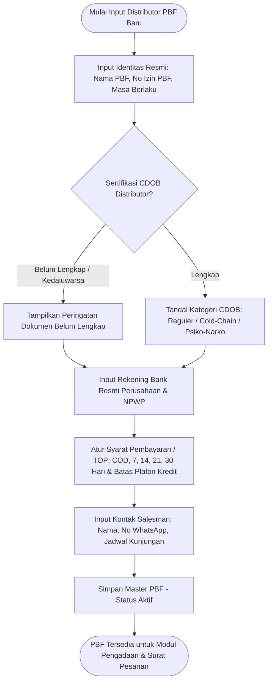
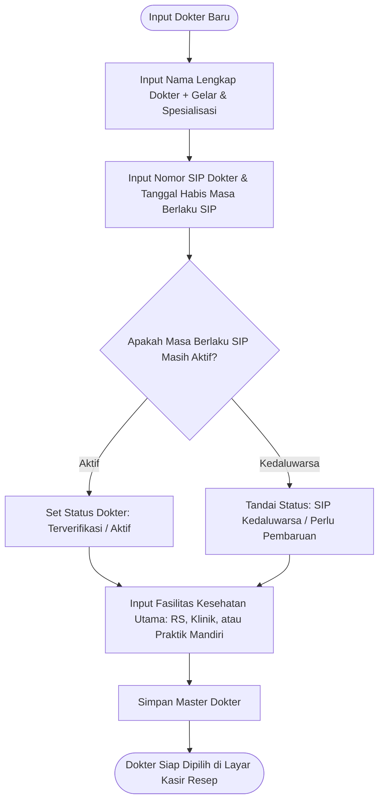
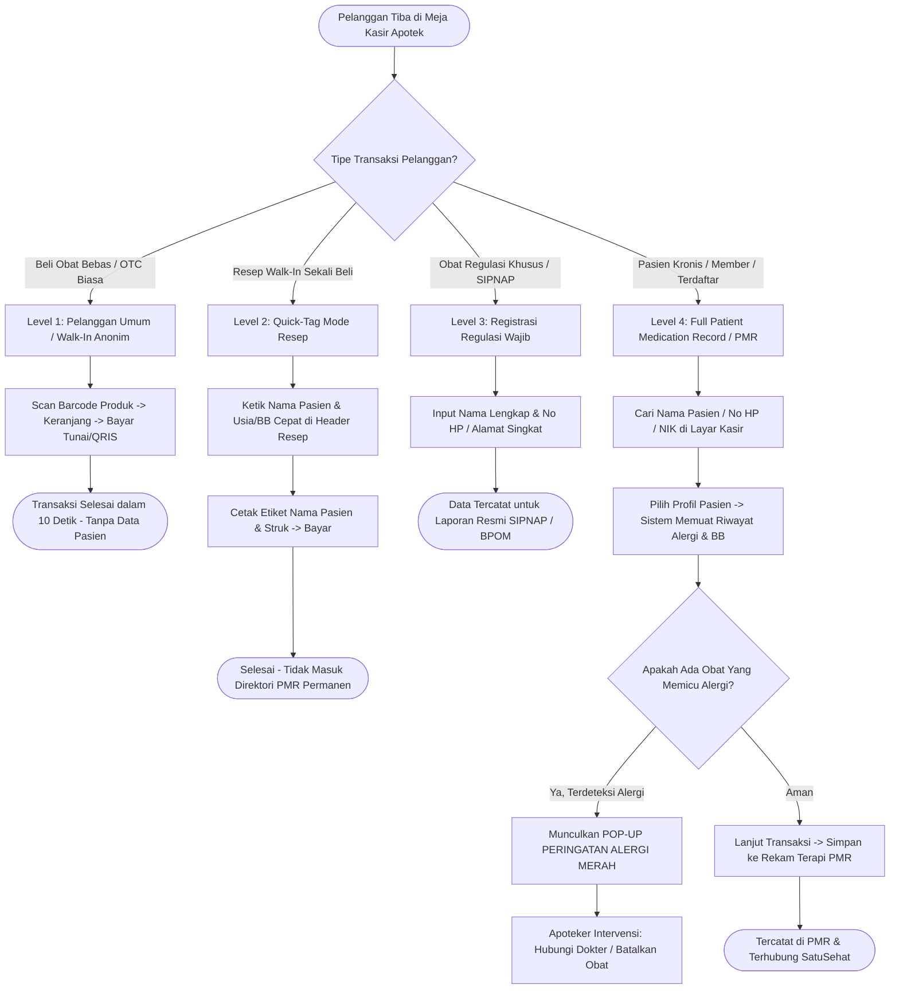

# Feature PRD: Master Distributor (PBF), Dokter Perujuk & Rekam Pengobatan Pasien (PMR)

---

## 1. Metadata Dokumen

| Properti | Keterangan |
| :--- | :--- |
| **Kode Dokumen** | **PRD-PHARM-MD03** |
| **Nama Modul** | Master Pedagang Besar Farmasi (PBF), Direktori Dokter Perujuk, Profil Pasien & Patient Medication Record (PMR) |
| **Dokumen Induk** | [`00-MASTER-PRD.md`](../../00-MASTER-PRD.md) |
| **Depends On (Prasyarat)** | • [`features/01-prd-auth-user.md`](../01-prd-auth-user.md) • [`features/master-data/01-prd-cabang-dan-gudang.md`](./01-prd-cabang-dan-gudang.md) • [`features/master-data/02-prd-obat-dan-satuan-bertingkat.md`](./02-prd-obat-dan-satuan-bertingkat.md) |
| **Consumed By (Dampak)** | • [`features/pos-resep/01-prd-kasir-otc-dan-shift.md`](../pos-resep/01-prd-kasir-otc-dan-shift.md) • [`features/pos-resep/02-prd-pelayanan-resep-dokter.md`](../pos-resep/02-prd-pelayanan-resep-dokter.md) • [`features/pos-resep/03-prd-obat-racikan-tuslah-embalase.md`](../pos-resep/03-prd-obat-racikan-tuslah-embalase.md) • [`features/procurement-pbf/01-prd-defekta-rop-dan-surat-pesanan-sp.md`](../procurement-pbf/01-prd-defekta-rop-dan-surat-pesanan-sp.md) • [`features/procurement-pbf/02-prd-faktur-masuk-hpp-dan-retur-pbf.md`](../procurement-pbf/02-prd-faktur-masuk-hpp-dan-retur-pbf.md) • [`features/finance-laporan/01-prd-hutang-pbf-dan-laba-rugi-cabang.md`](../finance-laporan/01-prd-hutang-pbf-dan-laba-rugi-cabang.md) • [`features/finance-laporan/02-prd-kepatuhan-sipnap-dan-satusehat.md`](../finance-laporan/02-prd-kepatuhan-sipnap-dan-satusehat.md) • [`technical/00-architecture-and-multibranch-guidelines.md`](../../technical/00-architecture-and-multibranch-guidelines.md) • [`technical/01-dra-database-erd-master-auth.md`](../../technical/01-dra-database-erd-master-auth.md) • [`technical/03-trd-master-data-api.md`](../../technical/03-trd-master-data-api.md) |
| **Target Pengguna** | Apoteker Pengelola Apotek (APA), Tenaga Teknis Kefarmasian (TTK), Kasir Front-Office, Petugas Pengadaan (Procurement), Petugas Pembukuan / Hutang Dagang (AP Finance) |

---

## 2. Latar Belakang & Masalah Bisnis

Operasional apotek tidak dapat dipisahkan dari tiga pihak eksternal utama: **Distributor Farmasi (PBF)** sebagai sumber pasokan rantai dingin dan obat resmi, **Dokter Perujuk** sebagai otoritas medis penerbit resep terapi, serta **Pasien / Pelanggan** sebagai subjek akhir penerima pelayanan kefarmasian. 

Modul ini menyelesaikan empat tantangan operasional dan regulasi kritis di apotek:

1. **Integritas Rantai Pasok Resmi & Pengawasan Legalitas Distributor (PBF):**
   * Berdasarkan regulasi BPOM tentang Cara Distribusi Obat yang Baik (CDOB) dan Permenkes No. 73/2016, apotek dilarang keras membeli obat dari sumber tidak resmi atau distributor liar.
   * Apotek memerlukan master distributor yang merekam nomor izin operasional PBF, masa berlaku izin, sertifikasi CDOB per kategori (farmasi reguler, rantai dingin/cold chain, psikotropika/narkotika), kontak resmi salesman order, serta rekening bank terverifikasi untuk pembayaran faktur guna mencegah transfer ke rekening fiktif/pribadi salesman.
   * Apotek juga membutuhkan pengelolaan kebijakan kredit distributor (*Term of Payment / TOP*: COD, 7 hari, 14 hari, 21 hari, hingga 30 hari) dan batas plafon kredit (*Credit Limit*) agar apotek tidak terkena sanksi penghentian kiriman (*order block*) dari distributor.

2. **Kepatuhan Administrasi Resep & Validitas Legalitas Dokter:**
   * Setiap lembar resep yang dilayani di apotek wajib melalui proses skrining administratif, farmasetik, dan klinis.
   * Ketiadaan atau kedaluwarsanya **Surat Izin Praktik (SIP)** dokter berisiko tinggi terhadap sanksi hukum dan audit BPOM/Dinkes, khususnya pada obat golongan Keras, Narkotika, dan Psikotropika.
   * Diperlukan direktori dokter terpusat yang menyimpan identitas dokter, nomor SIP, masa berlaku izin praktik, spesialisasi, alamat fasilitas kesehatan (klinik/rumah sakit/praktik mandiri), dan nomor kontak resmi untuk verifikasi jika resep terbaca ambigu (*unclear prescription*).

3. **Pencegahan Kesalahan Medis (*Medication Error*) & Keselamatan Pasien via PMR:**
   * Di apotek ritel konvensional, riwayat alergi obat pasien sering kali hanya mengandalkan ingatan kasir atau pengakuan pasien saat antre. Jika pasien lupa menyebut alergi penisilin dan dokter meresepkan antibiotik amoxicillin, dampaknya bisa fatal (syok anafilaksis).
   * Perhitungan dosis racikan anak (pediatrik) membutuhkan data Berat Badan (BB) dan usia yang akurat untuk menghitung persentase Dosis Maksimum (DM).
   * Apotek memerlukan **Patient Medication Record (PMR)** atau Catatan Pengobatan Pasien yang mencatat riwayat alergi obat, riwayat penyakit kronis (Hipertensi, Diabetes Mellitus, Asma), riwayat penebusan resep, kuota sisa pengulangan resep (*iter*), serta catatan edukasi Pelayanan Informasi Obat (PIO).

4. **Friksi Pelanggan Walk-In vs Pelanggan Tetap di Meja Kasir (Zero Barrier to Checkout):**
   * Lebih dari 75% transaksi harian apotek ritel adalah pembelian langsung oleh pelanggan lalu lalang (*walk-in customer*) yang membeli produk bebas (OTC) tanpa resep dan ingin transaksi selesai dalam belasan detik.
   * Jika sistem kasir mewajibkan registrasi profil pasien lengkap untuk setiap transaksi, antrean kasir akan macet total dan memicu komplain massal.
   * Diperlukan arsitektur **4-Level Pendekatan Pasien di POS**: kasir dapat melayani transaksi anonim secara instan tanpa input data sama sekali, melayani resep walk-in sekali beli menggunakan label instan (*Quick-Tag*), meminta data ringkas khusus untuk obat regulasi tertentu (SIPNAP), dan membuka profil lengkap PMR untuk pasien rutin kronis atau anggota apotek.

---

## 3. Persona & Konteks Penggunaan

| Persona | Lingkungan & Perangkat | Peran & Kebutuhan dalam Modul Ini |
| :--- | :--- | :--- |
| **Apoteker Pengelola Apotek (APA)** | Web Admin ERP (Desktop / Laptop). | Memverifikasi legalitas PBF (izin operasional & CDOB), mengesahkan dokter perujuk (keabsahan SIP), melakukan skrining klinis resep terhadap riwayat alergi pasien di PMR, serta mendokumentasikan konseling farmasi (PIO) dan Monitoring Efek Samping Obat (MESO). |
| **Petugas Pengadaan (Procurement)** | Web Admin ERP (Desktop). | Mengelola direktori supplier PBF, kontak salesman/order, katalog prinsipal yang dibawa masing-masing PBF, serta menetapkan PBF utama untuk auto-routing Surat Pesanan (SP). |
| **Petugas Keuangan / Hutang (AP Finance)** | Web Admin ERP (Desktop). | Memantau masa jatuh tempo tagihan (*Term of Payment*), batas plafon kredit PBF, dan memastikan pembayaran faktur hanya ditransfer ke rekening bank resmi atas nama perusahaan PBF. |
| **Kasir POS (Front-Office)** | Kasir POS (Layar Sentuh / Keyboard & Barcode Scanner). | Melayani transaksi OTC tanpa hambatan data pasien (level pelanggan umum), menginput nama cepat untuk etiket resep walk-in (*Quick-Tag*), atau memanggil profil pasien tetap untuk mendeteksi alergi obat dalam < 1 detik. |
| **Tenaga Teknis Kefarmasian (TTK) / Meja Racik** | Layar Tablet / Desktop Ruang Racik. | Mengakses data Berat Badan (BB) dan usia pasien dari PMR untuk validasi batas Dosis Maksimum (DM) sebelum meracik serbuk/kapsul. |

---

## 4. Alur Kerja Utama (Core User Journey)

### 4.1 Alur 1: Pendaftaran Master Distributor (PBF) & Legalitas Operasional

---

### 4.2 Alur 2: Pendaftaran Master Dokter Perujuk & Validasi Izin Praktik (SIP)

---

### 4.3 Alur 3: Pendekatan 4-Tingkat Pasien di POS (Kasir Cepat vs Resep vs PMR)

---

## 5. Kebutuhan Fungsional & Aturan Bisnis (Business Rules)

### 5.1 Bagian 1: Master Pedagang Besar Farmasi (PBF / Supplier)

* **BR-PHARM-MD03-01 (Integritas Legalitas Izin Operasional PBF):**
  * Setiap entitas distributor farmasi wajib memiliki nama resmi perusahaan (PT/CV), Nomor Izin PBF yang sah dari Kementerian Kesehatan/Dinas Kesehatan, dan tanggal masa berlaku izin.
  * Sistem wajib menampilkan indikator visual status izin PBF:
    * 🟢 **Aktif Valid:** Masa berlaku izin $> 60\text{ hari}$.
    * 🟡 **Peringatan Perpanjangan (*Expiring Soon*):** Masa berlaku izin $\le 60\text{ hari}$ sebelum jatuh tempo.
    * 🔴 **Kedaluwarsa (*Expired*):** Tanggal masa berlaku telah terlewati. Sistem wajib memblokir pembuatan Surat Pesanan (SP) baru ke PBF yang izinnya telah kedaluwarsa hingga izin diperbarui oleh APA.

* **BR-PHARM-MD03-02 (Klasifikasi Kapabilitas CDOB Distributor):**
  * Distributor PBF wajib ditandai kapabilitas distribusinya sesuai sertifikat Cara Distribusi Obat yang Baik (CDOB):
    1. **Reguler / Non-Cold Chain:** Obat bebas, obat keras umum, dan alkes.
    2. **Rantai Dingin (*Cold-Chain Products*):** Vaksin, serum, dan insulin (suhu $2^\circ\text{C} - 8^\circ\text{C}$).
    3. **Prekursor & Obat-Obat Tertentu (OOT):** Ephedrine, Pseudoephedrine, Tramadol, Trihexyphenidyl.
    4. **Narkotika & Psikotropika:** Hanya dapat disediakan oleh PBF milik negara / distributor berizin khusus resmi (misal: Kimia Farma Trading & Distribution).
  * Sistem melarang pemesanan obat psikotropika/narkotika ke PBF yang tidak memiliki izin jalur distribusi khusus.

* **BR-PHARM-MD03-03 (Syarat Pembayaran & Plafon Kredit / TOP):**
  * Setiap PBF memiliki pengaturan syarat pembayaran bawaan (*Default Term of Payment*): **Cash on Delivery (COD)**, **Cash Before Delivery (CBD)**, **Net 7 Hari**, **Net 14 Hari**, **Net 21 Hari**, atau **Net 30 Hari**.
  * Apotek dapat menetapkan batas pagu hutang (*Credit Limit*). Jika total faktur yang belum lunas ke PBF tersebut telah melebihi pagu kredit, sistem wajib memberikan peringatan kuning pada modul pembuatan PO/SP pengadaan.

* **BR-PHARM-MD03-04 (Rekening Resmi Perusahaan & Anti-Fraud):**
  * Pembayaran faktur PBF wajib ditujukan ke nomor rekening bank atas nama badan usaha PBF resmi (bukan rekening pribadi salesman).
  * Sistem mewajibkan pencatatan: Nama Bank, Kantor Cabang Bank, Nomor Rekening, dan Nama Pemilik Rekening sesuai akta/NPWP perusahaan distributor.
  * Perubahan nomor rekening bank PBF wajib melalui otorisasi level APA atau Manajer Keuangan.

* **BR-PHARM-MD03-05 (Direktori Kontak Salesman & Jadwal Kunjungan):**
  * Satu PBF dapat memiliki lebih dari satu kontak salesman (misal: Salesman Obat Reguler, Salesman Produk Rantai Dingin, Salesman Alkes).
  * Informasi salesman mencakup: Nama, Nomor Telepon/WhatsApp, Alamat Email Order, dan Hari Jadwal Kunjungan Rutin (*Order Day*) untuk sinkronisasi buku defekta apotek.

---

### 5.2 Bagian 2: Master Dokter Perujuk

* **BR-PHARM-MD03-06 (Identitas Resmi & Validitas Nomor SIP Dokter):**
  * Entitas dokter mencakup: Nama Lengkap beserta Gelar Akademik/Profesi (contoh: *dr. H. Budi Santoso, Sp.A*), Spesialisasi Medis (Dokter Umum, Spesialis Anak, Spesialis Penyakit Dalam, Spesialis Jiwa, Dokter Gigi, dll.), Nomor Surat Izin Praktik (SIP), dan Tanggal Kedaluwarsa SIP.
  * Jika tanggal SIP dokter telah kedaluwarsa:
    * Sistem memunculkan *warning banner* saat dokter tersebut dipilih di modul pelayanan resep POS.
    * Untuk resep Narkotika & Psikotropika, sistem **MENOLAK (Hard Block)** penggunaan dokter dengan SIP yang sudah tidak berlaku.

* **BR-PHARM-MD03-07 (Fasilitas Kesehatan Perujuk):**
  * Setiap dokter dapat ditautkan ke satu atau lebih Fasilitas Pelayanan Kesehatan (Fasyankes) tempat praktiknya: Nama RS/Klinik/Puskesmas/Praktik Mandiri, Alamat Praktik, dan Nomor Telepon Fasyankes.
  * Keterangan fasyankes ini otomatis tercetak pada salinan resep (*Copy Resep / Apograph*) dan arsip resep apotek.

* **BR-PHARM-MD03-08 (Dokter Default untuk Resep Internal / Tanpa Dokter Spesifik):**
  * Sistem menyediakan entitas sistem bawaan: **"Dokter Umum Luar (Non-Direktori)"** untuk mengakomodasi resep obat keras yang dibawa pasien dari dokter luar kota yang belum terdaftar di direktori, dengan kewajiban kasir menginput nama dokter dan nomor SIP secara manual pada transaksi tersebut.

---

### 5.3 Bagian 3: Profil Pasien & Patient Medication Record (PMR)

* **BR-PHARM-MD03-09 (Prinsip 4-Level Pendekatan Pasien di Meja Kasir):**
  * Kasir apotek tidak boleh diwajibkan mendaftarkan profil pasien untuk transaksi penjualan umum non-resep.
  * Sistem mendukung 4 level data pasien:
    1. **Level 1 (Pelanggan Umum / Walk-In Anonim):** Default state pada kasir. Tanpa identitas, tanpa registrasi, proses checkout instan.
    2. **Level 2 (Quick-Tag Resep Sekali Beli):** Kasir hanya menginput nama pasien dan usia/BB langsung pada lembar transaksi tanpa membuatkan kartu member atau meminta NIK/alamat lengkap.
    3. **Level 3 (Pencatatan Regulasi Khusus):** Wajib mencatat minimal Nama Lengkap, Nomor HP, dan Alamat Domisili saat menebus obat golongan Narkotika, Psikotropika, atau Prekursor tertentu untuk pelaporan resmi SIPNAP.
    4. **Level 4 (Pasien Tetap / Full PMR):** Pencatatan profil pasien komprehensif untuk pasien kronis, anggota loyalitas apotek, atau pasien rujukan klinik.

* **BR-PHARM-MD03-10 (Struktur Profil Pasien Lengkap / Full PMR):**
  * Profil pasien lengkap mencakup data administratif dan data klinis:
    * **Data Administratif:** Nama Lengkap, Nomor Induk Kependudukan (NIK 16 digit - validasi format KTP), Tanggal Lahir, Jenis Kelamin, Nomor Telepon/WhatsApp aktif, Alamat Domisili, dan Nama Kontak Darurat / Keluarga.
    * **Data Klinis Dasar:** Golongan Darah, Berat Badan (kg), Tinggi Badan (cm), dan Status Khusus (Hamil, Menyusui, Gangguan Fungsi Ginjal, Lansia/Geriatrik).
    * **Kesiapan SatuSehat:** Kolom penampung *IHS Patient Number* (sinkronisasi identitas SatuSehat Kemenkes berbasis NIK).

* **BR-PHARM-MD03-11 (Master Riwayat Alergi Pasien & Automatic Alerting):**
  * Setiap profil pasien PMR dapat memiliki daftar riwayat alergi yang diklasifikasikan ke dalam:
    1. **Alergi Zat Aktif / Golongan Obat:** (contoh: *Amoxicillin, Penicillin, Ibuprofen, Paracetamol, Sulfonamida, Aspirin*).
    2. **Tingkat Keparahan Reaksi Alergi:** Ringan (Gatal/Ruam), Sedang (Bengkak/Urtikaria), Berat/Fatal (Syok Anafilaksis, Sesak Napas/Edema Laring).
  * **Aturan Deteksi Otomatis di Layar Kasir / Resep:**
    * Saat item obat ditambahkan ke keranjang pasien yang bersangkutan, sistem otomatis mencocokkan zat aktif produk (dari Master Obat `PRD-PHARM-MD02`) dengan daftar riwayat alergi pasien.
    * Jika ditemukan kecocokan (*match*), sistem **WAJIB menghentikan proses sementara** dan menampilkan **Modal Peringatan Bahaya Alergi Berwarna Merah Menyala**:
      > *"BAHAYA KLINIS: Pasien memiliki riwayat ALERGI BERAT terhadap zat aktif [Nama Zat Aktif]! Reaksi tercatat: [Gejala Reaksi]. Apakah Anda ingin membatalkan obat ini atau melanjutkan dengan catatan apoteker?"*
    * Melanjutkan obat yang memicu alergi hanya diizinkan jika disetujui oleh Apoteker yang bertugas dengan memasukkan alasan klinis tertulis.

* **BR-PHARM-MD03-12 (Riwayat Terapi Pengobatan & Catatan Konseling Farmasi):**
  * Sistem secara otomatis membentuk riwayat pengobatan kronologis (*Medication History Timeline*) untuk setiap pasien terdaftar, memuat:
    * Tanggal penebusan, Nomor Transaksi/Resep, Dokter Penulis Resep, Nama Obat, Bentuk Sediaan, Dosis, Aturan Minum (*Signa*), dan Jumlah yang diserahkan.
    * Sisa kuota pengulangan resep (*Iter*).
  * Apoteker dapat menambahkan catatan konseling farmasi:
    * **Pelayanan Informasi Obat (PIO):** Kepatuhan pasien, pemahaman cara pakai (misal: teknik semprot inhaler atau waktu pakai obat maag), keluhan pasien.
    * **Monitoring Efek Samping Obat (MESO):** Catatan jika timbul efek samping setelah konsumsi obat tertentu untuk referensi konsultasi dokter berikutnya.

* **BR-PHARM-MD03-13 (Konversi Satu-Klik dari Walk-In ke Pasien Terdaftar):**
  * Jika pelanggan walk-in yang awalnya anonim atau berada di mode Quick-Tag memutuskan untuk mendaftarkan diri menjadi pasien tetap, kasir dapat menekan satu tombol pintas (*One-Click Convert to PMR*) di layar POS.
  * Sistem otomatis menyalin nama dan obat yang sedang dibeli ke formulir pendaftaran PMR baru tanpa menghapus isi keranjang belanja yang sedang aktif.

---

## 6. Elemen Antarmuka & Input Bisnis (UI & Information Elements)

### 6.1 Antarmuka Master PBF (Web Admin ERP)

1. **Tabel Ringkasan Direktori PBF:**
   * Kolom informasi: Kode PBF, Nama Distributor, No Izin PBF, Status Masa Berlaku Izin (Badge Hijau/Kuning/Merah), Sertifikasi CDOB, Syarat Pembayaran (TOP), Saldo Hutang Berjalan, Nama Salesman Utama & No WhatsApp, Tombol Aksi (Lihat Detail, Ubah Data, Nonaktifkan).
   * Filter & Pencarian: Pencarian cepat nama distributor / nomor izin, filter berdasarkan kategori CDOB (Cold Chain, Psiko-Narko), filter distributor dengan izin mendekati kedaluwarsa ($\le 60\text{ hari}$).

2. **Formulir Input / Ubah PBF:**
   * **Bagian 1: Profil Perusahaan:** Nama Resmi PBF, Alamat Kantor Pusat/Gudang, Nomor Telepon Kantor, Alamat Email Pesanan Resmi, NPWP Badan Usaha.
   * **Bagian 2: Izin Operasional & CDOB:** Nomor Izin Operasional PBF, Tanggal Terbit, Tanggal Habis Berlaku Izin, Checklist Sertifikasi CDOB yang dimiliki (Reguler, Rantai Dingin, Prekursor/OOT, Psikotropika/Narkotika).
   * **Bagian 3: Finansial & Pembayaran:** Syarat Pembayaran Default (Pilihan: COD, CBD, 7, 14, 21, 30 Hari), Batas Plafon Kredit (Nominal Rupiah), Nama Bank Resmi, Kantor Cabang Bank, Nomor Rekening Resmi, Nama Pemilik Rekening (Sesuai Akta Perusahaan).
   * **Bagian 4: Daftar Kontak Salesman:** Tabel dinamis penambahan salesman (Nama Lengkap, No Telepon/WhatsApp, Divisi Produk, Hari Kunjungan Rutin).

---

### 6.2 Antarmuka Master Dokter Perujuk (Web Admin ERP & Layar Pop-Up POS)

1. **Tabel Direktori Dokter:**
   * Kolom informasi: Kode Dokter, Nama Dokter beserta Gelar, Spesialisasi Medis, Nomor SIP, Tanggal Habis Berlaku SIP, Status Legalitas (Aktif / Perlu Perpanjangan / Kedaluwarsa), Fasyankes Utama, Nomor HP/Telepon.
   * Filter & Pencarian: Pencarian cepat berdasarkan nama dokter atau nomor SIP, filter berdasarkan spesialisasi medis, filter dokter dengan SIP kedaluwarsa.

2. **Formulir Input Dokter:**
   * Nama Lengkap Dokter (kolom teks dengan saran gelar depan/belakang: *dr., drg., Sp.A, Sp.PD, Sp.B, Sp.KJ, M.Biomed*, dll.).
   * Spesialisasi Medis (dropdown terstandarisasi).
   * Nomor Surat Izin Praktik (SIP) dan Tanggal Habis Berlaku SIP.
   * Tempat Praktik / Fasyankes: Nama Klinik / RS / Praktik Pribadi, Alamat Praktik, dan Nomor Telepon Fasyankes.
   * Nomor Kontak Pribadi/Konsultasi (opsional untuk verifikasi resep darurat oleh Apoteker).

---

### 6.3 Antarmuka Pasien & Rekam Pengobatan PMR (ERP & POS)

1. **Widget Pemilihan Pasien di Header Kasir POS:**
   * **Kotak Pencarian Pasien Terintegrasi:** Menerima input Nama, No HP, atau NIK.
   * **Tampilan Default:** Menampilkan tag *Badge Abu-abu:* `"Pelanggan Umum (Walk-In)"`.
   * **Pilihan Mode Fleksibel Kasir:**
     * Tombol `[Umum / Walk-in]` (F2): Kembali ke mode kasir bebas anonim.
     * Tombol `[Quick-Tag Resep]` (F3): Membuka kolom isian cepat: *Nama Pasien* dan *Usia / Berat Badan*.
     * Tombol `[Cari Pasien PMR]` (F4): Membuka dialog pencarian direktori pasien terdaftar.
     * Tombol `[Pasien Baru (+)]` (F8): Mendaftarkan pasien baru secara instan dari meja kasir.

2. **Tampilan Profil Pasien & Riwayat Medis (Drawer / Modal PMR):**
   * **Header Profil:** Nama Lengkap, NIK, Jenis Kelamin, Tanggal Lahir (Usia otomatis terhitung), Nomor HP WhatsApp, Nilai Berat Badan Terkini (kg).
   * **Banner Riwayat Alergi (High-Visibility):** Kotak peringatan merah terang menampilkan daftar zat aktif yang memicu alergi beserta tingkat keparahannya (misal: *Alergi Berat: Amoxicillin*).
   * **Tab 1: Riwayat Transaksi & Resep:** Tabel kronologis obat yang pernah dibeli, tanggal tebus, dokter penulis resep, dan aturan minum.
   * **Tab 2: Kondisi Medis Kronis:** Checklist penyakit bawaan (Hipertensi, Diabetes, Gangguan Ginjal, Asma, Status Hamil/Menyusui).
   * **Tab 3: Catatan Konseling Apoteker (PIO/MESO):** Kolom catatan bebas bagi apoteker untuk mencatat keluhan efek samping atau respon terapi pasien.

3. **Pop-up Peringatan Intervensi Alergi Obat:**
   * Tampil dengan suara notifikasi dan latar merah jika kasir memasukkan obat yang mengandung zat aktif alergen pasien.
   * Memuat: Nama Obat yang di-input, Zat Aktif Penyebab Alergi, Catatan Reaksi Masa Lalu Pasien, dan 2 Tombol Aksi:
     * Tombol Hijau: `[Batalkan Item Ini]` (Rekomendasi).
     * Tombol Merah: `[Lanjutkan dengan Otorisasi Apoteker]` (Wajib memasukkan PIN Apoteker dan Alasan Klinis Tertulis).

---

## 7. Skenario Pengecualian & Kasus Khusus (Edge Cases)

1. **PBF Mengganti Nomor Rekening Bank Pembayaran:**
   * Skenario: Salesman PBF menginformasikan lewat WhatsApp bahwa rekening pembayaran faktur telah dipindahkan ke rekening baru.
   * Solusi Bisnis: Sistem melarang kasir/petugas pengadaan mengubah rekening PBF secara langsung. Sistem mewajibkan lampiran dokumen resmi bertandatangan pimpinan PBF (*Surat Pemberitahuan Rekening Baru*) dan verifikasi otorisasi oleh Apoteker Pengelola Apotek (APA) atau Manajer Keuangan sebelum rekening baru aktif di sistem.

2. **Masa Berlaku Izin PBF Kedaluwarsa di Tengah Pesanan Berjalan:**
   * Skenario: Surat Pesanan (SP) sudah diterbitkan saat izin PBF masih aktif, namun saat faktur dan barang datang, izin PBF telah kedaluwarsa.
   * Solusi Bisnis: Sistem tetap mengizinkan proses penerimaan barang fisik untuk SP yang sah diterbitkan sebelum tanggal kedaluwarsa. Namun, sistem langsung mengunci pembuatan SP baru berikutnya hingga dokumen perpanjangan izin diunggah.

3. **Dokter Perujuk Belum Terdaftar Saat Antrean Kasir Sedang Padat:**
   * Skenario: Pasien datang membawa resep dari dokter praktik mandiri baru yang belum tercatat di direktori sistem.
   * Solusi Bisnis: Kasir tidak perlu membuka modul pengaturan Master Data yang panjang. Kasir cukup memilih opsi `[+ Tambah Dokter Cepat]` langsung dari antarmuka kasir resep, menginput Nama Dokter dan Nomor SIP, lalu transaksi resep dapat dilanjutkan seketika. Data dokter tersebut otomatis tersimpan ke master direktori apotek.

4. **Nomor SIP Dokter Kedaluwarsa pada Resep Penyakit Kronis:**
   * Skenario: Pasien rutin membawa resep obat hipertensi (Amlodipine) dari dokter langganannya, namun tanggal SIP dokter di sistem tercatat sudah lewat masa berlaku 1 minggu lalu.
   * Solusi Bisnis: Sistem membedakan penanganan:
     * Untuk obat non-narkotika/non-psikotropika: Sistem menampilkan *warning notification* kuning kepada kasir, dan mengizinkan penebusan obat dengan persetujuan Apoteker yang bertugas (*Apothecary Override*), disertai saran kepada pasien untuk mengingatkan dokternya.
     * Untuk obat Narkotika/Psikotropika: Sistem **memblokir mutlak** transaksi sesuai regulasi UU Narkotika.

5. **Pasien Tidak Tahu Riwayat Alergi Obatnya:**
   * Skenario: Pasien baru ditanya alergi obat namun menjawab "tidak tahu" atau "belum pernah tes".
   * Solusi Bisnis: Sistem mencatat status alergi sebagai `"Tidak Diketahui / Belum Terdata"` (bukan *"Tidak Ada Alergi"*). Pada etiket atau formulir informasi obat tercetak nomor telepon darurat apotek jika timbul gatal/reaksi setelah minum obat.

6. **Dua Pasien Memiliki Nama yang Sama Persis:**
   * Skenario: Di apotek terdapat dua pasien bernama "Siti Rahma".
   * Solusi Bisnis: Pada kotak pencarian kasir, sistem wajib menampilkan informasi pembeda secara berdampingan: *Nama Lengkap, Tahun Lahir/Usia, Alamat Singkat, dan 4 Digit Terakhir Nomor HP* (misal: *Siti Rahma — 45 th — Jl. Melawai (HP: ...0812)* vs *Siti Rahma — 19 th — Tebet (HP: ...9921)*).

---

## 8. Metrik Keberhasilan Bisnis (KPI)

| Metrik | Target Kinerja | Cara Pengukuran |
| :--- | :--- | :--- |
| **Kecepatan Transaksi Pelanggan Walk-In** | $\le 15\text{ detik}$ per transaksi | Waktu mulai scan barcode item pertama hingga struk tercetak pada mode Pelanggan Umum. |
| **Pencegahan Kejadian Nyaris Cedera (Near-Miss) Alergi Obat** | $100\%$ terdeteksi sebelum dispensing | Jumlah peringatan dini alergi yang berhasil dicegah dan dikonfirmasi intervensinya oleh apoteker. |
| **Nol Pembelian dari Distributor Ilegal (Zero Unlicensed Purchase)** | $0$ transaksi pengadaan ke PBF tidak sah | Persentase Surat Pesanan yang diterbitkan hanya ke PBF dengan izin operasional aktif dan valid. |
| **Akurasi Pembayaran Hutang Dagang ke Rekening Resmi PBF** | $100\%$ tepat sasaran | Tidak ada insiden pembayaran faktur ke rekening pribadi karyawan/salesman PBF. |
| **Kelengkapan Data Resep Regulasi SIPNAP** | $100\%$ patuh format BPOM | Seluruh transaksi Narkotika/Psikotropika memiliki identitas penebus lengkap (Nama & Alamat/HP). |

---

## 9. Kriteria Penerimaan (Acceptance Criteria)

### AC-01: Validasi Pembuatan Surat Pesanan ke PBF Berdasarkan Status Izin
* **Given** Apoteker atau Staf Pengadaan berada di modul pembuatan Surat Pesanan (SP),
* **When** Pengguna memilih distributor PBF yang tanggal masa berlaku izinnya telah kedaluwarsa,
* **Then** Sistem menonaktifkan tombol pemesanan, menampilkan badge peringatan merah: *"Izin Operasional PBF Kedaluwarsa"*, dan memblokir pembuatan SP hingga dokumen izin diperbarui.

### AC-02: Peringatan Plafon Kredit dan Jatuh Tempo PBF
* **Given** PBF memiliki pengaturan batas kredit (*Credit Limit*) Rp 50.000.000 dan saldo hutang berjalan saat ini Rp 48.000.000,
* **When** Pengguna membuat pesanan pembelian baru senilai Rp 5.000.000 ke PBF tersebut,
* **Then** Sistem menampilkan dialog konfirmasi peringatan: *"Pesanan ini akan menyebabkan total hutang melampaui plafon kredit PBF (Rp 53.000.000 / Rp 50.000.000). Lanjutkan pesanan?"* dengan status izin bergantung pada approval pengadaan.

### AC-03: Validasi Keabsahan SIP Dokter pada Resep Narkotika / Psikotropika
* **Given** Kasir berada pada layar pelayanan resep dokter untuk obat golongan Psikotropika (misal: Diazepam / Alprazolam),
* **When** Kasir memilih dokter perujuk yang memiliki status SIP *"Kedaluwarsa"*,
* **Then** Sistem menolak pemilihan dokter tersebut, menampilkan pesan kesalahan: *"Regulasi Farmasi: Resep Psikotropika hanya dapat dilayani dari dokter dengan Nomor SIP yang masih aktif dan sah"*, dan melarang proses checkout.

### AC-04: Transaksi Kasir Instan Mode Pelanggan Umum (Walk-In Anonim)
* **Given** Kasir membuka layar penjualan baru di kasir POS,
* **When** Kasir langsung memindai 2 kemasan obat bebas (OTC) tanpa menyentuh kolom pencarian pasien dan menyelesaikan pembayaran tunai,
* **Then** Transaksi sukses diselesaikan dalam waktu kurang dari 15 detik, kolom pasien tercatat sebagai Pelanggan Umum, dan struk belanja tercetak tanpa adanya permintaan input data diri pasien.

### AC-05: Peringatan Dini Otomatis Alergi Obat Pasien (PMR Alert)
* **Given** Pasien bernama "Budi Santoso" memiliki riwayat alergi tercatat terhadap zat aktif *"Amoxicillin"* di profil PMR,
* **When** Kasir memilih profil Budi Santoso di kasir dan memindai obat bermerek *"Amoxsan 500mg"* (yang mengandung Amoxicillin),
* **Then** Sistem seketika membunyikan peringatan suara, mengunci sementara penambahan item, dan menampilkan Pop-Up Merah peringatan alergi yang memuat informasi alergen dan opsi intervensi apoteker.

### AC-06: Konversi Instan Transaksi Walk-In Menjadi Pasien Terdaftar (One-Click PMR)
* **Given** Kasir sedang melayani pelanggan walk-in dengan 3 item obat di keranjang belanja kasir,
* **When** Pelanggan meminta agar riwayat obatnya dicatat dan kasir menekan tombol pintas `[Daftar Pasien Baru]`,
* **Then** Sistem membuka drawer pendaftaran pasien tanpa menghapus ketiga obat di keranjang, dan setelah data NIK/No HP disimpan, keranjang belanja langsung otomatis terhubung ke identitas pasien baru tersebut.
