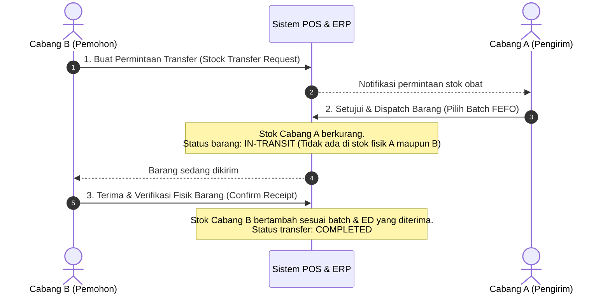

# Fondasi Arsitektur & Panduan Multi-Branch Ready
# Pharmacy POS & ERP System

Dokumen ini adalah acuan arsitektur tingkat teknis yang menetapkan prinsip desain sistem, skema database, dan strategi migrasi dari **Apotek Tunggal (Single-Branch)** menuju **Jaringan Apotek (Multi-Branch)** tanpa risiko penulisan ulang kode (*zero-rewrite*).

---

## 1. Filosofi: "Single-Branch in Mind, Multi-Branch in Design"

### 1.1 Masalah Klasik Migrasi Apotek
Banyak sistem POS apotek dibangun dengan asumsi cabang tunggal:
* Tabel `products` langsung menyimpan kolom `stock` dan `price`.
* Tabel transaksi `sales` tidak mencatat lokasi fisik apotek.
* Laci kasir dan sesi shift dianggap hanya satu di dunia nyata.

Ketika apotek membuka cabang ke-2 atau gudang pusat:
* Seluruh kueri pemotongan stok rusak karena tidak tahu stok milik cabang mana.
* Transaksi penjualan cabang A bercampur dengan cabang B.
* Pengembang terpaksa merombak ratusan kueri SQL, mengubah skema tabel, dan mengambil risiko *downtime* yang sangat mahal.

### 1.2 Strategi Solusi: Multi-Branch Ready Sejak Hari Pertama (Day 1)
Pada sistem ini, arsitektur data dan API dirancang **Multi-Branch Native sejak awal**:
1. **Di Lapisan Database:** Tabel `branches` sudah dibuat sejak migrasi pertama. Setiap baris data stok fisik, mutasi gudang, transaksi kasir, dan sesi shift **wajib** memiliki *Foreign Key* `branch_id REFERENCES branches(id)`.
2. **Di Lapisan Antarmuka Pengguna (UI/UX) Tahap 1:** Sistem dapat melakukan *auto-select* ke `branch_id` cabang default (misal: "Apotek Sehat - Cabang Utama"). Pengguna kasir tidak perlu memilih cabang saat bertransaksi.
3. **Saat Cabang ke-2 Dibuka:** Cukup membuka menu switch cabang dan modul *Inter-Branch Transfer*, **tanpa perlu mengubah skema database satu pun!**

---

## 2. Pemisahan Data: "Global Master" vs "Branch-Specific Data"

Untuk menjaga efisiensi dan mencegah duplikasi data obat, sistem memisahkan domain data secara tegas:

```
┌─────────────────────────────────────────────────────────────┐
│                 GLOBAL MASTER DATA (Shared)                 │
│  • Master Produk & Barcode (`products`)                     │
│  • Nama Generik & Zat Aktif (`generic_names`)               │
│  • Golongan Obat (`drug_classifications`)                   │
│  • Pabrik / Manufaktur (`manufacturers`)                    │
│  • Master Distributor PBF (`pbf_suppliers`)                 │
│  • Satuan & Aturan Konversi (`product_units`)               │
└──────────────────────────────┬──────────────────────────────┘
                               │ Digunakan bersama oleh seluruh cabang
                               ▼
┌─────────────────────────────────────────────────────────────┐
│              BRANCH-SPECIFIC DATA (Scoped by branch_id)     │
│  • Stok Fisik & Nomor Batch (`product_stocks`)              │
│  • Transaksi Penjualan POS (`sales` & `sale_items`)         │
│  • Buku Defekta Cabang (`branch_defects`)                   │
│  • Surat Pesanan & Penerimaan Faktur (`purchase_orders`)    │
│  • Sesi Shift & Laci Uang Kasir (`cash_shifts`)             │
│  • Kartu Stok Digital Cabang (`stock_mutations`)            │
│  • Hasil Stock Opname Fisik (`stock_opnames`)               │
└─────────────────────────────────────────────────────────────┘
```

---

## 3. Standar Invarian Database (PostgreSQL 15+)

### 3.1 Universal Audit Trail (5 Kolom Standar)
Setiap tabel entitas WAJIB memuat 5 kolom berikut:
```sql
id          UUID PRIMARY KEY DEFAULT gen_random_uuid(),
created_at  TIMESTAMPTZ NOT NULL DEFAULT NOW(),
updated_at  TIMESTAMPTZ NOT NULL DEFAULT NOW(),
created_by  UUID NULL REFERENCES users(id) ON DELETE RESTRICT,
deleted_at  TIMESTAMPTZ NULL -- Soft delete untuk audit trail
```

### 3.2 Kolom Cabang Wajib (`branch_id`)
Pada seluruh tabel yang bersifat operasional/spesifik cabang:
```sql
branch_id UUID NOT NULL REFERENCES branches(id) ON DELETE RESTRICT
```

### 3.3 Relational Integrity & Zero Hard-Delete
* Seluruh relasi *Foreign Key* wajib menggunakan `ON DELETE RESTRICT`.
* Dilarang menggunakan `ON DELETE CASCADE` pada data transaksi medis/farmasi untuk mencegah terhapusnya riwayat hukum obat keras/narkotika.

### 3.4 Tipe Data Presisi Anti-Floating Point
* **Harga & Nilai Finansial:** `DECIMAL(12,2)` (contoh: Rp 1.500.000,50).
* **Kuantitas & Formulasi Racikan:** `DECIMAL(10,3)` (contoh: 0.125 gram serbuk paracetamol, 15.500 ml sirup obat batuk).

---

## 4. Alur Manajemen Stok Berbasis Batch & FEFO

### 4.1 Skema Data Stok Fisik
Stok tidak pernah dicatat sebagai angka tunggal di tabel produk, melainkan dicatat per **nomor batch dan tanggal kadaluarsa** di cabang tertentu:

```sql
CREATE TABLE product_stocks (
    id UUID PRIMARY KEY DEFAULT gen_random_uuid(),
    branch_id UUID NOT NULL REFERENCES branches(id) ON DELETE RESTRICT,
    product_id UUID NOT NULL REFERENCES products(id) ON DELETE RESTRICT,
    batch_number VARCHAR(100) NOT NULL,
    expired_date DATE NOT NULL,
    quantity DECIMAL(10,3) NOT NULL DEFAULT 0,
    hpp DECIMAL(12,2) NOT NULL, -- Harga Pokok Pembelian untuk batch ini
    created_at TIMESTAMPTZ NOT NULL DEFAULT NOW(),
    updated_at TIMESTAMPTZ NOT NULL DEFAULT NOW(),
    created_by UUID NULL REFERENCES users(id) ON DELETE RESTRICT,
    deleted_at TIMESTAMPTZ NULL,
    
    CONSTRAINT uq_branch_product_batch UNIQUE (branch_id, product_id, batch_number)
);
```

### 4.2 Kueri Indexing Kunci (High-Speed FEFO Allocation)
Kueri pencarian obat yang wajib dikeluarkan kasir selalu diurutkan dari `expired_date ASC`:
```sql
CREATE INDEX idx_product_stocks_fefo 
ON product_stocks (branch_id, product_id, expired_date ASC)
WHERE deleted_at IS NULL AND quantity > 0;
```

---

## 5. Alur Transfer Stok Antar Cabang (Inter-Branch Transfer)

Ketika jaringan apotek memiliki lebih dari 1 cabang atau gudang pusat:



*Keuntungan Alur Ini:*
* Mencegah barang "hilang" di perjalanan.
* Nilai aset persediaan tetap seimbang di neraca keuangan (*In-Transit Inventory Account*).
* Riwayat nomor batch dan tanggal expired tetap utuh dari cabang asal ke cabang tujuan.

---

## 6. Otorisasi Sesi Pengguna & Header API (`X-Branch-Id`)

1. **Token JWT:** Memuat identitas pengguna, role, dan daftar `allowed_branch_ids`.
2. **Request Header:**
   Setiap panggilan API dari kasir atau admin menyertakan header:
   ```http
   X-Branch-Id: 550e8400-e29b-41d4-a716-446655440000
   ```
3. **Middleware Backend:**
   * Memvalidasi apakah user berhak mengakses `X-Branch-Id` tersebut.
   * Menginjeksi `branch_id` tersebut ke dalam kueri database (menggunakan parameterized filter `WHERE branch_id = :branch_id`).
   * Kasir hanya dapat beroperasi pada 1 cabang tempat dia ditugaskan.
   * Owner / Super Admin memiliki izin untuk switch ke cabang manapun atau melihat laporan gabungan (*All Branches Consolidated*).
