# Data Requirements Architecture (DRA): Fondasi Database, ERD & Skema Relasional Fase 1
# Modul: Master Cabang, Autentikasi IAM, Profil Staf, Katalog Obat, PBF, Dokter & PMR Pasien

---

## 1. Metadata Dokumen & Traceability Matrix

| Properti | Keterangan |
| :--- | :--- |
| **Kode Dokumen** | **DRA-PHARM-01** |
| **Nama Dokumen** | Data Requirements Architecture (DRA) & Relational DDL Master Data & Auth |
| **Versi & Status** | Versi 1.0 (Production-Ready Architecture) |
| **Dialek Basis Data** | ANSI SQL / PostgreSQL 15+ (Relational Standard) |
| **Skema SSOT Acuan** | [`technical/database/schema.dbml`](./database/schema.dbml) |
| **Blueprint Visual Acuan** | [`technical/diagrams/01-diagrams-auth-dan-cabang.md`](./diagrams/01-diagrams-auth-dan-cabang.md) |
| **Spesifikasi Bisnis (PRD)** | • [`features/01-prd-auth-user.md`](../features/01-prd-auth-user.md)<br>• [`features/master-data/01-prd-cabang-dan-gudang.md`](../features/master-data/01-prd-cabang-dan-gudang.md)<br>• [`features/master-data/02-prd-obat-dan-satuan-bertingkat.md`](../features/master-data/02-prd-obat-dan-satuan-bertingkat.md)<br>• [`features/master-data/03-prd-pbf-supplier-dan-dokter.md`](../features/master-data/03-prd-pbf-supplier-dan-dokter.md) |
| **Spesifikasi Teknis (TRD)** | • [`technical/01-trd-auth-dan-cabang.md`](./01-trd-auth-dan-cabang.md) |
| **Target Pengembang** | Database Administrator (DBA), Backend Engineers, System Analyst, QA Engineers |

---

## 2. Prinsip Arsitektur Data & Invarian Global

Setiap tabel dan kueri yang dibangun dalam sistem farmasi ini wajib mematuhi 6 aturan arsitektur data mutlak berikut:

### 2.1 Multi-Branch Ready Sejak Hari Pertama (Invarian `branch_id`)
Seluruh tabel operasional, penugasan staf, stok fisik, rak simpan, dan riwayat medikasi cabang wajib memuat kolom Foreign Key:
```sql
branch_id UUID NOT NULL REFERENCES branches(id) ON DELETE RESTRICT
```
*Tabel master data global (seperti katalog `products`, `pbf_suppliers`, dan `roles`) bersifat shared lintas cabang tanpa `branch_id`.*

### 2.2 Universal Audit Trail (5 Kolom Standar di Setiap Entitas)
Demi akuntabilitas hukum kefarmasian (standar BPOM, Permenkes No. 73/2016, dan audit keuangan), setiap tabel entitas wajib memiliki 5 kolom audit berikut:
```sql
id          UUID PRIMARY KEY DEFAULT gen_random_uuid(),
created_at  TIMESTAMPTZ NOT NULL DEFAULT NOW(),
updated_at  TIMESTAMPTZ NOT NULL DEFAULT NOW(),
created_by  UUID NULL REFERENCES users(id) ON DELETE RESTRICT,
deleted_at  TIMESTAMPTZ NULL -- Soft delete untuk menjaga integritas resep & faktur
```

### 2.3 Integritas Relasional & Kebijakan Anti Hard-Delete (Zero Cascade Delete)
* Seluruh relasi *Foreign Key* ke data transaksi, resep medis, batch obat, dan profil staf **DILARANG KERAS** menggunakan `ON DELETE CASCADE`.
* Relasi wajib menggunakan **`ON DELETE RESTRICT`** agar penghapusan data induk yang memiliki riwayat operasional dicegah oleh engine database.
* Penghapusan data hanya dilakukan via mekanisme *Soft Delete* dengan mengisi `deleted_at = NOW()`. Seluruh kueri aktif wajib memfilter `WHERE deleted_at IS NULL`.

### 2.4 Tipe Data Presisi Finansial & Dosis Racikan (Anti-Floating Point)
* **Finansial & Valuasi HPP:** `DECIMAL(12,2)` (Harga beli, harga jual, margin, plafon kredit). Penggunaan tipe `FLOAT` atau `DOUBLE PRECISION` dilarang demi mencegah selisih pembulatan sen.
* **Kuantitas & Dosis Pecahan Racikan:** `DECIMAL(10,3)` (Mendukung fraksi miligram/gram serbuk puyer, mililiter sirup, dan pecahan tablet).
* **Waktu / Timestamp:** `TIMESTAMPTZ` (disimpan dalam UTC, standar ISO 8601).
* **Tanggal Kalender / Kedaluwarsa:** `DATE` (untuk masa berlaku izin dan expiry date obat).

### 2.5 Standar Penamaan Kolom (Ubiquitous Language)
* **Atribut Teknis & Struktur Umum:** Wajib menggunakan Bahasa Inggris dengan format `snake_case` (contoh: `full_name`, `created_at`, `is_active`, `quantity`, `unit_price`, `unit_cost_price`).
* **Istilah Regulasi & Domain Khas Farmasi Indonesia:** Diwajibkan mempertahankan istilah baku lokal / akronim resmi agar tidak bias hukum (contoh: `sia_number`, `sipa_number`, `strttk_number`, `is_apa`, `bpjs_card_number`, `sipnap_reported_at`, `satusehat_ihs_id`, `nik`, `tuslah_amount`, `embalase_fee`, dan enum golongan obat BPOM).

### 2.6 Decoupling Profil Staf Fisik vs Akun Login IAM (BR-PHARM-AUTH-13)
* `users` berdiri independen sebagai **Identity Principal** (email, password hash, PIN cepat POS, barcode kartu ID, role).
* `staff_profiles` adalah data induk kepegawaian fisik yang memegang foreign key nullable:
  ```sql
  user_id UUID UNIQUE NULL REFERENCES users(id) ON DELETE SET NULL
  ```
* Staf operasional non-login (kurir, helper) dapat terdata rapi (`user_id = NULL`), dan staf resign hanya dinonaktifkan akun loginnya tanpa menghapus profil fisik atau merusak riwayat nama masa lalu.

---

## 3. Comprehensive Entity Relationship Diagram (ERD)

Diagram ERD berikut memetakan relasi lengkap 20 entitas tabel Fase 1 dengan kepatuhan penuh pada parser rendering GitHub:

```mermaid
erDiagram
    BRANCHES ||--o{ BRANCH_STORAGE_RACKS : "memiliki lokasi rak"
    BRANCHES ||--o{ USER_BRANCHES : "menugaskan staf"
    BRANCHES ||--o{ PHARMACIST_PROFILES : "lokasi izin SIPA resmi"
    BRANCHES ||--o{ PRODUCT_PRICES : "harga spesifik cabang"
    BRANCHES ||--o{ PATIENT_MEDICATION_HISTORIES : "cabang penebusan"
    BRANCHES ||--o{ SUPERVISOR_OVERRIDE_LOGS : "lokasi override"

    ROLES ||--o{ USERS : "mengelompokkan wewenang"
    USERS ||--o{ USER_BRANCHES : "ditempatkan pada"
    USERS ||--o{ SUPERVISOR_OVERRIDE_LOGS : "mencatat aksi kasir"

    STAFF_PROFILES ||--o| USERS : "memiliki akun login sistem"
    STAFF_PROFILES ||--o| PHARMACIST_PROFILES : "memiliki legalitas profesi"

    PRODUCTS ||--o{ PRODUCT_UNITS : "memiliki hierarki satuan"
    PRODUCT_UNITS ||--o{ PRODUCT_BARCODES : "memiliki barcode fisik"
    PRODUCT_UNITS ||--o{ PRODUCT_PRICES : "memiliki matriks harga"
    PRODUCTS ||--o{ PATIENT_MEDICATION_HISTORIES : "riwayat obat diserahkan"

    PBF_SUPPLIERS ||--o{ PBF_BANK_ACCOUNTS : "memiliki rekening bank"
    PBF_SUPPLIERS ||--o{ PBF_SALESMEN : "memiliki kontak salesman"

    DOCTORS ||--o{ PATIENT_MEDICATION_HISTORIES : "meresepkan terapi"

    PATIENTS ||--o{ PATIENT_ALLERGIES : "memiliki riwayat alergi"
    PATIENTS ||--o{ PATIENT_CHRONIC_DISEASES : "memiliki penyakit kronis"
    PATIENTS ||--o{ PATIENT_MEDICATION_HISTORIES : "menerima terapi PMR"

    BRANCHES {
        uuid id PK
        varchar branch_code UK "Kode unik cabang"
        varchar branch_name "Nama apotek atau gudang"
        enum branch_type "RETAIL atau CLINIC atau CENTRAL_WAREHOUSE"
        varchar sia_number "Nomor izin SIA resmi"
        date sia_expired_date "Masa berlaku izin SIA"
        boolean is_active "Status operasional aktif"
    }

    BRANCH_STORAGE_RACKS {
        uuid id PK
        uuid branch_id FK "Invarian cabang"
        varchar rack_code "Kode fisik rak"
        varchar zone_area "Zona penyimpanan obat"
        boolean is_locked "Kunci lemari obat"
    }

    ROLES {
        uuid id PK
        varchar role_code UK "Kode persona RBAC"
        varchar role_name "Nama tampilan role"
        boolean can_supervisor_override "Wewenang PIN override"
    }

    USERS {
        uuid id PK
        varchar email UK "Email login Web ERP"
        varchar password_hash "Bcrypt hash kata sandi"
        varchar pin_hash "Bcrypt hash PIN kasir"
        varchar barcode_card UK "Barcode kartu ID staf"
        uuid role_id FK "Role wewenang staf"
        boolean is_active "Status aktif akun login"
    }

    STAFF_PROFILES {
        uuid id PK
        uuid user_id FK "Akun login IAM jika ada"
        varchar employee_code UK "NIK internal karyawan"
        varchar nik UK "NIK KTP 16 digit"
        varchar full_name "Nama lengkap dan gelar"
        varchar phone "Nomor WhatsApp aktif"
        date hire_date "Tanggal mulai bekerja"
        varchar job_position "Jabatan kepegawaian"
        boolean is_active "Status kepegawaian aktif"
    }

    USER_BRANCHES {
        uuid id PK
        uuid user_id FK "Akun login staf"
        uuid branch_id FK "Cabang penugasan"
        boolean is_default "Cabang default"
        boolean can_operate_pos "Wewenang buka kasir"
    }

    PHARMACIST_PROFILES {
        uuid id PK
        uuid staff_id FK "Staf nakes berizin"
        varchar license_type "SIPA atau STRTTK"
        varchar license_number "Nomor izin resmi"
        date license_expired_date "Masa aktif izin"
        boolean is_apa "Penanggung Jawab 1 Apotek 1 APA"
        uuid assigned_branch_id FK "Cabang izin terdaftar"
    }

    SUPERVISOR_OVERRIDE_LOGS {
        uuid id PK
        uuid branch_id FK "Cabang aksi override"
        uuid cashier_user_id FK "Kasir pemohon"
        uuid supervisor_user_id FK "Supervisor penyetuju"
        varchar action_type "Tipe aksi void atau diskon"
        varchar reason_category "Kategori alasan"
        text reason_notes "Keterangan detail"
    }

    PRODUCTS {
        uuid id PK
        varchar product_code UK "SKU produk obat"
        varchar product_name "Nama paten produk"
        varchar generic_name "Nama zat aktif generik"
        enum drug_classification "Golongan BPOM"
        varchar dosage_form "Bentuk sediaan obat"
        decimal min_stock_alert "Buffer stock minimum"
        boolean requires_prescription "Wajib resep dokter"
    }

    PRODUCT_UNITS {
        uuid id PK
        uuid product_id FK "Produk pemilik kemasan"
        varchar unit_name "Nama satuan kemasan"
        enum unit_level "BASE atau SUB atau OUTER"
        decimal conversion_to_base "Pengali ke satuan dasar"
        boolean is_default_dispense "Satuan default kasir"
    }

    PRODUCT_BARCODES {
        uuid id PK
        uuid product_unit_id FK "Satuan kemasan produk"
        varchar barcode UK "Nomor barcode fisik"
    }

    PRODUCT_PRICES {
        uuid id PK
        uuid product_unit_id FK "Satuan kemasan"
        uuid branch_id FK "Cabang khusus atau null global"
        decimal purchase_price "HPP acuan pembelian"
        decimal selling_price "Harga jual kotor kasir"
        decimal margin_percentage "Persentase margin laba"
    }

    PBF_SUPPLIERS {
        uuid id PK
        varchar pbf_code UK "Kode distributor farmasi"
        varchar pbf_name "Nama resmi PT distributor"
        varchar license_number "Nomor izin PBF Kemenkes"
        enum cdob_capability "Sertifikasi CDOB distributor"
        enum default_top "Term of Payment kredit"
        decimal credit_limit "Plafon hutang dagang"
    }

    PBF_BANK_ACCOUNTS {
        uuid id PK
        uuid pbf_id FK "Distributor pemilik"
        varchar bank_name "Nama bank resmi"
        varchar account_number "Nomor rekening bank"
        varchar account_holder_name "Nama pemilik rekening PT"
        boolean is_verified "Verifikasi bagian keuangan"
    }

    PBF_SALESMEN {
        uuid id PK
        uuid pbf_id FK "Distributor salesman"
        varchar salesman_name "Nama lengkap salesman"
        varchar phone_whatsapp "WhatsApp order defekta"
        varchar order_day "Hari jadwal kunjungan"
    }

    DOCTORS {
        uuid id PK
        varchar doctor_code UK "Kode unik dokter"
        varchar doctor_name "Nama dan gelar dokter"
        varchar specialization "Spesialisasi medis"
        varchar sip_number "Nomor izin praktik SIP"
        date sip_expired_date "Masa berlaku izin SIP"
    }

    PATIENTS {
        uuid id PK
        varchar patient_code UK "Nomor rekam medis apotek"
        varchar nik UK "NIK KTP 16 digit"
        varchar ihs_number UK "Identitas SatuSehat Kemenkes"
        varchar full_name "Nama lengkap pasien"
        date birth_date "Tanggal lahir pasien"
        decimal current_weight_kg "Berat badan kalkulasi dosis"
    }

    PATIENT_ALLERGIES {
        uuid id PK
        uuid patient_id FK "Pasien pemilik riwayat"
        varchar allergen_name "Nama zat aktif alergen"
        enum severity "Tingkat keparahan alergi"
    }

    PATIENT_CHRONIC_DISEASES {
        uuid id PK
        uuid patient_id FK "Pasien penderita"
        varchar disease_name "Nama penyakit kronis"
        int diagnosed_year "Tahun pertama terdiagnosa"
    }

    PATIENT_MEDICATION_HISTORIES {
        uuid id PK
        uuid patient_id FK "Pasien penerima terapi"
        uuid branch_id FK "Cabang penebusan obat"
        uuid product_id FK "Obat yang diserahkan"
        decimal quantity "Jumlah obat dasar"
        varchar signa_instructions "Aturan pakai resep"
    }
```



---

## 4. Spesifikasi Skema Relasional & DDL SQL (PostgreSQL 15+)

Berikut adalah skema DDL SQL lengkap yang siap dieksekusi secara berurutan sesuai dependensi Foreign Key:

### 4.0 Tipe Data Khusus (Enums Standar Farmasi & Operasional)

```sql
-- Ekstensi UUID generator
CREATE EXTENSION IF NOT EXISTS "pgcrypto";

-- Tipe Operasional Cabang
CREATE TYPE branch_type_enum AS ENUM (
    'RETAIL_PHARMACY',   -- Apotek Ritel Mandiri / Front-Office Kasir
    'CLINIC_PHARMACY',   -- Apotek Faskes / Klinik Rawat Jalan
    'CENTRAL_WAREHOUSE'  -- Gudang Pusat Distribusi / Buffer Warehouse
);

-- Penggolongan Regulasi Obat BPOM
CREATE TYPE drug_classification_enum AS ENUM (
    'BEBAS',             -- Lingkaran Hijau (OTC Bebas)
    'BEBAS_TERBATAS',    -- Lingkaran Biru (P1-P6)
    'KERAS',             -- Lingkaran Merah / K (Wajib Resep)
    'OWA',               -- Obat Wajib Apotek (Diserahkan Apoteker tanpa resep)
    'PREKURSOR',         -- Prekursor Farmasi (Pseudoephedrine/Ephedrine)
    'OOT',               -- Obat-Obat Tertentu (Tramadol, Trihexyphenidyl, dll)
    'PSIKOTROPIKA',      -- Psikotropika (Pelaporan SIPNAP)
    'NARKOTIKA'          -- Narkotika (Jalur SP & SIPNAP Khusus)
);

-- Hierarki Multi-Satuan Kemasan
CREATE TYPE unit_level_enum AS ENUM (
    'BASE',              -- Satuan Terkecil / Dispensing Unit (Tablet, Kapsul, Botol, Tube, Sachet)
    'SUB',               -- Satuan Antara (Strip, Blister, Amplop)
    'OUTER'              -- Satuan Terbesar (Box, Dus, Karton, Kaleng 1.000s)
);

-- Sertifikasi CDOB Distributor Farmasi
CREATE TYPE pbf_cdob_type_enum AS ENUM (
    'REGULAR',           -- Distributor Farmasi Reguler
    'COLD_CHAIN',        -- Rantai Dingin (Vaksin, Serum, Insulin 2-8 C)
    'PRECURSOR_OOT',     -- Jalur Prekursor & OOT Resmi
    'PSYCHO_NARCO'       -- Distributor Khusus BUMN / Berizin Narkotika
);

-- Syarat Pembayaran Kredit (Term of Payment / TOP)
CREATE TYPE top_terms_enum AS ENUM (
    'COD',               -- Cash On Delivery
    'CBD',               -- Cash Before Delivery
    'NET_7',             -- Jatuh Tempo 7 Hari
    'NET_14',            -- Jatuh Tempo 14 Hari
    'NET_21',            -- Jatuh Tempo 21 Hari
    'NET_30'             -- Jatuh Tempo 30 Hari
);

-- Tingkat Keparahan Alergi Obat
CREATE TYPE allergy_severity_enum AS ENUM (
    'MILD',              -- Ringan (Gatal-gatal, ruam merah lokal)
    'MODERATE',          -- Sedang (Bengkak bibir/mata, urtikaria luas)
    'SEVERE'             -- Berat / Fatal (Syok anafilaksis, edema laring, sesak)
);
```

---

### 4.1 Klaster 1: Cabang & Gudang Fisik (Multi-Branch Core)

#### Tabel `branches`
Master data cabang apotek, klinik, gudang pusat distribusi, dan legalitas izin operasional resmi (SIA).

```sql
CREATE TABLE branches (
    id                  UUID PRIMARY KEY DEFAULT gen_random_uuid(),
    branch_code         VARCHAR(20) NOT NULL,
    branch_name         VARCHAR(100) NOT NULL,
    branch_type         branch_type_enum NOT NULL DEFAULT 'RETAIL_PHARMACY',
    sia_number          VARCHAR(100) NULL,
    sia_expired_date    DATE NULL,
    phone               VARCHAR(30) NULL,
    email               VARCHAR(100) NULL,
    address             TEXT NOT NULL,
    city                VARCHAR(100) NOT NULL,
    province            VARCHAR(100) NOT NULL,
    postal_code         VARCHAR(10) NULL,
    is_active           BOOLEAN NOT NULL DEFAULT TRUE,

    -- Universal Audit Trail
    created_at          TIMESTAMPTZ NOT NULL DEFAULT NOW(),
    updated_at          TIMESTAMPTZ NOT NULL DEFAULT NOW(),
    created_by          UUID NULL,
    deleted_at          TIMESTAMPTZ NULL,

    CONSTRAINT uq_branches_code UNIQUE (branch_code)
);

COMMENT ON TABLE branches IS 'Master data cabang apotek, gudang pusat, dan izin SIA resmi.';
```

#### Tabel `branch_storage_racks`
Denah tata letak dan penomoran rak fisik di masing-masing cabang untuk memandu peracikan obat dan pelabelan lemari narkotika.

```sql
CREATE TABLE branch_storage_racks (
    id                  UUID PRIMARY KEY DEFAULT gen_random_uuid(),
    branch_id           UUID NOT NULL REFERENCES branches(id) ON DELETE RESTRICT,
    rack_code           VARCHAR(30) NOT NULL,
    rack_name           VARCHAR(100) NOT NULL,
    zone_area           VARCHAR(50) NOT NULL, -- Depan OTC, Meja Racik, Suhu Dingin (2-8 C), Lemari Narkotika
    is_locked           BOOLEAN NOT NULL DEFAULT FALSE,
    notes               VARCHAR(255) NULL,

    -- Universal Audit Trail
    created_at          TIMESTAMPTZ NOT NULL DEFAULT NOW(),
    updated_at          TIMESTAMPTZ NOT NULL DEFAULT NOW(),
    created_by          UUID NULL,
    deleted_at          TIMESTAMPTZ NULL,

    CONSTRAINT uq_branch_rack_code UNIQUE (branch_id, rack_code)
);

COMMENT ON TABLE branch_storage_racks IS 'Denah tata letak dan penomoran rak obat fisik di masing-masing cabang apotek.';
```

---

### 4.2 Klaster 2: Pengguna, Kepegawaian & IAM (Auth, Staff & RBAC)

#### Tabel `roles`
Matriks hak akses 6 persona apotek terstandarisasi.

```sql
CREATE TABLE roles (
    id                      UUID PRIMARY KEY DEFAULT gen_random_uuid(),
    role_code               VARCHAR(30) NOT NULL,
    role_name               VARCHAR(100) NOT NULL,
    description             VARCHAR(255) NULL,
    can_supervisor_override BOOLEAN NOT NULL DEFAULT FALSE,

    -- Universal Audit Trail
    created_at              TIMESTAMPTZ NOT NULL DEFAULT NOW(),
    updated_at              TIMESTAMPTZ NOT NULL DEFAULT NOW(),
    created_by              UUID NULL,
    deleted_at              TIMESTAMPTZ NULL,

    CONSTRAINT uq_roles_code UNIQUE (role_code)
);

COMMENT ON TABLE roles IS 'Matriks hak akses 6 persona apotek terstandarisasi.';
```

#### Tabel `users`
Akun kredensial digital IAM independen untuk login Web ERP dan Fast PIN kasir POS.

```sql
CREATE TABLE users (
    id                  UUID PRIMARY KEY DEFAULT gen_random_uuid(),
    email               VARCHAR(100) NOT NULL,
    password_hash       VARCHAR(255) NOT NULL,
    pin_hash            VARCHAR(255) NULL,
    barcode_card        VARCHAR(50) NULL,
    role_id             UUID NOT NULL REFERENCES roles(id) ON DELETE RESTRICT,
    is_active           BOOLEAN NOT NULL DEFAULT TRUE,

    -- Universal Audit Trail
    created_at          TIMESTAMPTZ NOT NULL DEFAULT NOW(),
    updated_at          TIMESTAMPTZ NOT NULL DEFAULT NOW(),
    created_by          UUID NULL REFERENCES users(id) ON DELETE RESTRICT,
    deleted_at          TIMESTAMPTZ NULL,

    CONSTRAINT uq_users_email UNIQUE (email)
);

COMMENT ON TABLE users IS 'Akun identitas digital IAM untuk akses login sistem apotek.';
```

#### Tabel `staff_profiles`
Master data profil kepegawaian fisik (HR Record) yang mencatat manusia pekerja apotek sesuai `BR-PHARM-AUTH-13`.

```sql
CREATE TABLE staff_profiles (
    id                  UUID PRIMARY KEY DEFAULT gen_random_uuid(),
    user_id             UUID NULL REFERENCES users(id) ON DELETE SET NULL,
    employee_code       VARCHAR(30) NOT NULL,
    nik                 VARCHAR(16) NULL,
    full_name           VARCHAR(100) NOT NULL,
    gender              VARCHAR(10) NULL, -- LAKI_LAKI / PEREMPUAN
    phone               VARCHAR(30) NOT NULL,
    email               VARCHAR(100) NULL,
    address             TEXT NULL,
    hire_date           DATE NOT NULL DEFAULT CURRENT_DATE,
    job_position        VARCHAR(50) NOT NULL, -- APOTEKER, ASISTEN_APOTEKER, KASIR, GUDANG, KURIR, FINANCE
    is_active           BOOLEAN NOT NULL DEFAULT TRUE,

    -- Universal Audit Trail
    created_at          TIMESTAMPTZ NOT NULL DEFAULT NOW(),
    updated_at          TIMESTAMPTZ NOT NULL DEFAULT NOW(),
    created_by          UUID NULL REFERENCES users(id) ON DELETE RESTRICT,
    deleted_at          TIMESTAMPTZ NULL,

    CONSTRAINT uq_staff_employee_code UNIQUE (employee_code),
    CONSTRAINT uq_staff_user_id UNIQUE (user_id)
);

COMMENT ON TABLE staff_profiles IS 'Master data profil kepegawaian fisik (HR Record) apotek sesuai BR-PHARM-AUTH-13.';
```

#### Tabel `user_branches`
Pemetaan penugasan staf ke cabang tertentu untuk penegakan isolasi multi-cabang (`X-Branch-Id`).

```sql
CREATE TABLE user_branches (
    id                  UUID PRIMARY KEY DEFAULT gen_random_uuid(),
    user_id             UUID NOT NULL REFERENCES users(id) ON DELETE RESTRICT,
    branch_id           UUID NOT NULL REFERENCES branches(id) ON DELETE RESTRICT,
    is_default          BOOLEAN NOT NULL DEFAULT FALSE,
    can_operate_pos     BOOLEAN NOT NULL DEFAULT TRUE,

    -- Universal Audit Trail
    created_at          TIMESTAMPTZ NOT NULL DEFAULT NOW(),
    updated_at          TIMESTAMPTZ NOT NULL DEFAULT NOW(),
    created_by          UUID NULL REFERENCES users(id) ON DELETE RESTRICT,
    deleted_at          TIMESTAMPTZ NULL,

    CONSTRAINT uq_user_branch_assignment UNIQUE (user_id, branch_id)
);

COMMENT ON TABLE user_branches IS 'Pemetaan penugasan staf ke cabang tertentu untuk isolasi multi-cabang (X-Branch-Id).';
```

#### Tabel `pharmacist_profiles`
Profil legalitas profesi kefarmasian (SIPA/STRTTK) yang terikat langsung pada sosok staf fisik (`staff_id`).

```sql
CREATE TABLE pharmacist_profiles (
    id                      UUID PRIMARY KEY DEFAULT gen_random_uuid(),
    staff_id                UUID NOT NULL REFERENCES staff_profiles(id) ON DELETE RESTRICT,
    license_type            VARCHAR(30) NOT NULL, -- SIPA (Apoteker) atau STRTTK / SIPTTK (TTK)
    license_number          VARCHAR(100) NOT NULL,
    license_expired_date    DATE NOT NULL,
    is_apa                  BOOLEAN NOT NULL DEFAULT FALSE,
    assigned_branch_id      UUID NULL REFERENCES branches(id) ON DELETE RESTRICT,

    -- Universal Audit Trail
    created_at              TIMESTAMPTZ NOT NULL DEFAULT NOW(),
    updated_at              TIMESTAMPTZ NOT NULL DEFAULT NOW(),
    created_by              UUID NULL REFERENCES users(id) ON DELETE RESTRICT,
    deleted_at              TIMESTAMPTZ NULL,

    CONSTRAINT uq_pharmacist_staff UNIQUE (staff_id)
);

COMMENT ON TABLE pharmacist_profiles IS 'Profil legalitas profesi kefarmasian untuk keabsahan Surat Pesanan (SP) dan penanggung jawab etiket obat.';
```

#### Tabel `supervisor_override_logs`
Rekam jejak hukum permanen otorisasi supervisor di kasir (pembatalan/void, diskon manual, buka laci kas).

```sql
CREATE TABLE supervisor_override_logs (
    id                  UUID PRIMARY KEY DEFAULT gen_random_uuid(),
    branch_id           UUID NOT NULL REFERENCES branches(id) ON DELETE RESTRICT,
    cashier_user_id     UUID NOT NULL REFERENCES users(id) ON DELETE RESTRICT,
    supervisor_user_id  UUID NOT NULL REFERENCES users(id) ON DELETE RESTRICT,
    action_type         VARCHAR(50) NOT NULL, -- VOID_TRANSACTION, DELETE_ITEM, MANUAL_DISCOUNT, OPEN_DRAWER, PETTY_CASH
    reason_category     VARCHAR(50) NOT NULL, -- PATIENT_CANCEL, WRONG_INPUT, INSUFFICIENT_FUNDS, EMPLOYEE_DISCOUNT, OTHER
    reason_notes        TEXT NULL,
    target_entity_type  VARCHAR(50) NULL,     -- SALE_ORDER, SALE_ITEM, CASH_DRAWER
    target_entity_id    UUID NULL,

    -- Universal Audit Trail
    created_at          TIMESTAMPTZ NOT NULL DEFAULT NOW(),
    updated_at          TIMESTAMPTZ NOT NULL DEFAULT NOW(),
    created_by          UUID NULL REFERENCES users(id) ON DELETE RESTRICT,
    deleted_at          TIMESTAMPTZ NULL
);

COMMENT ON TABLE supervisor_override_logs IS 'Log audit permanen persetujuan Supervisor Override di kasir (BR-PHARM-AUTH-11 & BR-PHARM-AUTH-12).';
```

---

### 4.3 Klaster 3: Katalog Obat, Multi-Satuan & Harga (Product Catalog)

#### Tabel `products`
Master katalog produk obat, nama paten, zat aktif generik, dan penggolongan regulasi farmasi BPOM.

```sql
CREATE TABLE products (
    id                      UUID PRIMARY KEY DEFAULT gen_random_uuid(),
    product_code            VARCHAR(30) NOT NULL,
    product_name            VARCHAR(150) NOT NULL,
    generic_name            VARCHAR(150) NULL,
    manufacturer            VARCHAR(100) NULL,
    drug_classification     drug_classification_enum NOT NULL DEFAULT 'BEBAS',
    dosage_form             VARCHAR(50) NOT NULL, -- Tablet, Kapsul, Sirup, Salep, Injeksi, Tetes Mata
    strength                VARCHAR(50) NULL,     -- 500 mg, 125 mg / 5 ml
    min_stock_alert         DECIMAL(10,3) NOT NULL DEFAULT 0,
    max_stock_limit         DECIMAL(10,3) NULL,
    is_active               BOOLEAN NOT NULL DEFAULT TRUE,
    requires_prescription   BOOLEAN NOT NULL DEFAULT FALSE,

    -- Universal Audit Trail
    created_at              TIMESTAMPTZ NOT NULL DEFAULT NOW(),
    updated_at              TIMESTAMPTZ NOT NULL DEFAULT NOW(),
    created_by              UUID NULL REFERENCES users(id) ON DELETE RESTRICT,
    deleted_at              TIMESTAMPTZ NULL,

    CONSTRAINT uq_products_code UNIQUE (product_code)
);

COMMENT ON TABLE products IS 'Master katalog obat & produk farmasi global (tidak terikat cabang).';
```

#### Tabel `product_units`
Hierarki kemasan bertingkat per produk (Box -> Strip -> Tablet) untuk kalkulasi auto-breakdown dan peracikan.

```sql
CREATE TABLE product_units (
    id                      UUID PRIMARY KEY DEFAULT gen_random_uuid(),
    product_id              UUID NOT NULL REFERENCES products(id) ON DELETE RESTRICT,
    unit_name               VARCHAR(50) NOT NULL, -- Box, Strip, Tablet, Botol, Tube
    unit_level              unit_level_enum NOT NULL,
    conversion_to_base      DECIMAL(10,3) NOT NULL DEFAULT 1,
    is_default_dispense     BOOLEAN NOT NULL DEFAULT FALSE,

    -- Universal Audit Trail
    created_at              TIMESTAMPTZ NOT NULL DEFAULT NOW(),
    updated_at              TIMESTAMPTZ NOT NULL DEFAULT NOW(),
    created_by              UUID NULL REFERENCES users(id) ON DELETE RESTRICT,
    deleted_at              TIMESTAMPTZ NULL,

    CONSTRAINT uq_product_unit_name UNIQUE (product_id, unit_name)
);

COMMENT ON TABLE product_units IS 'Hierarki multi-satuan bertingkat per produk untuk konversi otomatis dan peracikan.';
```

#### Tabel `product_barcodes`
Dukungan multi-barcode per kemasan fisik (barcode Box berbeda dengan barcode Strip dan Botol).

```sql
CREATE TABLE product_barcodes (
    id                  UUID PRIMARY KEY DEFAULT gen_random_uuid(),
    product_unit_id     UUID NOT NULL REFERENCES product_units(id) ON DELETE RESTRICT,
    barcode             VARCHAR(50) NOT NULL,

    -- Universal Audit Trail
    created_at          TIMESTAMPTZ NOT NULL DEFAULT NOW(),
    updated_at          TIMESTAMPTZ NOT NULL DEFAULT NOW(),
    created_by          UUID NULL REFERENCES users(id) ON DELETE RESTRICT,
    deleted_at          TIMESTAMPTZ NULL,

    CONSTRAINT uq_barcodes_code UNIQUE (barcode)
);

COMMENT ON TABLE product_barcodes IS 'Multi-barcode per kemasan: Barcode Box berbeda dengan Barcode Strip dan Barcode Botol.';
```

#### Tabel `product_prices`
Matriks harga beli HPP dan harga jual kotor per satuan kemasan (dapat berlaku global atau khusus cabang tertentu).

```sql
CREATE TABLE product_prices (
    id                  UUID PRIMARY KEY DEFAULT gen_random_uuid(),
    product_unit_id     UUID NOT NULL REFERENCES product_units(id) ON DELETE RESTRICT,
    branch_id           UUID NULL REFERENCES branches(id) ON DELETE RESTRICT,
    purchase_price      DECIMAL(12,2) NOT NULL DEFAULT 0,
    selling_price       DECIMAL(12,2) NOT NULL DEFAULT 0,
    margin_percentage   DECIMAL(5,2) NOT NULL DEFAULT 0,

    -- Universal Audit Trail
    created_at          TIMESTAMPTZ NOT NULL DEFAULT NOW(),
    updated_at          TIMESTAMPTZ NOT NULL DEFAULT NOW(),
    created_by          UUID NULL REFERENCES users(id) ON DELETE RESTRICT,
    deleted_at          TIMESTAMPTZ NULL,

    CONSTRAINT uq_product_unit_branch_price UNIQUE (product_unit_id, branch_id)
);

COMMENT ON TABLE product_prices IS 'Matriks harga jual dan HPP bertingkat per satuan kemasan obat.';
```

---

### 4.4 Klaster 4: Distributor Farmasi (PBF) & Pengadaan (Suppliers & CDOB)

#### Tabel `pbf_suppliers`
Direktori distributor Pedagang Besar Farmasi (PBF) berizin resmi standar CDOB dan batas plafon kredit.

```sql
CREATE TABLE pbf_suppliers (
    id                  UUID PRIMARY KEY DEFAULT gen_random_uuid(),
    pbf_code            VARCHAR(30) NOT NULL,
    pbf_name            VARCHAR(150) NOT NULL,
    license_number      VARCHAR(100) NOT NULL,
    license_expired_date DATE NOT NULL,
    cdob_capability     pbf_cdob_type_enum NOT NULL DEFAULT 'REGULAR',
    default_top         top_terms_enum NOT NULL DEFAULT 'NET_30',
    credit_limit        DECIMAL(12,2) NOT NULL DEFAULT 0,
    phone               VARCHAR(30) NULL,
    email               VARCHAR(100) NULL,
    address             TEXT NOT NULL,
    npwp                VARCHAR(50) NULL,
    is_active           BOOLEAN NOT NULL DEFAULT TRUE,

    -- Universal Audit Trail
    created_at          TIMESTAMPTZ NOT NULL DEFAULT NOW(),
    updated_at          TIMESTAMPTZ NOT NULL DEFAULT NOW(),
    created_by          UUID NULL REFERENCES users(id) ON DELETE RESTRICT,
    deleted_at          TIMESTAMPTZ NULL,

    CONSTRAINT uq_pbf_suppliers_code UNIQUE (pbf_code)
);

COMMENT ON TABLE pbf_suppliers IS 'Direktori resmi Pedagang Besar Farmasi (PBF) berizin standar CDOB.';
```

#### Tabel `pbf_bank_accounts`
Rekening bank resmi distributor tervalidasi atas nama badan usaha (anti-fraud transfer rekening pribadi).

```sql
CREATE TABLE pbf_bank_accounts (
    id                  UUID PRIMARY KEY DEFAULT gen_random_uuid(),
    pbf_id              UUID NOT NULL REFERENCES pbf_suppliers(id) ON DELETE RESTRICT,
    bank_name           VARCHAR(50) NOT NULL,
    branch_office       VARCHAR(100) NULL,
    account_number      VARCHAR(50) NOT NULL,
    account_holder_name VARCHAR(150) NOT NULL,
    is_verified         BOOLEAN NOT NULL DEFAULT TRUE,

    -- Universal Audit Trail
    created_at          TIMESTAMPTZ NOT NULL DEFAULT NOW(),
    updated_at          TIMESTAMPTZ NOT NULL DEFAULT NOW(),
    created_by          UUID NULL REFERENCES users(id) ON DELETE RESTRICT,
    deleted_at          TIMESTAMPTZ NULL,

    CONSTRAINT uq_pbf_bank_acc UNIQUE (pbf_id, account_number)
);

COMMENT ON TABLE pbf_bank_accounts IS 'Rekening bank resmi distributor PBF untuk mencegah penipuan transfer ke rekening pribadi salesman.';
```

#### Tabel `pbf_salesmen`
Kontak salesman order distributor untuk sinkronisasi pesanan buku defekta mingguan.

```sql
CREATE TABLE pbf_salesmen (
    id                  UUID PRIMARY KEY DEFAULT gen_random_uuid(),
    pbf_id              UUID NOT NULL REFERENCES pbf_suppliers(id) ON DELETE RESTRICT,
    salesman_name       VARCHAR(100) NOT NULL,
    phone_whatsapp      VARCHAR(30) NOT NULL,
    division            VARCHAR(50) NULL, -- Ethical, OTC, Rantai Dingin, Alkes
    order_day           VARCHAR(20) NULL, -- Hari jadwal order rutin

    -- Universal Audit Trail
    created_at          TIMESTAMPTZ NOT NULL DEFAULT NOW(),
    updated_at          TIMESTAMPTZ NOT NULL DEFAULT NOW(),
    created_by          UUID NULL REFERENCES users(id) ON DELETE RESTRICT,
    deleted_at          TIMESTAMPTZ NULL
);

COMMENT ON TABLE pbf_salesmen IS 'Kontak salesman PBF untuk sinkronisasi pemesanan rutin buku defekta.';
```

---

### 4.5 Klaster 5: Dokter Perujuk & Rekam Pasien PMR (Clinical & Patient Care)

#### Tabel `doctors`
Direktori dokter perujuk untuk skrining kelengkapan administrasi resep dan validasi masa aktif izin praktik (SIP).

```sql
CREATE TABLE doctors (
    id                  UUID PRIMARY KEY DEFAULT gen_random_uuid(),
    doctor_code         VARCHAR(30) NOT NULL,
    doctor_name         VARCHAR(100) NOT NULL,
    specialization      VARCHAR(100) NOT NULL DEFAULT 'DOKTER_UMUM',
    sip_number          VARCHAR(100) NOT NULL,
    sip_expired_date    DATE NOT NULL,
    faskes_name         VARCHAR(150) NULL,
    faskes_address      TEXT NULL,
    phone               VARCHAR(30) NULL,
    is_active           BOOLEAN NOT NULL DEFAULT TRUE,

    -- Universal Audit Trail
    created_at          TIMESTAMPTZ NOT NULL DEFAULT NOW(),
    updated_at          TIMESTAMPTZ NOT NULL DEFAULT NOW(),
    created_by          UUID NULL REFERENCES users(id) ON DELETE RESTRICT,
    deleted_at          TIMESTAMPTZ NULL,

    CONSTRAINT uq_doctors_code UNIQUE (doctor_code)
);

COMMENT ON TABLE doctors IS 'Direktori dokter perujuk untuk skrining administrasi resep dan regulasi SIP.';
```

#### Tabel `patients`
Profil rekam medikasi pasien (PMR Level 4), NIK KTP, dan ID SatuSehat Kemenkes.

```sql
CREATE TABLE patients (
    id                  UUID PRIMARY KEY DEFAULT gen_random_uuid(),
    patient_code        VARCHAR(30) NOT NULL,
    nik                 VARCHAR(16) NULL,
    ihs_number          VARCHAR(50) NULL,
    full_name           VARCHAR(100) NOT NULL,
    gender              VARCHAR(10) NOT NULL, -- LAKI_LAKI / PEREMPUAN
    birth_date          DATE NOT NULL,
    phone_whatsapp      VARCHAR(30) NULL,
    address             TEXT NULL,
    blood_type          VARCHAR(5) NULL,
    current_weight_kg   DECIMAL(5,2) NULL,
    is_pregnant         BOOLEAN NOT NULL DEFAULT FALSE,
    is_breastfeeding    BOOLEAN NOT NULL DEFAULT FALSE,

    -- Universal Audit Trail
    created_at          TIMESTAMPTZ NOT NULL DEFAULT NOW(),
    updated_at          TIMESTAMPTZ NOT NULL DEFAULT NOW(),
    created_by          UUID NULL REFERENCES users(id) ON DELETE RESTRICT,
    deleted_at          TIMESTAMPTZ NULL,

    CONSTRAINT uq_patients_code UNIQUE (patient_code)
);

COMMENT ON TABLE patients IS 'Master profil pasien & rekam medikasi klinis (PMR Level 4).';
```

#### Tabel `patient_allergies`
Daftar riwayat alergi zat aktif obat pasien untuk memicu alert pop-up merah di kasir POS dan ruang racik.

```sql
CREATE TABLE patient_allergies (
    id                  UUID PRIMARY KEY DEFAULT gen_random_uuid(),
    patient_id          UUID NOT NULL REFERENCES patients(id) ON DELETE RESTRICT,
    allergen_type       VARCHAR(50) NOT NULL DEFAULT 'ZAT_AKTIF', -- ZAT_AKTIF, GOLONGAN_OBAT, MAKANAN
    allergen_name       VARCHAR(100) NOT NULL,
    severity            allergy_severity_enum NOT NULL DEFAULT 'MILD',
    reaction_description VARCHAR(255) NULL,

    -- Universal Audit Trail
    created_at          TIMESTAMPTZ NOT NULL DEFAULT NOW(),
    updated_at          TIMESTAMPTZ NOT NULL DEFAULT NOW(),
    created_by          UUID NULL REFERENCES users(id) ON DELETE RESTRICT,
    deleted_at          TIMESTAMPTZ NULL
);

COMMENT ON TABLE patient_allergies IS 'Daftar riwayat alergi pasien untuk memicu Pop-Up Peringatan Bahaya Alergi Merah di POS.';
```

#### Tabel `patient_chronic_diseases`
Penyakit kronis penyerta untuk program rujuk balik (PRB) dan pemantauan kepatuhan terapi jangka panjang.

```sql
CREATE TABLE patient_chronic_diseases (
    id                  UUID PRIMARY KEY DEFAULT gen_random_uuid(),
    patient_id          UUID NOT NULL REFERENCES patients(id) ON DELETE RESTRICT,
    disease_name        VARCHAR(100) NOT NULL,
    diagnosed_year      INT NULL,
    notes               VARCHAR(255) NULL,

    -- Universal Audit Trail
    created_at          TIMESTAMPTZ NOT NULL DEFAULT NOW(),
    updated_at          TIMESTAMPTZ NOT NULL DEFAULT NOW(),
    created_by          UUID NULL REFERENCES users(id) ON DELETE RESTRICT,
    deleted_at          TIMESTAMPTZ NULL
);

COMMENT ON TABLE patient_chronic_diseases IS 'Penyakit penyerta kronis untuk pemantauan terapi rutin dan Program Rujuk Balik (PRB).';
```

#### Tabel `patient_medication_histories`
Rekam riwayat terapi kronologis penyerahan obat ke pasien (Patient Medication Record / PMR).

```sql
CREATE TABLE patient_medication_histories (
    id                      UUID PRIMARY KEY DEFAULT gen_random_uuid(),
    patient_id              UUID NOT NULL REFERENCES patients(id) ON DELETE RESTRICT,
    branch_id               UUID NOT NULL REFERENCES branches(id) ON DELETE RESTRICT,
    order_reference_id      UUID NULL,
    dispense_date           TIMESTAMPTZ NOT NULL DEFAULT NOW(),
    doctor_id               UUID NULL REFERENCES doctors(id) ON DELETE RESTRICT,
    product_id              UUID NOT NULL REFERENCES products(id) ON DELETE RESTRICT,
    product_name_snapshot   VARCHAR(150) NOT NULL,
    quantity                DECIMAL(10,3) NOT NULL,
    unit_name_snapshot      VARCHAR(50) NOT NULL,
    signa_instructions      VARCHAR(150) NOT NULL,
    pharmacist_notes        TEXT NULL,

    -- Universal Audit Trail
    created_at              TIMESTAMPTZ NOT NULL DEFAULT NOW(),
    updated_at              TIMESTAMPTZ NOT NULL DEFAULT NOW(),
    created_by              UUID NULL REFERENCES users(id) ON DELETE RESTRICT,
    deleted_at              TIMESTAMPTZ NULL
);

COMMENT ON TABLE patient_medication_histories IS 'Rekam riwayat terapi kronologis penggunaan obat pasien (Patient Medication Record / PMR).';
```

---

## 5. Strategi Pengindeksan Berbasis Kinerja (Performance Indexing)

Kueri pada sistem POS kasir dan pengadaan apotek dieksekusi secara intensif. Seluruh indeks dibuat menggunakan klausa *partial index* `WHERE deleted_at IS NULL` untuk menjaga ukuran indeks tetap ramping dan super cepat:

```sql
-- 1. PENCARIAN STAF, USER & LOGIN IAM
CREATE UNIQUE INDEX uq_users_barcode_card ON users(barcode_card) 
WHERE deleted_at IS NULL AND barcode_card IS NOT NULL;

CREATE UNIQUE INDEX uq_staff_user_id ON staff_profiles(user_id) 
WHERE deleted_at IS NULL AND user_id IS NOT NULL;

CREATE UNIQUE INDEX uq_staff_nik ON staff_profiles(nik) 
WHERE deleted_at IS NULL AND nik IS NOT NULL;

CREATE UNIQUE INDEX uq_user_branches_assignment ON user_branches(user_id, branch_id) 
WHERE deleted_at IS NULL;

CREATE INDEX idx_override_logs_branch_date ON supervisor_override_logs(branch_id, created_at DESC) 
WHERE deleted_at IS NULL;

-- 2. PENCARIAN KATALOG OBAT & BARCODE SCANNER DI KASIR POS (< 30ms)
CREATE UNIQUE INDEX uq_product_barcodes_code ON product_barcodes(barcode) 
WHERE deleted_at IS NULL;

CREATE INDEX idx_products_search ON products(product_name varchar_pattern_ops, generic_name varchar_pattern_ops) 
WHERE deleted_at IS NULL AND is_active = TRUE;

CREATE INDEX idx_products_classification ON products(drug_classification) 
WHERE deleted_at IS NULL;

-- 3. VALIDASI LEGALITAS DOKTER, APOTEKER & PBF
CREATE INDEX idx_pharmacist_sipa_expiry ON pharmacist_profiles(license_expired_date) 
WHERE deleted_at IS NULL;

CREATE INDEX idx_doctors_sip_expiry ON doctors(sip_expired_date) 
WHERE deleted_at IS NULL;

CREATE INDEX idx_pbf_license_expiry ON pbf_suppliers(license_expired_date) 
WHERE deleted_at IS NULL;

-- 4. PENCARIAN PASIEN & REKAM PMR DI KASIR RESEP
CREATE UNIQUE INDEX uq_patients_nik ON patients(nik) 
WHERE deleted_at IS NULL AND nik IS NOT NULL;

CREATE UNIQUE INDEX uq_patients_ihs ON patients(ihs_number) 
WHERE deleted_at IS NULL AND ihs_number IS NOT NULL;

CREATE INDEX idx_patients_search ON patients(full_name varchar_pattern_ops, phone_whatsapp) 
WHERE deleted_at IS NULL;

CREATE INDEX idx_patient_allergies_search ON patient_allergies(patient_id, allergen_name) 
WHERE deleted_at IS NULL;

CREATE INDEX idx_medication_history_patient_date ON patient_medication_histories(patient_id, dispense_date DESC) 
WHERE deleted_at IS NULL;
```

---

## 6. Script Inisialisasi Data Awal (Bootstrap Seeding Script)

Eksekusi script SQL berikut untuk menginisialisasi role standar, Super Admin default, profil fisik staf, dan cabang utama apotek:

```sql
BEGIN;

-- 1. Seeding 6 Role Baku Sistem
INSERT INTO roles (id, role_code, role_name, description, can_supervisor_override) VALUES
('a0000000-0000-0000-0000-000000000001', 'SUPER_ADMIN', 'Super Administrator IT', 'Akses penuh ke konfigurasi sistem dan seluruh cabang.', TRUE),
('a0000000-0000-0000-0000-000000000002', 'APOTEKER', 'Apoteker Pengelola Apotek (APA)', 'Penanggung jawab teknis kefarmasian, SP PBF, verifikasi resep & override kasir.', TRUE),
('a0000000-0000-0000-0000-000000000003', 'ASISTEN_APOTEKER', 'Tenaga Teknis Kefarmasian (TTK)', 'Pelayanan resep dokter, peracikan obat, dan etiket.', FALSE),
('a0000000-0000-0000-0000-000000000004', 'KASIR', 'Kasir Front-Office', 'Pelayanan kasir transaksi obat bebas (OTC) dan penerimaan pembayaran.', FALSE),
('a0000000-0000-0000-0000-000000000005', 'GUDANG', 'Staf Gudang & Logistik', 'Penerimaan faktur barang PBF, penataan rak obat, mutasi cabang dan stock opname.', FALSE),
('a0000000-0000-0000-0000-000000000006', 'FINANCE_OWNER', 'Owner & Manajemen Keuangan', 'Pengawasan keuangan, arus kas shift kasir, pelunasan hutang PBF, dan laporan laba rugi.', TRUE)
ON CONFLICT (role_code) DO NOTHING;

-- 2. Seeding Cabang Default (Apotek Sehat - Cabang Utama)
INSERT INTO branches (id, branch_code, branch_name, branch_type, sia_number, sia_expired_date, phone, email, address, city, province, postal_code, is_active) VALUES
('b0000000-0000-0000-0000-000000000001', 'AP-MLW-01', 'Apotek Sehat - Cabang Melawai', 'RETAIL_PHARMACY', '503/SIA-001/DPMPTSP/2024', '2029-01-15', '021-7201234', 'melawai@apoteksehat.id', 'Jl. Melawai Raya No. 12, Kebayoran Baru', 'Jakarta Selatan', 'DKI Jakarta', '12160', TRUE)
ON CONFLICT (branch_code) DO NOTHING;

-- 3. Seeding Akun Login Default Super Admin
-- Password default: "AdminSuper2026!" di-hash dengan Bcrypt (Cost 12)
INSERT INTO users (id, email, password_hash, pin_hash, barcode_card, role_id, is_active) VALUES
('c0000000-0000-0000-0000-000000000001', 'admin@apoteksehat.id', '$2a$12$eA83t5aW8z1L1zQ6Y6.NgeXk2K5w7W6D9f1p2o3q4r5s6t7u8v9w0', '$2a$10$sO83t5aW8z1L1zQ6Y6.NgeXk2K5w7W6D9f1p2o3q4r5s6t7u8v9w0', 'CARD-SA-01', 'a0000000-0000-0000-0000-000000000001', TRUE)
ON CONFLICT (email) DO NOTHING;

-- 4. Seeding Profil Fisik HR Staf Super Admin (BR-PHARM-AUTH-13)
INSERT INTO staff_profiles (id, user_id, employee_code, nik, full_name, gender, phone, email, address, hire_date, job_position, is_active) VALUES
('d0000000-0000-0000-0000-000000000001', 'c0000000-0000-0000-0000-000000000001', 'STF-ADM-001', '3171010101900001', 'Super Administrator IT', 'LAKI_LAKI', '081234567890', 'admin@apoteksehat.id', 'Kantor Pusat Apotek Sehat', '2024-01-01', 'ADMIN', TRUE)
ON CONFLICT (employee_code) DO NOTHING;

-- 5. Penugasan Super Admin ke Cabang Default
INSERT INTO user_branches (id, user_id, branch_id, is_default, can_operate_pos) VALUES
('e0000000-0000-0000-0000-000000000001', 'c0000000-0000-0000-0000-000000000001', 'b0000000-0000-0000-0000-000000000001', TRUE, TRUE)
ON CONFLICT (user_id, branch_id) DO NOTHING;

COMMIT;
```

---

## 7. Verifikasi & Checklist Kepatuhan Arsitektur

| Standar Arsitektur | Status Evaluasi | Bukti Implementasi pada DDL |
| :--- | :---: | :--- |
| **Invarian `branch_id`** | ✅ Terpenuhi | Terdapat pada `branch_storage_racks`, `user_branches`, `supervisor_override_logs`, `product_prices`, dan `patient_medication_histories`. |
| **Universal Audit Trail 5 Kolom** | ✅ Terpenuhi | 100% dari 20 tabel memiliki `id`, `created_at`, `updated_at`, `created_by`, dan `deleted_at`. |
| **Zero Hard-Delete (`ON DELETE RESTRICT`)** | ✅ Terpenuhi | Seluruh Foreign Key relasional menggunakan `ON DELETE RESTRICT` (kecuali `staff_profiles.user_id` yang menggunakan `ON DELETE SET NULL` terisolasi). |
| **Anti-Floating Point Presisi** | ✅ Terpenuhi | Seluruh harga menggunakan `DECIMAL(12,2)` dan dosis/kuantitas menggunakan `DECIMAL(10,3)`. |
| **Decoupling HR vs IAM (BR-PHARM-AUTH-13)** | ✅ Terpenuhi | `users` independen tanpa `staff_id`, `staff_profiles` memegang `user_id UUID UNIQUE NULL`. |
| **Standar Penamaan English + Regulasi ID** | ✅ Terpenuhi | Field umum murni English (`full_name`, `created_at`, dll.), istilah hukum mempertahankan istilah baku (`sia_number`, `sipa_number`, `bpjs_card_number`, `nik`, dll.). |
| **GitHub Mermaid Syntax Zero Error** | ✅ Terpenuhi | ERD menggunakan safe string quotes tanpa kurung/garis miring pada label kardinalitas. |
