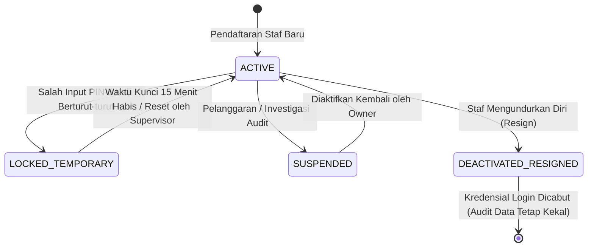
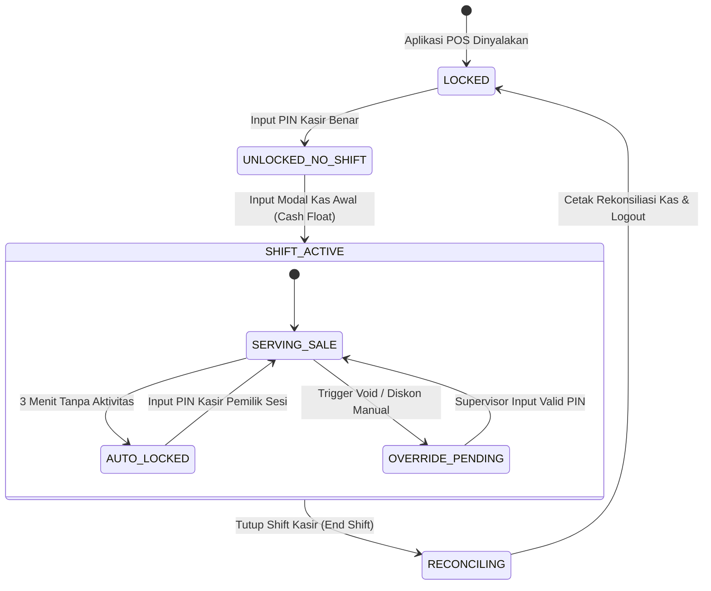

# Technical Requirements Document (TRD): Autentikasi Dual-UX, Sesi Kasir POS, Multi-Branch & Hak Akses (RBAC)

---

## 1. Metadata & Traceability

| Properti | Keterangan |
| :--- | :--- |
| **Kode Dokumen** | **TRD-PHARM-01** |
| **Nama Modul** | Autentikasi Dual-UX, Sesi Kasir POS, Isolasi Multi-Cabang, Legalitas SIPA & Hak Akses (RBAC) |
| **Target PRD Acuan** | • [`features/01-prd-auth-user.md`](../features/01-prd-auth-user.md) (Autentikasi & Akun Staf)<br>• [`features/master-data/01-prd-cabang-dan-gudang.md`](../features/master-data/01-prd-cabang-dan-gudang.md) (Master Cabang) |
| **Target Diagram Acuan**| [`technical/diagrams/01-diagrams-auth-dan-cabang.md`](./diagrams/01-diagrams-auth-dan-cabang.md) (Visual Blueprints) |
| **Target DBML Acuan**   | [`technical/database/schema.dbml`](./database/schema.dbml) (Grup `Auth_And_Staff` & `Core_MultiBranch`) |
| **Target Tim Pengembang**| Backend Engineer `[BE]`, Web Admin Engineer `[FE-WEB]`, POS Cashier Engineer `[FE-POS]`, QA Tester |
| **Prinsip Arsitektur**  | **Tech-Agnostic / Platform-Independent Blueprint** (Valid untuk runtime atau framework apa pun) |

---

## 2. Architectural Layers & Component Interactions

Sistem memisahkan tanggung jawab autentikasi dan otorisasi ke dalam 4 lapisan arsitektur bersih (*Clean Layered Architecture*):

```
┌──────────────────────────────────────────────────────────────────────────────────┐
│                             CLIENT LAYER (FE-WEB & FE-POS)                       │
│  • Web ERP: Token Storage (HttpOnly Cookie / Memory), Branch Switcher State     │
│  • POS Kasir: In-Memory Cart, Screen Lock Timer, Scanner Keyboard-Wedge Buffer  │
└────────────────────────────────────────┬─────────────────────────────────────────┘
                                         │ HTTP/REST (JSON + Headers: X-Branch-Id)
                                         ▼
┌──────────────────────────────────────────────────────────────────────────────────┐
│                       TRANSPORT & CONTROLLER LAYER [BE]                          │
│  • Rate Limiting & Throttling Guard (Anti-Bruteforce 5x Salah PIN)              │
│  • JWT Authentication Middleware (RS256 / Ed25519 Token Claims Validator)        │
│  • Multi-Branch Isolation Interceptor (Memvalidasi X-Branch-Id vs user_branches) │
│  • Role-Based Access Control (RBAC) Permission Evaluator                         │
└────────────────────────────────────────┬─────────────────────────────────────────┘
                                         │ DTO & Context Injected
                                         ▼
┌──────────────────────────────────────────────────────────────────────────────────┐
│                          DOMAIN SERVICE LAYER [BE]                               │
│  • AuthenticationService (Web Login, Fast POS PIN, Refresh Token Rotation)      │
│  • SupervisorOverrideService (Validasi PIN Supervisor, Logging Transaksional)    │
│  • StaffLicenseService (Validasi Masa Berlaku SIPA/STRTTK & Cron Evaluator)      │
│  • UserManagementService (Pendaftaran Staf, Hak Akses, Penugasan Cabang)        │
└────────────────────────────────────────┬─────────────────────────────────────────┘
                                         │ Repository Interface
                                         ▼
┌──────────────────────────────────────────────────────────────────────────────────┐
│                     DATA ACCESS & PERSISTENCE LAYER [BE]                         │
│  • Repositories: UserRepository, RoleRepository, UserBranchRepository            │
│  • Repositories: PharmacistProfileRepository, SupervisorOverrideLogRepository     │
│  • Database Engine: ANSI SQL Relational Storage (PostgreSQL 15+ Reference)       │
└──────────────────────────────────────────────────────────────────────────────────┘
```

---

## 3. RESTful API Contracts (The Single Source of Truth)

Seluruh payload request dan response mematuhi **Uniform JSON Envelope Standard**:
* **Sukses:** `{ "success": true, "data": { ... }, "meta": { ... } | null, "error": null }`
* **Gagal:** `{ "success": false, "data": null, "meta": null, "error": { "code": string, "message": string, "details": array } }`

---

### 3.1 `POST /api/v1/auth/pos/fast-login`
* **Deskripsi & Aturan Bisnis:** Login kilat kasir di meja depan menggunakan PIN 6-digit numerik atau pemindaian barcode ID Card. Sesi langsung terikat pada cabang kasir aktif. *(Implements `BR-PHARM-AUTH-01`, `BR-PHARM-AUTH-02`, `BR-PHARM-AUTH-04`)*.
* **Header Wajib:**
  * `Content-Type: application/json`
  * `X-Branch-Id: <uuid>` *(ID cabang fisik tempat terminal POS berada)*
* **Request Body (JSON Schema):**
```json
{
  "type": "object",
  "required": ["method", "identifier"],
  "properties": {
    "method": { "type": "string", "enum": ["PIN", "BARCODE"] },
    "identifier": { 
      "type": "string", 
      "description": "User ID jika metode PIN, atau Kode Barcode kartu jika metode BARCODE" 
    },
    "pin": { 
      "type": "string", 
      "pattern": "^[0-9]{4,6}$", 
      "description": "Wajib diisi jika method=PIN, 4-6 digit angka rahasia kasir" 
    }
  }
}
```
* **Contoh Request Payload (Metode PIN):**
```json
{
  "method": "PIN",
  "identifier": "550e8400-e29b-41d4-a716-446655440001",
  "pin": "123890"
}
```
* **Response Sukses (HTTP 200 OK):**
```json
{
  "success": true,
  "data": {
    "access_token": "eyJhbGciOiJSUzI1NiIsInR5cCI6IkpXVCJ9...",
    "token_type": "Bearer",
    "expires_in": 900,
    "user": {
      "id": "550e8400-e29b-41d4-a716-446655440001",
      "employee_code": "STF-2026-004",
      "full_name": "Rina Anggraini",
      "role_code": "KASIR",
      "role_name": "Kasir Apotek",
      "can_supervisor_override": false
    },
    "active_branch": {
      "id": "8a7c2b3d-1e4f-4a0b-9c8d-7e6f5a4b3c2d",
      "branch_code": "AP-MLW-01",
      "branch_name": "Apotek Sehat - Cabang Melawai",
      "can_operate_pos": true
    }
  },
  "meta": null,
  "error": null
}
```
* **Catatan Pengiriman Refresh Token (Browser Web vs Mobile Native):**
  * **Klien Browser Web / PWA (Fase Saat Ini):** Endpoint ini menerbitkan `refresh_token` yang otomatis disuntikkan ke dalam cookie browser terproteksi: `Set-Cookie: refresh_token=<token>; HttpOnly; Secure; SameSite=Strict; Path=/api/v1/auth; Max-Age=604800`.
  * **Klien Native Mobile (Android / iOS di Masa Depan):** Jika request menyertakan header `X-Client-Type: mobile`, response JSON menyertakan properti `"refresh_token": "<token>"` di dalam objek `data` agar dapat disimpan pada media penyimpanan aman native (*Android EncryptedSharedPreferences* atau *iOS Keychain*).
* **Matriks Skenario Error:**
  * `HTTP 400 (INVALID_PAYLOAD)`: Format PIN bukan angka atau identifier kosong.
  * `HTTP 401 (INVALID_CREDENTIALS)`: PIN salah atau barcode tidak terdaftar. Menyertakan informasi `remaining_attempts: 3`.
  * `HTTP 403 (BRANCH_ACCESS_DENIED)`: Staf tidak memiliki izin penugasan di `X-Branch-Id` tersebut.
  * `HTTP 403 (USER_INACTIVE)`: Akun staf dalam status ditangguhkan (*suspended*) atau nonaktif.
  * `HTTP 429 (ACCOUNT_LOCKED_TEMPORARY)`: Gagal input PIN 5 kali berturut-turut. Akun dikunci sementara 15 menit.

---

### 3.2 `POST /api/v1/auth/web/login`
* **Deskripsi & Aturan Bisnis:** Autentikasi staf backoffice, APA, Keuangan, dan Owner menggunakan kredensial standar Email & Password. Mendukung penarikan daftar cabang yang boleh diakses pengguna. *(Implements `BR-PHARM-AUTH-01`, `BR-PHARM-AUTH-03`)*.
* **Header Wajib:**
  * `Content-Type: application/json`
* **Request Body (JSON Schema):**
```json
{
  "type": "object",
  "required": ["email", "password"],
  "properties": {
    "email": { "type": "string", "format": "email" },
    "password": { "type": "string", "minLength": 8 }
  }
}
```
* **Response Sukses (HTTP 200 OK):**
```json
{
  "success": true,
  "data": {
    "access_token": "eyJhbGciOiJSUzI1NiIsInR5cCI6IkpXVCJ9...",
    "token_type": "Bearer",
    "expires_in": 900,
    "user": {
      "id": "111e8400-e29b-41d4-a716-446655440099",
      "employee_code": "STF-2026-001",
      "full_name": "apt. Siti Rahmawati, S.Farm.",
      "email": "siti.rahmawati@apoteksehat.id",
      "role_code": "APOTEKER",
      "role_name": "Apoteker Pengelola Apotek (APA)",
      "can_supervisor_override": true
    },
    "pharmacist_profile": {
      "license_type": "SIPA",
      "license_number": "19920815/SIPA_31.71/2023/2045",
      "license_expired_date": "2027-08-15",
      "is_apa": true,
      "days_until_expiration": 328
    },
    "allowed_branches": [
      {
        "branch_id": "8a7c2b3d-1e4f-4a0b-9c8d-7e6f5a4b3c2d",
        "branch_code": "AP-MLW-01",
        "branch_name": "Apotek Sehat - Cabang Melawai",
        "is_default": true
      },
      {
        "branch_id": "9b8d3c4e-2f5a-4b1c-8d9e-8f7a6b5c4d3e",
        "branch_code": "AP-STB-02",
        "branch_name": "Apotek Sehat - Cabang Setiabudi",
        "is_default": false
      }
    ]
  },
  "meta": null,
  "error": null
}
```
* **Catatan Pengiriman Refresh Token (Browser Web vs Mobile Native):**
  * **Klien Browser Web / PWA (Fase Saat Ini):** Server menyuntikkan `Set-Cookie: refresh_token=<token>; HttpOnly; Secure; SameSite=Strict; Path=/api/v1/auth; Max-Age=604800`.
  * **Klien Native Mobile (Android / iOS di Masa Depan):** Jika header `X-Client-Type: mobile` disertakan, server menyertakan properti `"refresh_token": "<token>"` di dalam objek `data` untuk disimpan pada *Android EncryptedSharedPreferences* atau *iOS Keychain*.
* **Matriks Skenario Error:**
  * `HTTP 401 (INVALID_CREDENTIALS)`: Email tidak ditemukan atau kata sandi tidak cocok.
  * `HTTP 403 (USER_DEACTIVATED)`: Staf telah resign atau dinonaktifkan permanen oleh Owner.
  * `HTTP 429 (TOO_MANY_REQUESTS)`: Terlalu banyak percobaan gagal login dalam 1 menit (Rate limiting IP/Email).

---

### 3.3 `POST /api/v1/auth/refresh-token`
* **Deskripsi & Aturan Bisnis:** Memperpanjang sesi secara transparan tanpa mengganggu kasir/admin dengan mekanisme *Refresh Token Rotation (RTR)*.
* **Header & Mekanisme Pengiriman:**
  * **Klien Browser Web / PWA (Fase Saat Ini):** Browser otomatis menyertakan Cookie `refresh_token=<token>`. Kode JavaScript klien tidak menyentuh refresh token (terlindungi penuh dari serangan XSS).
  * **Klien Native Mobile (Masa Depan):** Mengirimkan header `X-Client-Type: mobile` dan menyertakan body JSON `{ "refresh_token": "<token>" }`.
* **Response Sukses (HTTP 200 OK):**
```json
{
  "success": true,
  "data": {
    "access_token": "eyJhbGciOiJSUzI1NiIsInR5cCI6IkpXVCJ9...",
    "token_type": "Bearer",
    "expires_in": 900,
    "refresh_token": "eyJhbGciOiJSUzI1NiIsInR5cCI6IkpXVCJ9..." 
  },
  "meta": null,
  "error": null
}
```
*Catatan: Properti `refresh_token` di dalam JSON data hanya dikembalikan jika request berasal dari `X-Client-Type: mobile`. Pada browser, refresh token baru otomatis dikirimkan via header `Set-Cookie`.*
* **Matriks Skenario Error:**
  * `HTTP 401 (TOKEN_EXPIRED)`: Refresh token telah melewati masa aktif maksimal (7 hari). Klien wajib mengarahkan ke layar login.
  * `HTTP 401 (TOKEN_REUSE_DETECTED)`: Terdeteksi penggunaan ulang token yang sama (indikasi pencurian token). Seluruh token dalam silsilah sesi tersebut langsung dicabut (*revoked*).

---

### 3.4 `POST /api/v1/auth/pos/supervisor-override`
* **Deskripsi & Aturan Bisnis:** Otorisasi tindakan berisiko tinggi di meja kasir (Void nota, hapus baris item setelah cetak, diskon manual, buka laci uang, dan petty cash). Wajib memvalidasi PIN supervisor dan mencatat log audit permanen. *(Implements `BR-PHARM-AUTH-11`, `BR-PHARM-AUTH-12`)*.
* **Header Wajib:**
  * `Authorization: Bearer <jwt_kasir>`
  * `X-Branch-Id: <uuid>`
* **Request Body (JSON Schema):**
```json
{
  "type": "object",
  "required": ["supervisor_pin", "action_type", "reason_category"],
  "properties": {
    "supervisor_pin": { "type": "string", "pattern": "^[0-9]{4,6}$" },
    "action_type": { 
      "type": "string", 
      "enum": ["VOID_TRANSACTION", "DELETE_ITEM", "MANUAL_DISCOUNT", "OPEN_DRAWER", "PETTY_CASH"] 
    },
    "reason_category": { 
      "type": "string", 
      "enum": ["PATIENT_CANCEL", "WRONG_INPUT", "INSUFFICIENT_FUNDS", "EMPLOYEE_DISCOUNT", "OTHER"] 
    },
    "reason_notes": { "type": "string", "maxLength": 255 },
    "target_entity_type": { "type": "string", "enum": ["SALE_ORDER", "SALE_ITEM", "CASH_DRAWER"] },
    "target_entity_id": { "type": "string", "format": "uuid" }
  }
}
```
* **Response Sukses (HTTP 200 OK):**
```json
{
  "success": true,
  "data": {
    "approved": true,
    "override_log_id": "c7a8b9d0-1234-5678-9abc-def012345678",
    "authorized_at": "2026-09-20T06:35:10.123Z",
    "supervisor": {
      "id": "111e8400-e29b-41d4-a716-446655440099",
      "full_name": "apt. Siti Rahmawati, S.Farm.",
      "role_code": "APOTEKER"
    }
  },
  "meta": null,
  "error": null
}
```
* **Matriks Skenario Error:**
  * `HTTP 401 (INVALID_SUPERVISOR_PIN)`: PIN yang dimasukkan bukan milik staf berwenang.
  * `HTTP 403 (NOT_AUTHORIZED_FOR_OVERRIDE)`: Pemilik PIN tidak memiliki flag `can_supervisor_override = true` atau tidak bertugas di cabang tersebut.
  * `HTTP 429 (OVERRIDE_ATTEMPTS_EXCEEDED)`: PIN salah 3 kali berturut-turut pada sesi dialog override ini. Dialog otomatis tertutup dan tindakan dibatalkan.

---

### 3.5 `POST /api/v1/auth/pos/lock` & `POST /api/v1/auth/pos/unlock`
* **Deskripsi & Aturan Bisnis:** Penguncian layar POS manual atau otomatis (*Auto-Lock* setelah 3 menit tanpa aktivitas) dan pembukaan kembali menggunakan PIN kasir tanpa menghilangkan keranjang aktif. *(Implements `BR-PHARM-AUTH-05`)*.
* **Header Wajib:**
  * `Authorization: Bearer <jwt_kasir>`
  * `X-Branch-Id: <uuid>`
* **Payload Unlock:** `{ "pin": "123890" }`
* **Response Sukses Unlock (HTTP 200 OK):**
```json
{
  "success": true,
  "data": {
    "unlocked": true,
    "unlocked_at": "2026-09-20T06:40:00.000Z"
  },
  "meta": null,
  "error": null
}
```

---

### 3.6 `POST /api/v1/auth/switch-branch`
* **Deskripsi & Aturan Bisnis:** Pengalihan konteks cabang aktif untuk staf manajerial / Owner tanpa logout. Menghasilkan token baru dengan klaim `branch_id` yang diperbarui. *(Implements `BR-PHARM-AUTH-03`)*.
* **Header Wajib:**
  * `Authorization: Bearer <jwt>`
* **Request Body:** `{ "target_branch_id": "9b8d3c4e-2f5a-4b1c-8d9e-8f7a6b5c4d3e" }`
* **Response Sukses (HTTP 200 OK):**
```json
{
  "success": true,
  "data": {
    "access_token": "eyJhbGciOiJSUzI1NiIsInR5cCI6IkpXVCJ9...",
    "active_branch": {
      "id": "9b8d3c4e-2f5a-4b1c-8d9e-8f7a6b5c4d3e",
      "branch_code": "AP-STB-02",
      "branch_name": "Apotek Sehat - Cabang Setiabudi"
    }
  },
  "meta": null,
  "error": null
}
```

---

### 3.7 `GET /api/v1/users` & `POST /api/v1/users`
* **Deskripsi:** Pengelolaan akun pengguna, peran sistem, penugasan cabang, dan profil legalitas farmasi. Hanya dapat diakses oleh Super Admin / Owner. *(Implements `BR-PHARM-AUTH-10`, `BR-PHARM-AUTH-13`)*.
* **Payload Pembuatan Pengguna Baru (`POST /api/v1/users`):**
```json
{
  "employee_code": "STF-2026-015",
  "full_name": "Budi Santoso, A.Md.Farm.",
  "email": "budi.santoso@apoteksehat.id",
  "password": "PasswordSuperAman2026!",
  "pin": "456123",
  "barcode_card": "CRD-STF-015",
  "phone": "081234567890",
  "role_id": "333e8400-e29b-41d4-a716-446655440003",
  "branch_assignments": [
    {
      "branch_id": "8a7c2b3d-1e4f-4a0b-9c8d-7e6f5a4b3c2d",
      "is_default": true,
      "can_operate_pos": true
    }
  ],
  "pharmacist_profile": {
    "license_type": "STRTTK",
    "license_number": "19980512/STRTTK_31/2024/1102",
    "license_expired_date": "2029-05-12",
    "is_apa": false,
    "assigned_branch_id": "8a7c2b3d-1e4f-4a0b-9c8d-7e6f5a4b3c2d"
  }
}
```

---

## 4. Concurrency, Transactional & Database Logic

### 4.1 Standar Keamanan Kredensial & Kriptografi (Tech-Agnostic)
1. **Hash Kata Sandi Web ERP (`password_hash`):**
   * Menggunakan algoritma **Bcrypt** dengan Cost Factor $\ge$ 12 (direkomendasikan Cost Factor 12 untuk standar emas keamanan industri terhadap serangan offline dictionary/bruteforce dengan waktu komputasi ~200–300ms per otentikasi).
2. **Hash PIN Cepat POS Kasir (`pin_hash`):**
   * Menggunakan algoritma **Bcrypt** dengan Cost Factor 10 (dioptimalkan untuk kecepatan verifikasi instan < 100ms di meja kasir front-office, tetap menghasilkan salt acak unik per kasir).
   * Divalidasi anti-pola sederhana: Menolak PIN berulang (`111111`, `000000`) atau sekuensial (`123456`, `654321`).
3. **Standar Token Otentikasi (JWT):**
   * Menggunakan algoritma asimetris **RS256** (atau **Ed25519**). Server auth menandatangani token dengan *Private Key*, sedangkan verifikasi di API Gateway atau middleware menggunakan *Public Key*.
   * **Masa Hidup Token:** Access Token = 15 Menit (`900s`), Refresh Token = 7 Hari.
   * **Struktur Klaim Standar JWT Payload:**
     ```json
     {
       "sub": "550e8400-e29b-41d4-a716-446655440001",
       "employee_code": "STF-2026-004",
       "role": "KASIR",
       "branch_id": "8a7c2b3d-1e4f-4a0b-9c8d-7e6f5a4b3c2d",
       "can_override": false,
       "can_pos": true,
       "iat": 1789900000,
       "exp": 1789900900,
       "jti": "8f3b2c1a-9e8d-4c7b-6a5f-4e3d2c1b0a9f"
     }
     ```
4. **Catatan Strategis Arsitektur: Manajemen Refresh Token Browser Web/PWA vs Kesiapan Mobile Native (Android / iOS):**
   * **Fase 1 (Web Desktop, Laptop & Tablet PWA):**
     * Seluruh pengguna (Kasir POS dan Admin ERP) beroperasi melalui Web Browser.
     * Refresh token **WAJIB** disimpan dan ditransmisikan menggunakan Cookie dengan atribut `HttpOnly; Secure; SameSite=Strict; Path=/api/v1/auth; Max-Age=604800`.
     * *Rasional Keamanan:* Atribut `HttpOnly` memastikan token tidak dapat dibaca atau diekstraksi oleh skrip JavaScript klien, sepenuhnya memitigasi risiko pencurian token akibat serangan *Cross-Site Scripting (XSS)*.
   * **Jalur Kompatibilitas Aplikasi Mobile Native (Android / iOS di Masa Depan):**
     * Lingkungan mobile native (Flutter, Android Kotlin, iOS Swift) tidak memiliki mekanisme *cookie jar* otomatis seperti browser web.
     * Backend dirancang memiliki kemampuan **Dual-Mode Handler (Hybrid-Ready)**:
       1. **Mode Browser (Default):** Backend membaca refresh token dari Cookie HTTP dan menyuntikkan token rotasi baru via header `Set-Cookie`.
       2. **Mode Mobile Native:** Jika klien menyertakan header `X-Client-Type: mobile`, backend menerima `refresh_token` dari body JSON saat request `/refresh-token`, dan mengembalikan pasangan token baru di dalam respons JSON `{ "access_token": "...", "refresh_token": "..." }`.
       3. **Penyimpanan di Perangkat Klien Mobile:** Token disimpan di media penyimpanan terenkripsi bawaan OS, yaitu **EncryptedSharedPreferences / Android Keystore** (Android) dan **Keychain Services** (iOS).
     * Dengan dokumentasi ini, pengembangan sistem saat ini aman di web browser, dan ketika fase aplikasi mobile dimulai, tidak ada perubahan mendasar pada logika bisnis backend (*zero-rewrite*).

---

### 4.2 Strategi Pengindeksan Database Kinerja Tinggi
Kueri login dan otorisasi dieksekusi ratusan kali per hari, sehingga wajib didukung indeks relasional:
```sql
-- Pencarian kilat barcode kartu identitas staf kasir
CREATE UNIQUE INDEX uq_users_barcode_card ON users(barcode_card) 
WHERE deleted_at IS NULL AND barcode_card IS NOT NULL;

-- Pencarian kilat email login backoffice
CREATE UNIQUE INDEX uq_users_email ON users(email) 
WHERE deleted_at IS NULL;

-- Indeks komposit validasi penugasan staf ke cabang tertentu
CREATE UNIQUE INDEX uq_user_branches_assignment ON user_branches(user_id, branch_id) 
WHERE deleted_at IS NULL;

-- Indeks pelacakan audit supervisor override per cabang & tanggal
CREATE INDEX idx_override_logs_branch_date ON supervisor_override_logs(branch_id, created_at DESC) 
WHERE deleted_at IS NULL;
```

---

### 4.3 Transaksi Atomik Persetujuan Supervisor Override
Pencatatan persetujuan supervisor override WAJIB dieksekusi dalam satu transaksi database ACID bersamaan dengan tindakan yang dipicu:
```sql
BEGIN;

-- 1. Insert rekam jejak hukum ke supervisor_override_logs
INSERT INTO supervisor_override_logs (
    id, branch_id, cashier_user_id, supervisor_user_id, 
    action_type, reason_category, reason_notes, 
    target_entity_type, target_entity_id, created_at, updated_at
) VALUES (
    gen_random_uuid(), :branch_id, :cashier_id, :supervisor_id,
    :action_type, :reason_category, :reason_notes,
    :target_entity_type, :target_entity_id, NOW(), NOW()
);

-- 2. Jalankan mutasi tindakan (misal: VOID penjualan)
UPDATE sales 
SET status = 'VOIDED', 
    void_reason = :reason_notes,
    updated_at = NOW() 
WHERE id = :target_entity_id AND branch_id = :branch_id;

COMMIT;
```

---

### 4.4 Scheduled Worker: Pemantauan Kedaluwarsa Izin SIPA & STRTTK
* **Jadwal:** Dieksekusi otomatis setiap hari pada pukul **01:00 UTC (08:00 WIB)**.
* **Logika Kerja:**
  1. Menghitung selisih hari: `days_remaining = license_expired_date - CURRENT_DATE`.
  2. **Kondisi 1 (`days_remaining <= 0`):** Flag izin menjadi kadaluarsa. Sistem otomatis mengunci hak penerbitan SP obat keras/narkotika pada cabang terkait dan memunculkan pop-up blokir di antarmuka kasir/resep.
  3. **Kondisi 2 (`0 < days_remaining <= 30`):** Terbitkan notifikasi prioritas tinggi (*Critical Alert*) ke dashboard Owner dan email Apoteker.
  4. **Kondisi 3 (`30 < days_remaining <= 90`):** Terbitkan notifikasi siaga (*Warning*) di bilah notifikasi Web Admin.

---

## 5. Frontend Web Admin [FE-WEB] Architecture

### 5.1 Route Guards & Navigasi Berbasis RBAC
Sistem navigasi Web Admin membatasi menu secara reaktif sesuai peran pengguna yang tersimpan dalam `currentUser.role_code`:
* `SUPER_ADMIN / OWNER`: Akses penuh ke seluruh menu (Dashboard Konsolidasian, Master Cabang, Master Staf & RBAC, Laporan Finansial).
* `APOTEKER (APA)`: Akses ke Master Obat, Buku Defekta, Pengadaan SP, Verifikasi Resep, Pelaporan SIPNAP, dan Profil Legalitas SIPA.
* `FINANCE`: Akses ke Rekonsiliasi Kas Shift, Hutang Piutang PBF, Buku Kas Kecil, dan Laba Rugi.
* `GUDANG`: Akses ke Penerimaan Faktur PBF, Manajemen Rak Gudang, Kartu Stok, dan Stock Opname.

### 5.2 Komponen Global Context: Branch Switcher
1. Bilah navigasi atas (*Top Navigation Bar*) memuat komponen pemilih cabang (*Branch Switcher*).
2. Sumber data diisi dari daftar `allowed_branches` milik pengguna saat ini.
3. Saat pengguna memilih cabang berbeda:
   * Klien memanggil endpoint `POST /api/v1/auth/switch-branch`.
   * State aplikasi memperbarui `active_branch` dan mengganti nilai header HTTP `X-Branch-Id` pada seluruh permintaan API berikutnya.
   * Tabel data dan laporan otomatis me-refresh data sesuai konteks cabang baru.

### 5.3 Validasi Form Pendaftaran Staf Berjenjang
Form pendaftaran staf mengadopsi struktur 3 tahap dengan validasi skema:
1. **Tahap 1 (Data HR):** Nama lengkap, NIK (16 digit angka), nomor telepon WhatsApp, dan cabang penugasan utama.
2. **Tahap 2 (Legalitas Kefarmasian):** Tampil hanya jika role yang dipilih adalah `APOTEKER` atau `ASISTEN_APOTEKER`. Wajib mengisi nomor izin resmi (SIPA/STRTTK) dan tanggal kadaluarsa izin.
3. **Tahap 3 (Kredensial Login):** Email resmi, password minimal 8 karakter (kombinasi huruf besar, kecil, angka, dan karakter khusus), serta PIN kasir 6-digit (hanya angka).

---

## 6. Frontend POS Cashier [FE-POS] Architecture

### 6.1 Layar Kunci Kasir & Mode Input Cepat (POS Lock Screen)
* **Penyimpanan Status Terminal:** Terminal POS menyimpan `branch_id` permanen pada penyimpanan lokal (*Local Persistent Store*).
* **Dual Input Interface:**
  1. **Keyboard Numpad Fisik:** Event listener global menangkap input numerik `0-9`, `Backspace`, dan `Enter`.
  2. **Virtual On-Screen Keypad:** Tombol sentuh angka berukuran besar untuk form factor tablet layar sentuh (10–12 inci).
* **Penyangga Pemindai Barcode (Keyboard-Wedge Debounce Buffer):**
  * Barcode scanner USB mengirimkan karakter dengan kecepatan sangat tinggi (< 30ms antar karakter) yang diakhiri penekanan tombol `Enter`.
  * Sistem membedakan ketikan manual kasir dengan aliran data scanner menggunakan *input time-delta accumulator*. Jika total input diterima < 100ms dan diakhiri `Enter`, sistem langsung memprosesnya sebagai pembacaan kartu ID staf (*Fast Barcode Login*).

### 6.2 Mekanisme Auto-Lock Layar Kasir
* Kasir memiliki pengatur waktu tidak aktif (*Inactivity Timer*) berdurasi **180 detik (3 menit)**.
* Setiap aktivitas penekanan tombol keyboard, klik mouse, sentuhan layar, atau scan barcode akan me-reset timer ke 0.
* Jika timer mencapai 180 detik:
  * Layar langsung tertutup oleh modal transparan (*Screen Lock Overlay*).
  * Data keranjang belanja yang sedang berjalan **tetap tersimpan utuh di dalam memori klien (*In-Memory State Store*)**.
  * Kasir cukup mengetikkan kembali 6-digit PIN miliknya untuk membuka layar tanpa kehilangan transaksi pasien.

### 6.3 Interceptor Pop-Up Supervisor Override
1. Ketika kasir menekan tombol berisiko tinggi (misal: "Void Nota" atau "Hapus Item Obat"):
2. Antarmuka POS membekukan interaksi kasir dan memunculkan pop-up dialog **Supervisor Override**:
   * Menampilkan ringkasan aksi yang akan dilakukan beserta nilai rupiahnya.
   * Input 6-digit PIN Supervisor / Apoteker.
   * Dropdown alasan otorisasi (wajib pilih).
3. Permintaan dikirim ke `POST /api/v1/auth/pos/supervisor-override`.
4. Jika sukses: Pop-up tertutup otomatis, aksi dijalankan, dan toast notifikasi hijau muncul.
5. Jika gagal: Menampilkan peringatan sisa kesempatan (maksimal 3 kali). Jika gagal 3 kali, modal terkunci dan tindakan dibatalkan.

---

## 7. Domain Algorithms & State Lifecycles

### 7.1 Siklus Status Akun Pengguna (User Account Lifecycle)



---

### 7.2 Siklus Status Sesi Kasir POS (Cashier Session Lifecycle)



---

### 7.3 Pseudocode Algoritma Verifikasi PIN Kasir & Rate Limiting
```text
ALGORITHM VerifyCashierFastPin(branchId, userId, inputPin):
    user = UserRepository.FindById(userId)
    IF user IS NULL OR user.deleted_at IS NOT NULL THEN
        RETURN Error(HTTP_404, "USER_NOT_FOUND")
    END IF

    IF user.is_active == FALSE THEN
        RETURN Error(HTTP_403, "USER_INACTIVE")
    END IF

    // 1. Cek Penugasan Cabang
    assignment = UserBranchRepository.Find(userId, branchId)
    IF assignment IS NULL OR assignment.can_operate_pos == FALSE THEN
        RETURN Error(HTTP_403, "BRANCH_ACCESS_DENIED")
    END IF

    // 2. Cek Status Kunci Sementara (Anti-Bruteforce)
    lockStatus = Cache.Get("lockout:user:" + userId)
    IF lockStatus.is_locked == TRUE THEN
        RETURN Error(HTTP_429, "ACCOUNT_LOCKED_TEMPORARY", "Sisa waktu: " + lockStatus.remaining_seconds + " detik")
    END IF

    // 3. Verifikasi Hash PIN
    isPinValid = Cryptography.VerifyHash(inputPin, user.pin_hash)
    IF isPinValid == FALSE THEN
        failedAttempts = Cache.Increment("failed_pin:user:" + userId, TTL = 900)
        remaining = 5 - failedAttempts
        IF remaining <= 0 THEN
            Cache.Set("lockout:user:" + userId, { is_locked: TRUE }, TTL = 900)
            Cache.Delete("failed_pin:user:" + userId)
            RETURN Error(HTTP_429, "ACCOUNT_LOCKED_TEMPORARY", "Akun terkunci 15 menit karena 5x salah PIN.")
        ELSE
            RETURN Error(HTTP_401, "INVALID_CREDENTIALS", "PIN salah. Sisa percobaan: " + remaining)
        END IF
    END IF

    // 4. Reset counter percobaan gagal jika sukses
    Cache.Delete("failed_pin:user:" + userId)

    // 5. Terbitkan Token Sesi Kasir Terikat Cabang
    token = TokenService.GenerateJwt(user, branchId, ttl = 900)
    refreshToken = TokenService.GenerateRefreshToken(user, branchId, ttl = 604800)

    RETURN Success(token, refreshToken, user, assignment)
END ALGORITHM
```

---

### 7.4 Pseudocode Algoritma Supervisor Override
```text
ALGORITHM ProcessSupervisorOverride(branchId, cashierUserId, supervisorPin, actionType, reasonCategory, reasonNotes, targetId):
    // 1. Cari user di cabang yang memiliki izin override dan cocokkan PIN
    candidateSupervisors = UserRepository.FindActiveSupervisorsByBranch(branchId)
    matchedSupervisor = NULL

    FOR EACH supervisor IN candidateSupervisors DO
        IF Cryptography.VerifyHash(supervisorPin, supervisor.pin_hash) == TRUE THEN
            matchedSupervisor = supervisor
            BREAK
        END IF
    END FOR

    IF matchedSupervisor IS NULL THEN
        RETURN Error(HTTP_401, "INVALID_SUPERVISOR_PIN", "PIN supervisor tidak valid atau tidak memiliki wewenang override di cabang ini.")
    END IF

    // 2. Catat log audit secara transaksional
    DB.BeginTransaction()
    TRY
        overrideLog = SupervisorOverrideLogRepository.Create({
            branch_id: branchId,
            cashier_user_id: cashierUserId,
            supervisor_user_id: matchedSupervisor.id,
            action_type: actionType,
            reason_category: reasonCategory,
            reason_notes: reasonNotes,
            target_entity_id: targetId,
            created_at: NOW()
        })
        DB.Commit()
        RETURN Success({ approved: TRUE, log_id: overrideLog.id, supervisor: matchedSupervisor.full_name })
    CATCH Exception e
        DB.Rollback()
        RETURN Error(HTTP_500, "OVERRIDE_LOGGING_FAILED")
    END TRY
END ALGORITHM
```

---

## 8. GitHub Issue Ticket Mapping (Atomic Task Decomposition)

Dokumen TRD ini didekomposisi menjadi **tiket tugas atomik siap eksekusi** (1 Pull Request fokus berukuran 1–3 hari kerja) untuk mencegah *monolithic task* dan *monster PR*:

### A. Klaster Backend `[BE]` (5 Sub-Tasks)
| No Tiket | Judul Tiket Rekomendasi | Deliverable Utama |
| :--- | :--- | :--- |
| `BE-01` | `[BE] Auth & Sesi (Part 1/5): Migrasi Skema Database Relasional, Indeks & Seeding` | File migrasi tabel `branches`, `roles`, `users`, `user_branches`, `pharmacist_profiles`, `supervisor_override_logs`, foreign keys, dan seed Super Admin. |
| `BE-02` | `[BE] Auth & Sesi (Part 2/5): Endpoint Web Login, Fast PIN POS & Refresh Token Rotation` | Endpoint `/auth/web/login`, `/auth/pos/fast-login`, `/auth/refresh-token` (dual cookie browser & body mobile), Bcrypt, rate-limit 5x salah PIN. |
| `BE-03` | `[BE] Auth & Sesi (Part 3/5): Middleware Isolasi X-Branch-Id & Lock/Unlock Layar POS` | Middleware validasi `X-Branch-Id`, endpoint `/auth/switch-branch`, dan endpoint `/auth/pos/lock` & `/unlock`. |
| `BE-04` | `[BE] Auth & Sesi (Part 4/5): Supervisor Override Transaksional & Audit Logging` | Endpoint `/auth/pos/supervisor-override`, verifikasi PIN supervisor, check `can_supervisor_override = true`, dan transaksi ACID insert ke log audit. |
| `BE-05` | `[BE] Auth & Sesi (Part 5/5): CRUD Manajemen Staf & Scheduled Worker Kedaluwarsa SIPA` | Endpoint `GET/POST/PUT /users` dengan data SIPA/STRTTK, dan scheduled cron worker harian (01:00 UTC) peringatan H-90, H-30, H-0 blokir SP. |

### B. Klaster Frontend POS Kasir `[FE-POS]` (3 Sub-Tasks)
| No Tiket | Judul Tiket Rekomendasi | Deliverable Utama |
| :--- | :--- | :--- |
| `POS-01` | `[FE-POS] Kasir Auth (Part 1/3): Layar Kunci (Lock Screen), Numpad Listener & Fast PIN Login` | Komponen layar kunci kasir, event listener keyboard numpad fisik (0-9, Backspace, Enter), keypad sentuh, dan integrasi fast-login PIN. |
| `POS-02` | `[FE-POS] Kasir Auth (Part 2/3): Penyangga Barcode Scanner ID Card & Auto-Lock Inactivity 3 Menit` | Input accumulator stream barcode scanner (< 50ms interval) dan timer inaktivitas 180 detik pengunci layar tanpa menghilangkan keranjang aktif di memori. |
| `POS-03` | `[FE-POS] Kasir Auth (Part 3/3): Pop-Up Dialog Supervisor Override & Action Interceptor` | Modal dialog otorisasi kasir (Void/Diskon/Buka Laci), input PIN supervisor, dropdown alasan, proteksi gagal 3x, dan eksekusi callback aksi kasir. |

### C. Klaster Frontend Web Admin `[FE-WEB]` (2 Sub-Tasks)
| No Tiket | Judul Tiket Rekomendasi | Deliverable Utama |
| :--- | :--- | :--- |
| `WEB-01` | `[FE-WEB] Admin Auth (Part 1/2): Halaman Login ERP, RBAC Route Guards & Global Branch Switcher` | Form login email/password, proteksi navigasi rute berbasis 6 persona, dan komponen pemilih cabang di header atas yang menginjeksi header `X-Branch-Id`. |
| `WEB-02` | `[FE-WEB] Admin Auth (Part 2/2): Manajemen Pengguna & Form Pendaftaran Staf Berjenjang 3 Tahap` | Data table staf (search, filter cabang, pagination), dan modal form 3 tahap (Data HR $\rightarrow$ Legalitas SIPA/STRTTK $\rightarrow$ Kredensial IAM & Penugasan Cabang). |

### D. Klaster Quality Assurance & Testing `[QA]` (1 Sub-Task)
| No Tiket | Judul Tiket Rekomendasi | Deliverable Utama |
| :--- | :--- | :--- |
| `QA-01` | `[QA] Auth Test Matrix: Dual-UX Sesi, Isolasi Header X-Branch-Id & Simulasi PIN Lockout` | Test suite pengujian skenario: 5x salah PIN, pemalsuan header cabang, token rotation reuse detection, dan audit trail supervisor override. |
