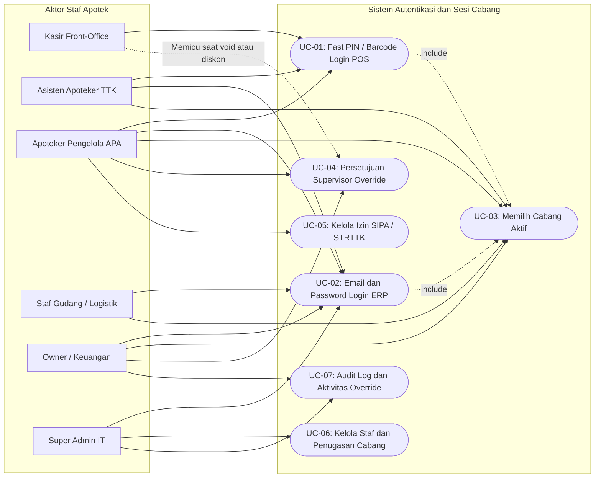
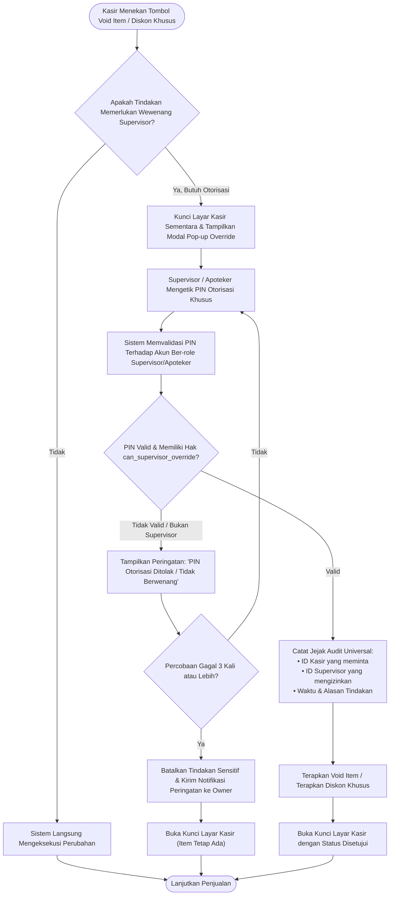
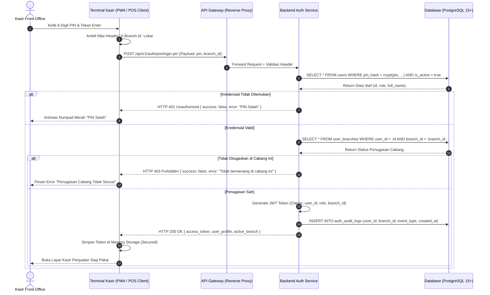
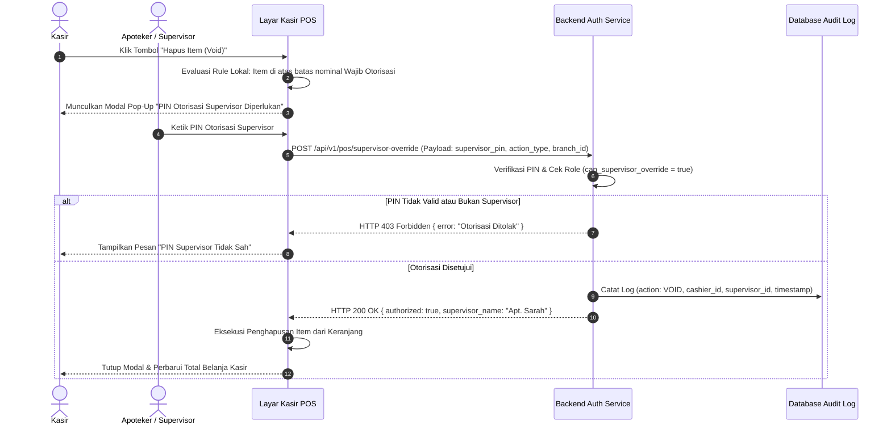
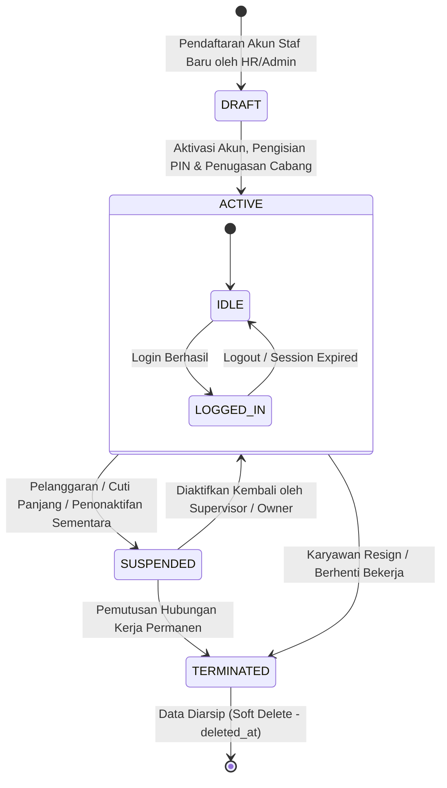
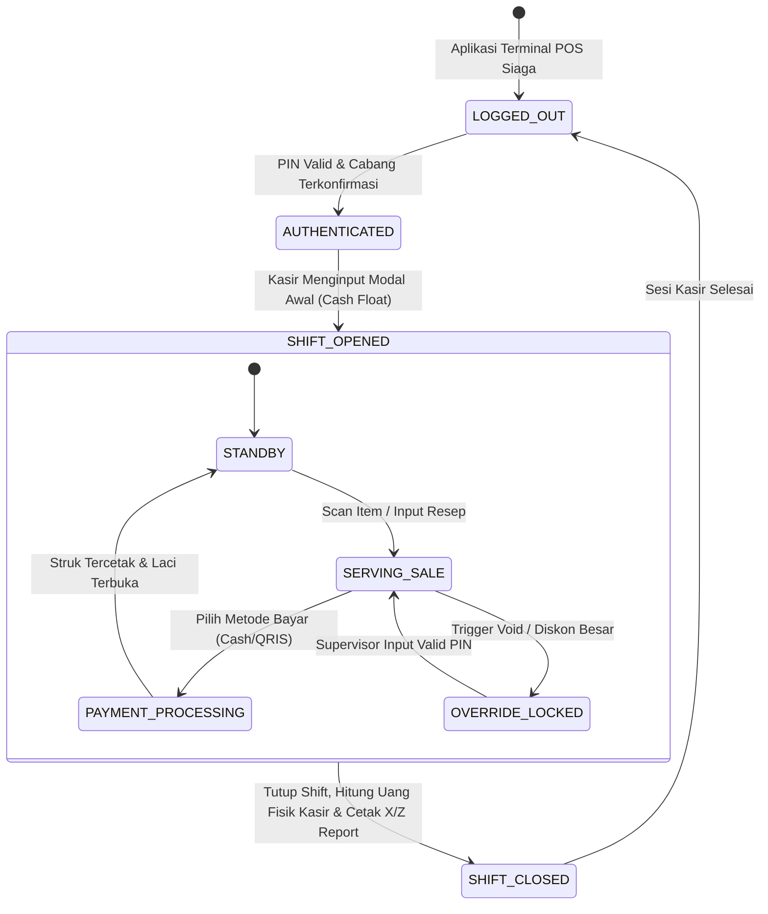
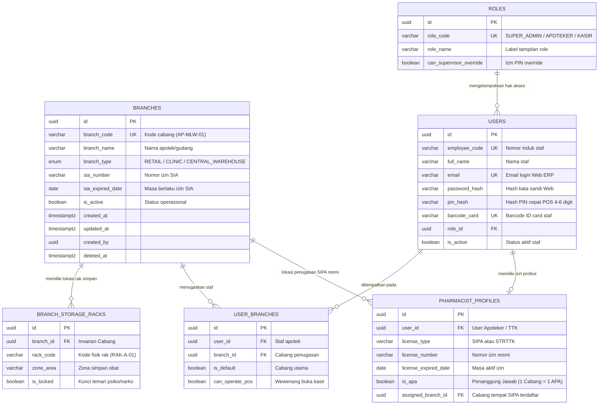

# Blueprint Visual: Diagram Usecase, Alur Proses & Scoped ERD
# Modul: Autentikasi Dual-UX, Hak Akses (RBAC) & Sesi Cabang

---

## 1. Metadata Dokumen

| Properti | Keterangan |
| :--- | :--- |
| **Kode Dokumen** | **DIAG-PHARM-AUTH01** |
| **Nama Modul** | Diagram Alur Proses, Usecase, Sequence, dan Scoped ERD untuk Autentikasi & User |
| **Dokumen Bisnis Acuan** | • [`features/01-prd-auth-user.md`](../../features/01-prd-auth-user.md)<br>• [`features/master-data/01-prd-cabang-dan-gudang.md`](../../features/master-data/01-prd-cabang-dan-gudang.md) |
| **Skema Database Acuan** | [`technical/database/schema.dbml`](../database/schema.dbml) (Grup `Auth_And_Staff` & `Core_MultiBranch`) |
| **Audiens Target** | UI/UX Designer, Frontend POS & Web Engineers, Backend Engineers, QA Engineers, System Analyst |

---

## 2. Diagram Usecase (Aktor vs Fungsionalitas Sistem)

Diagram ini memetakan batas kewenangan 6 persona staf apotek terhadap fungsi-fungsi autentikasi, legalitas, dan sesi cabang:



---

## 3. Diagram Alur Proses Sistem (Detailed Flowcharts)

### 3.1 Flowchart 1: Alur Login Dual-UX (Terminal POS Kasir vs Web Admin ERP)

Menerjemahkan aturan login cepat di meja kasir (*Zero Lag*) vs login aman dengan verifikasi ketat di back-office ERP:

```mermaid
flowchart TD
    Start([Pengguna Mengakses Sistem]) --> DetectClient{Deteksi Perangkat / Antarmuka?}
    
    %% Cabang 1: Terminal POS Kasir
    DetectClient -->|Layar Kasir POS / Tablet| POS_Mode["Mode Layar Sentuh / Kasir Cepat"]
    POS_Mode --> ChooseInput{Metode Input Staf?}
    ChooseInput -->|Scan Kartu Barcode| ReadBarcode["Barcode Scanner Membaca ID Card"]
    ChooseInput -->|Numpad Layar / Keyboard| InputPIN["Staf Mengetik 4-6 Digit PIN Cepat"]
    ReadBarcode --> VerifyPOSAuth["Backend Mencocokkan Hash Barcode / PIN"]
    InputPIN --> VerifyPOSAuth
    
    VerifyPOSAuth --> CheckPOSValid{Kredensial Valid & User Aktif?}
    CheckPOSValid -->|Tidak| ShowPOSErr["Tampilkan Error: 'PIN / Barcode Salah'"]
    ShowPOSErr --> POS_Mode
    
    CheckPOSValid -->|Ya| CheckPOSBranch{"Apakah Staf Ditugaskan di Cabang Ini?"}
    CheckPOSBranch -->|Tidak Ditugaskan| RejectBranch["Tolak Login: 'Anda tidak memiliki penugasan aktif di cabang ini'"]
    RejectBranch --> POS_Mode
    CheckPOSBranch -->|Ditugaskan| IssuePOSToken["Terbitkan Token Sesi Kasir Terikat X-Branch-Id"]
    IssuePOSToken --> OpenDrawerCheck{Apakah Kasir Membuka Shift Baru?}
    OpenDrawerCheck -->|Ya| InputFloat["Input Modal Awal Kasir (Cash Float)"]
    OpenDrawerCheck -->|Tidak| GoToPOSCart["Buka Layar Transaksi Penjualan"]
    InputFloat --> GoToPOSCart
    GoToPOSCart --> EndPOS([Kasir Siap Melayani Transaksi])

    %% Cabang 2: Web Admin ERP Backoffice
    DetectClient -->|Peramban Web Browser / ERP| Web_Mode["Halaman Login Web ERP"]
    Web_Mode --> InputCreds["Input Alamat Email & Kata Sandi"]
    InputCreds --> VerifyWebAuth["Backend Memvalidasi Email & Hash Argon2id"]
    VerifyWebAuth --> CheckWebValid{Email & Password Cocok?}
    CheckWebValid -->|Tidak| WebError["Tampilkan Error: 'Kredensial Tidak Valid'"]
    WebError --> Web_Mode
    
    CheckWebValid -->|Ya| FetchBranches["Ambil Daftar Cabang yang Berhak Diakses Staf"]
    FetchBranches --> BranchCountCheck{Jumlah Cabang Terdaftar?}
    BranchCountCheck -->|1 Cabang Saja| AutoSelectBranch["Otomatis Pilih Cabang Tunggal"]
    BranchCountCheck -->|Multi-Cabang (Lebih dari 1 Cabang)| ModalSelectBranch["Munculkan Dialog Pemilihan Cabang Kerja"]
    ModalSelectBranch --> UserSelectBranch["Pengguna Memilih Cabang yang Akan Dioperasikan"]
    UserSelectBranch --> IssueWebToken["Terbitkan JWT RS256 + Refresh Token"]
    AutoSelectBranch --> IssueWebToken
    IssueWebToken --> LoadDashboard["Buka Dashboard ERP Sesuai Hak Akses RBAC"]
    LoadDashboard --> EndWeb([Staf Siap Bekerja di Web ERP])
```

---

### 3.2 Flowchart 2: Alur Persetujuan Supervisor (*Manager Override*) di Meja Kasir

Mekanisme otorisasi instan saat kasir melakukan tindakan sensitif (membatalkan/void item yang sudah di-scan, memberikan diskon di luar wewenang kasir, atau retur obat):



---

### 3.3 Flowchart 3: Siklus Pemantauan Masa Berlaku Legalitas Profesi (SIPA / STRTTK)

Memastikan apotek selalu terlindungi dari sanksi Dinkes/BPOM terkait legalitas izin praktik:

```mermaid
flowchart TD
    CheckCron([Pengecekan Harian Otomatis Masa Berlaku SIPA/STRTTK]) --> CalcDays["Hitung Selisih Hari: Tanggal Habis Izin - Hari Ini"]
    
    CalcDays --> EvaluateStatus{Kategori Sisa Hari?}
    
    EvaluateStatus -->|Lebih dari 60 Hari| StatusGreen["Status: HIJAU (Valid & Aman)"]
    StatusGreen --> EndCheck([Tidak Ada Tindakan])
    
    EvaluateStatus -->|Antara 30 sampai 60 Hari| StatusYellow["Status: KUNING (Peringatan Awal)"]
    StatusYellow --> NotifyAPA["Tampilkan Notifikasi Peringatan di Dashboard Admin:<br/>Masa Berlaku Izin SIPA Akan Berakhir dalam X Hari"]
    NotifyAPA --> EndCheck
    
    EvaluateStatus -->|Antara 1 sampai 30 Hari| StatusOrange["Status: ORANYE (Mendesak / Perpanjangan)"]
    StatusOrange --> AlertUrgent["Tampilkan Alert Oranye Banner di Seluruh Sesi Apoteker"]
    AlertUrgent --> EndCheck
    
    EvaluateStatus -->|Kedaluwarsa (0 Hari atau Kurang)| StatusRed["Status: MERAH (Kedaluwarsa / Expired)"]
    StatusRed --> LockSP["KUNCI OTOMATIS: Dilarang Menerbitkan Surat Pesanan (SP) Obat Keras/Narkotika"]
    LockSP --> RequireExtension["Wajib Unggah Nomor & Masa Berlaku SIPA Baru untuk Membuka Kunci"]
    RequireExtension --> EndCheck
```

---

## 4. Sequence Diagram (Interaksi Teknis Antar Komponen)

### 4.1 Sequence 1: Login Cepat Kasir POS (Fast PIN Authentication)



---

### 4.2 Sequence 2: Dialog Otorisasi Supervisor (*Manager Override Pop-Up*)



---

## 5. Diagram Status & Siklus Hidup (State Lifecycle Diagrams)

### 5.1 Siklus Status Akun Staf (`users`)



---

### 5.2 Siklus Sesi Kerja Kasir di Cabang (`user_branches` & Kasir POS)



---

## 6. Scoped ERD: Khusus Domain Autentikasi, Staf & Cabang

Berikut adalah sub-diagram relasi database PostgreSQL khusus untuk domain **Auth, User, Profil Profesi, dan Cabang** (diambil secara terfokus dari [`technical/database/schema.dbml`](../database/schema.dbml)):



---

## 7. Rangkuman Keterkaitan Antara Diagram dengan Dokumen Spesifikasi

| Nama Diagram | Aturan Bisnis yang Direpresentasikan (PRD) | Dampak Implementasi Koding (TRD / Database) |
| :--- | :--- | :--- |
| **Usecase Diagram (Bab 2)** | `BR-PHARM-AUTH-01` s/d `BR-PHARM-AUTH-05` (Matriks 6 persona RBAC) | Menentukan rute menu Frontend Web, middleware otorisasi API, dan guards di POS. |
| **Flowchart Login Dual-UX (Bab 3.1)** | `BR-PHARM-AUTH-01` (Fast PIN vs Email Login) & `BR-PHARM-BR-03` (Isolasi Cabang) | Endpoint `POST /auth/pos/login-pin` vs `POST /auth/web/login`, validasi header `X-Branch-Id`. |
| **Flowchart Supervisor Override (Bab 3.2)**| `BR-PHARM-AUTH-03` (Otorisasi Pembatalan & Diskon) | Endpoint `POST /pos/supervisor-override` & pencatatan tabel audit khusus. |
| **SIPA License Lifecycle (Bab 3.3)** | `BR-PHARM-AUTH-02` & `BR-PHARM-BR-02` (Legalitas Profesi & 1 Apotek 1 APA) | Cron-job peringatan kedaluwarsa SIPA & penguncian modul Surat Pesanan (SP). |
| **Scoped ERD (Bab 6)** | Seluruh entitas pengguna, cabang, dan relasi peran | DDL skema database PostgreSQL pada berkas `technical/database/schema.dbml`. |
